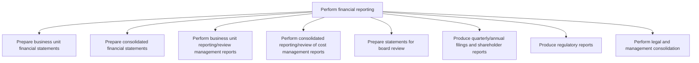
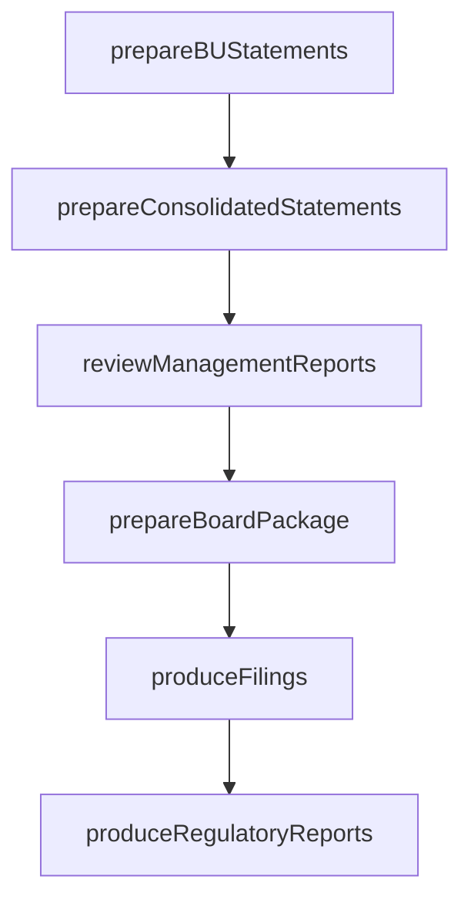

# Perform financial reporting

> Business-as-Code definition for financial reporting. Models business unit and consolidated statement preparation, management reporting, board review packages, regulatory filings, and legal consolidation as programmable APIs.

## Overview

Reporting on the organization's financial status to stakeholders. Include balance sheets, income statements, cash flow statements, and statements of shareholders' equity.

## Process Hierarchy



## GraphDL

```yaml
perform:
  object: Financial Reporting
  actor: FinancialReportingManager
  result: FinancialStatementPackage
```

## Actions

| Action | Description |
|--------|-------------|
| prepareBUStatements | Generate financial statements for individual business units |
| prepareConsolidatedStatements | Combine entity statements with eliminations into consolidated view |
| reviewManagementReports | Produce internal management reports with variance commentary |
| prepareBoardPackage | Compile financial statements and analysis for board review |
| produceFilings | Generate quarterly and annual SEC filings and shareholder reports |
| produceRegulatoryReports | Create regulatory reports for banking, tax, or industry authorities |

## Events

| Event | Description |
|-------|-------------|
| buStatementsPrepared | Business unit financial statements finalized |
| consolidatedStatementsPrepared | Consolidated financial statements completed with eliminations |
| managementReportsReviewed | Internal management reports distributed to leadership |
| boardPackagePrepared | Board review package compiled and submitted |
| filingsProduced | Quarterly or annual SEC filings generated and filed |
| regulatoryReportsProduced | Regulatory reports submitted to applicable authorities |

## Searches

| Search | Description |
|--------|-------------|
| getFinancialStatements | Retrieve financial statements by entity, period, and type |
| getFilingStatus | Check status of regulatory and SEC filing submissions |
| getManagementReports | Query management reports by business unit or period |
| getBoardPackages | Retrieve board review packages by meeting date |

## Process Flow



## RACI Matrix

| Activity | Responsible | Accountable | Consulted | Informed |
|----------|-------------|-------------|-----------|----------|
| prepareBUStatements | Financial Reporting Analyst | Controller | Business Unit Controllers | CFO |
| prepareConsolidatedStatements | Consolidation Analyst | Controller | Subsidiary Controllers | CFO |
| prepareBoardPackage | Reporting Manager | CFO | General Counsel | Board of Directors |
| produceFilings | SEC Reporting Manager | CFO | External Auditors | Legal |

## Sub-Processes

| ID | Name | Description |
|----|------|-------------|
| 9.3.4.1 | Prepare business unit financial statements | Making reports of subsidiaries units to show profits generated from them. Prepare financial statemen |
| 9.3.4.2 | Prepare consolidated financial statements | Making final accounts for all units of company together. Prepare combined financial statements of a  |
| 9.3.4.3 | Perform business unit reporting/review management reports | Making reports for units/subsidiaries to help management in decision making. Prepare financial state |
| 9.3.4.4 | Perform consolidated reporting/review of cost management reports | Making reports for all units to help higher management in decision making. Prepare combined financia |
| 9.3.4.5 | Prepare statements for board review | Preparing a draft of financial statements for the board to review before they are sent to the audito |
| 9.3.4.6 | Produce quarterly/annual filings and shareholder reports | Making and presenting financial reports to stakeholders. Create annual and quarterly financial state |
| 9.3.4.7 | Produce regulatory reports | Reporting raw or summary data for final accounts following rules and regulations. |
| 9.3.4.8 | Perform legal and management consolidation | Carrying out activities associated with legal and management consolidation. Legal consolidation can  |

## Related Processes

| Process | Relationship |
|---------|-------------|
| 9.3.2 Perform general accounting | Upstream - trial balance feeds financial statement preparation |
| 9.1 Perform planning and management accounting | Parallel - variance data enhances management reports |
| 9.8 Manage internal controls | Parallel - controls ensure reporting accuracy and compliance |

## Related Departments

| Department | Role |
|-----------|------|
| Financial Reporting | Primary owner of statement preparation and filings |
| General Accounting | Provides trial balance and reconciled data |
| Investor Relations | Distributes shareholder communications and earnings releases |
| Legal | Reviews regulatory filings for compliance |
| External Audit | Audits financial statements for accuracy and fairness |

## Related Occupations

| Occupation | Involvement |
|-----------|-------------|
| Financial Reporting Manager | Oversees statement preparation and filing process |
| SEC Reporting Analyst | Prepares quarterly and annual regulatory filings |
| Consolidation Analyst | Manages multi-entity consolidation for reporting |

## KPIs

| KPI | Description | Unit |
|-----|-------------|------|
| Reporting Cycle Time | Days from period close to financial statement issuance | Days |
| Filing Timeliness | Percentage of regulatory filings submitted before deadline | % |
| Restatement Rate | Number of financial restatements per fiscal year | Count |
| Audit Adjustment Count | Number of audit adjustments identified by external auditors | Count |

## Usage

```typescript
import { performFinancialReporting } from '@headlessly/perform-financial-reporting'

const reporting = performFinancialReporting()

// Prepare consolidated financial statements
const statements = await reporting.prepareConsolidatedStatements({
  period: '2025-12',
  entities: ['US-CORP', 'EU-SUB', 'APAC-SUB'],
  standard: 'US-GAAP'
})

// Produce quarterly SEC filing
await reporting.produceFilings({
  filingType: '10-Q',
  period: 'Q4-2025',
  reviewedBy: 'external-auditor'
})
```
