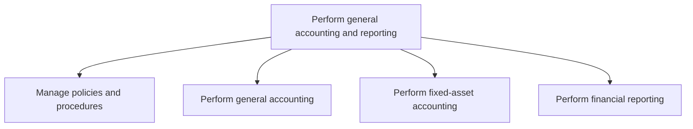
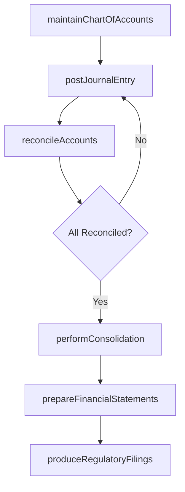

# Perform general accounting and reporting

> Business-as-Code definition for general accounting and financial reporting. Models chart of accounts management, journal entry processing, period-end close, fixed-asset accounting, and statutory reporting as programmable APIs.

## Overview

Making statements about business activities and functions. Prepare financial statements (balance sheet, income statement, statement of cash flows, and statement of stockholders' equity) according to accounting concepts and principles.

## Process Hierarchy



## GraphDL

```yaml
perform:
  object: General Accounting And Reporting
  actor: Controller
  result: FinancialStatementPackage
```

## Actions

| Action | Description |
|--------|-------------|
| maintainChartOfAccounts | Create, modify, or deactivate general ledger account codes |
| postJournalEntry | Record debit and credit entries to the general ledger |
| reconcileAccounts | Verify subledger balances match general ledger control accounts |
| performConsolidation | Combine financial data from multiple entities with eliminations |
| prepareFinancialStatements | Generate balance sheet, income statement, and cash flow statement |
| produceRegulatoryFilings | Create statutory and regulatory reports for external submission |

## Events

| Event | Description |
|-------|-------------|
| chartOfAccountsMaintained | Account structure updated with new or modified accounts |
| journalEntryPosted | General ledger entry recorded and approved |
| accountsReconciled | Subledger-to-GL reconciliation completed for the period |
| consolidationPerformed | Multi-entity financial consolidation with eliminations completed |
| financialStatementsPrepared | Period-end financial statements finalized |
| regulatoryFilingsProduced | Statutory reports generated and submitted to authorities |

## Searches

| Search | Description |
|--------|-------------|
| getTrialBalance | Retrieve trial balance for a given entity and period |
| findJournalEntries | Search journal entries by account, date, amount, or source |
| getReconciliationStatus | Check reconciliation completion status for all GL accounts |
| getConsolidatedStatements | Retrieve consolidated financial statements for a reporting period |

## Process Flow



## RACI Matrix

| Activity | Responsible | Accountable | Consulted | Informed |
|----------|-------------|-------------|-----------|----------|
| postJournalEntry | Staff Accountant | Controller | Tax Manager | Internal Audit |
| reconcileAccounts | Senior Accountant | Controller | AP/AR Managers | CFO |
| performConsolidation | Consolidation Analyst | Controller | Subsidiary Controllers | CFO |
| prepareFinancialStatements | Reporting Manager | Controller | External Auditors | Board of Directors |

## Sub-Processes

| ID | Name | Description |
|----|------|-------------|
| 9.3.1 | Manage policies and procedures | Creating procedures to perform general accounting and reporting. Follow the rules and regulations ma |
| 9.3.2 | Perform general accounting | Applying basic principles, concepts, and accounting practices in recording and preparing final accou |
| 9.3.3 | Perform fixed-asset accounting | Accounting for long-term and fixed assets. Record purchased, fixed assets that are not easily conver |
| 9.3.4 | Perform financial reporting | Reporting on the organization's financial status to stakeholders. Include balance sheets, income sta |

## Related Processes

| Process | Relationship |
|---------|-------------|
| 9.1 Perform planning and management accounting | Upstream - budget data feeds variance reporting |
| 9.2 Perform revenue accounting | Upstream - AR subledger posts to general ledger |
| 9.4 Manage fixed-asset project accounting | Upstream - capital project costs post to fixed-asset accounts |
| 9.8 Manage internal controls | Parallel - controls govern accounting policies and procedures |

## Related Departments

| Department | Role |
|-----------|------|
| General Accounting | Primary owner of journal entries, reconciliations, and close |
| Financial Reporting | Prepares financial statements and regulatory filings |
| Internal Audit | Reviews controls and validates accounting accuracy |
| Tax | Provides tax adjustments and ensures compliance in reporting |
| IT Finance Systems | Maintains ERP and consolidation platforms |

## Related Occupations

| Occupation | Involvement |
|-----------|-------------|
| Controller | Oversees accounting operations and financial close |
| General Ledger Accountant | Processes journal entries and account reconciliations |
| Financial Reporting Analyst | Prepares consolidated statements and regulatory filings |

## KPIs

| KPI | Description | Unit |
|-----|-------------|------|
| Days to Close | Business days from period end to finalized financial close | Days |
| Journal Entry Error Rate | Percentage of journal entries requiring correction | % |
| Reconciliation Completion Rate | Percentage of accounts reconciled by close deadline | % |
| Regulatory Filing Timeliness | Filings submitted on or before regulatory deadlines | % |

## Usage

```typescript
import { performGeneralAccountingAndReporting } from '@headlessly/perform-general-accounting-and-reporting'

const accounting = performGeneralAccountingAndReporting()

// Post a journal entry
await accounting.postJournalEntry({
  date: '2025-12-31',
  entries: [
    { account: '5100', debit: 25000 },
    { account: '2100', credit: 25000 }
  ],
  description: 'Accrued consulting expense'
})

// Retrieve trial balance for the period
const trialBalance = await accounting.getTrialBalance({
  entity: 'US-CORP',
  period: '2025-12'
})
```
