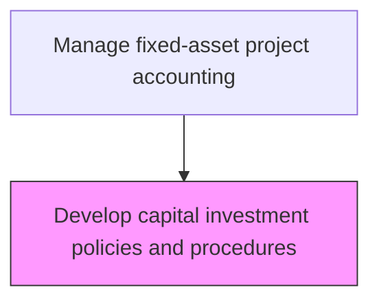
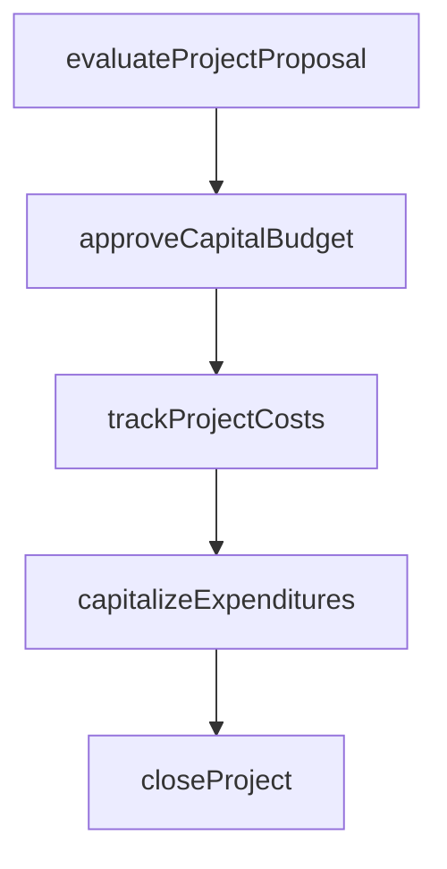

# Develop capital investment policies and procedures

> Business-as-Code definition for capital investment policies and procedures. Models the end-to-end process of develop capital investment policies and procedures as a programmable workflow.

## Overview

Creating procedures and policies to follow for investing in capital projects. Create rules and regulations regarding large investment plans, which require in-depth forecasting for expenditure and revenue. This includes defining approval thresholds, hurdle rates, and governance frameworks that standardize how the organization evaluates and authorizes capital investments. The resulting policies ensure consistent decision-making across business units while maintaining alignment with long-term strategic objectives and risk tolerance levels.

## Process Hierarchy



## GraphDL

```yaml
develop:
  object: Capital Investment Policies And Procedures
  actor: CapitalProjectAccountant
  result: CapitalInvestmentPoliciesAndProceduresPlan
```

## Actions

| Action | Description |
|--------|-------------|
| evaluateProjectProposal | Assess capital project requests against investment criteria |
| approveCapitalBudget | Authorize capital expenditure within approved funding limits |
| trackProjectCosts | Monitor actual capital expenditures against approved project budgets |
| capitalizeExpenditures | Reclassify qualifying costs from expense to fixed asset accounts |
| closeProject | Finalize project accounting and transfer assets to operating registers |

## Events

| Event | Description |
|-------|-------------|
| projectProposalEvaluated | Assess capital project requests against investment criteria |
| capitalBudgetApproved | Authorize capital expenditure within approved funding limits |
| projectCostsTracked | Monitor actual capital expenditures against approved project budgets |
| expendituresCapitalized | Qualifying costs reclassified from expense to fixed asset accounts |
| projectClosed | Finalize project accounting and transfer assets to operating registers |

## Searches

| Search | Description |
|--------|-------------|
| getCapitalInvestmentPoliciesAndProcedures | Retrieve capital investment policies and procedures records filtered by status, date, or owner |
| findCapitalInvestmentPoliciesAndProceduresByPeriod | Search capital investment policies and procedures data for a specified date range |
| getCapitalInvestmentPoliciesAndProceduresSummary | Retrieve summary statistics and trends for capital investment policies and procedures |
| listCapitalInvestmentPoliciesAndProceduresHistory | Query the audit trail and change history for capital investment policies and procedures records |

## Process Flow



## RACI Matrix

| Activity | Responsible | Accountable | Consulted | Informed |
|----------|-------------|-------------|-----------|----------|
| evaluateProjectProposal | CapitalProjectAccountant | Controller | BusinessUnitLeaders | CFO |
| approveCapitalBudget | Controller | CFO | FinancialAnalyst | BoardOfDirectors |
| trackProjectCosts | CapitalProjectAccountant | Controller | ProjectManager | FinancePlanning |
| capitalizeExpenditures | CapitalProjectAccountant | Controller | ExternalAuditors | TaxDepartment |
| closeProject | CapitalProjectAccountant | Controller | FixedAssetManager | InternalAudit |

## Related Processes

| Process | Relationship |
|---------|-------------|
| 9.4.1.2 Develop and approve capital expenditure plans and budgets | Downstream - policies feed budget creation |
| 9.4.1.3 Review and approve capital projects and fixed-asset acquisitions | Downstream - policies define approval criteria |
| 9.2.1 Perform general accounting | Related - capital policies align with chart of accounts standards |
| 9.4.1 | Parent - governing process group |

## Related Departments

| Department | Role |
|-----------|------|
| Capital Planning | Evaluates and approves capital investment proposals |
| Project Accounting | Tracks costs against approved capital budgets |
| Fixed Assets | Manages capitalization and depreciation |

## Related Occupations

| Occupation | Involvement |
|-----------|-------------|
| Capital Project Accountant | Project cost tracking and capitalization |
| Financial Analyst | Investment analysis and ROI evaluation |

## KPIs

| KPI | Description | Unit |
|-----|-------------|------|
| Capital Budget Utilization | Percentage of approved capital budget spent | % |
| Project Cost Variance | Deviation between actual and budgeted project costs | % |
| Capitalization Accuracy | Percentage of assets correctly capitalized | % |
| Policy Compliance Rate | Percentage of capital projects following approved investment policies | % |

## Usage

```typescript
import { developCapitalInvestmentPoliciesAndProcedures } from '@headlessly/develop-capital-investment-policies-and-procedures'

const client = developCapitalInvestmentPoliciesAndProcedures()

// Assess capital project requests against investment criteria
const result = await client.evaluateProjectProposal({
  period: '2025-Q4',
  scope: 'enterprise'
})

// Retrieve summary of current capital investment policies
const policies = await client.getCapitalInvestmentPoliciesAndProceduresSummary({
  fiscalYear: 2025,
  includeThresholds: true
})
```
