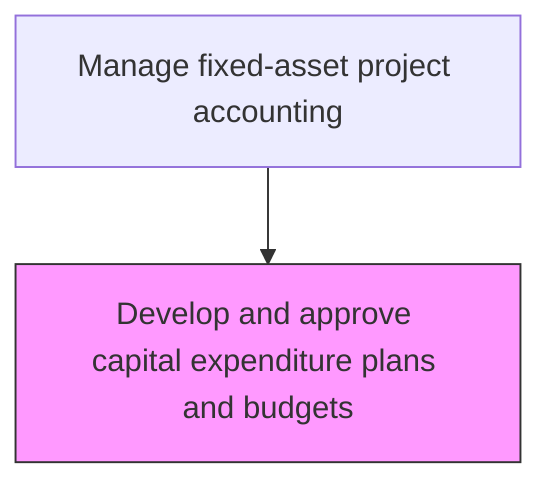
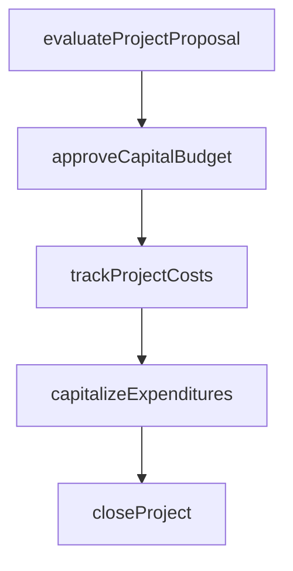

# Develop and approve capital expenditure plans and budgets

> Business-as-Code definition for approve capital expenditure plans and budgets. Models the end-to-end process of develop and approve capital expenditure plans and budgets as a programmable workflow.

## Overview

Creating budgets, and soliciting approvals for capital projects. Prepare budgets for projects that require heavy investments, consolidating requests from multiple business units into a prioritized capital expenditure plan. Secure approvals from management by presenting financial projections, strategic alignment assessments, and risk analyses. The approved capital budget serves as the financial blueprint governing all fixed-asset investments for the planning period.

## Process Hierarchy



## GraphDL

```yaml
develop:
  object: And Approve Capital Expenditure Plans And Budgets
  actor: CapitalProjectAccountant
  result: ApproveCapitalExpenditurePlansAndBudgetsPlan
```

## Actions

| Action | Description |
|--------|-------------|
| evaluateProjectProposal | Assess capital project requests against investment criteria |
| approveCapitalBudget | Authorize capital expenditure within approved funding limits |
| trackProjectCosts | Monitor actual capital expenditures against approved project budgets |
| capitalizeExpenditures | Reclassify qualifying costs from expense to fixed asset accounts |
| closeProject | Finalize project accounting and transfer assets to operating registers |

## Events

| Event | Description |
|-------|-------------|
| projectProposalEvaluated | Assess capital project requests against investment criteria |
| capitalBudgetApproved | Authorize capital expenditure within approved funding limits |
| projectCostsTracked | Monitor actual capital expenditures against approved project budgets |
| expendituresCapitalized | Qualifying costs reclassified from expense to fixed asset accounts |
| projectClosed | Finalize project accounting and transfer assets to operating registers |

## Searches

| Search | Description |
|--------|-------------|
| getApproveCapitalExpenditurePlansAndBudgets | Retrieve approve capital expenditure plans and budgets records filtered by status, date, or owner |
| findApproveCapitalExpenditurePlansAndBudgetsByPeriod | Search approve capital expenditure plans and budgets data for a specified date range |
| getApproveCapitalExpenditurePlansAndBudgetsSummary | Retrieve summary statistics and trends for approve capital expenditure plans and budgets |
| listApproveCapitalExpenditurePlansAndBudgetsHistory | Query the audit trail and change history for approve capital expenditure plans and budgets records |

## Process Flow



## RACI Matrix

| Activity | Responsible | Accountable | Consulted | Informed |
|----------|-------------|-------------|-----------|----------|
| evaluateProjectProposal | FinancialAnalyst | Controller | BusinessUnitLeaders | CFO |
| approveCapitalBudget | Controller | CFO | FinancePlanning | BoardOfDirectors |
| trackProjectCosts | CapitalProjectAccountant | Controller | ProjectManager | FinancePlanning |
| capitalizeExpenditures | CapitalProjectAccountant | Controller | ExternalAuditors | TaxDepartment |
| closeProject | CapitalProjectAccountant | Controller | FixedAssetManager | InternalAudit |

## Related Processes

| Process | Relationship |
|---------|-------------|
| 9.4.1.1 Develop capital investment policies and procedures | Upstream - policies govern budget development |
| 9.4.1.3 Review and approve capital projects and fixed-asset acquisitions | Downstream - approved budget enables project reviews |
| 9.1.3 Perform capital planning | Related - strategic capital plan informs expenditure budgets |
| 9.4.1 | Parent - governing process group |

## Related Departments

| Department | Role |
|-----------|------|
| Capital Planning | Evaluates and approves capital investment proposals |
| Project Accounting | Tracks costs against approved capital budgets |
| Fixed Assets | Manages capitalization and depreciation |

## Related Occupations

| Occupation | Involvement |
|-----------|-------------|
| Capital Project Accountant | Project cost tracking and capitalization |
| Financial Analyst | Investment analysis and ROI evaluation |

## KPIs

| KPI | Description | Unit |
|-----|-------------|------|
| Capital Budget Utilization | Percentage of approved capital budget spent | % |
| Project Cost Variance | Deviation between actual and budgeted project costs | % |
| Budget Approval Cycle Time | Average time from budget submission to final approval | Days |
| Capital Plan Coverage | Percentage of business unit requests incorporated into approved plan | % |

## Usage

```typescript
import { developAndApproveCapitalExpenditurePlansAndBudgets } from '@headlessly/develop-and-approve-capital-expenditure-plans-and-budgets'

const client = developAndApproveCapitalExpenditurePlansAndBudgets()

// Assess capital project requests against investment criteria
const result = await client.evaluateProjectProposal({
  period: '2025-Q4',
  scope: 'enterprise'
})

// Authorize the consolidated capital expenditure budget
await client.approveCapitalBudget({
  budgetId: result.id,
  fiscalYear: 2026,
  totalAmount: 12500000
})
```
