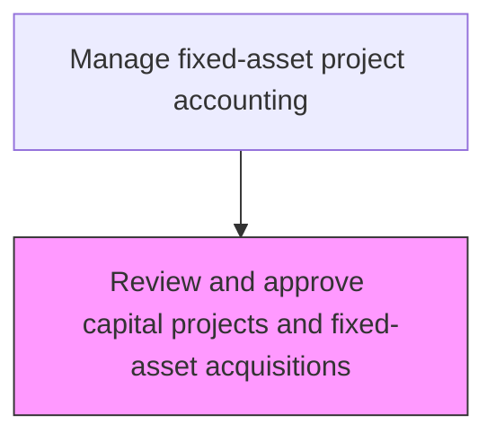
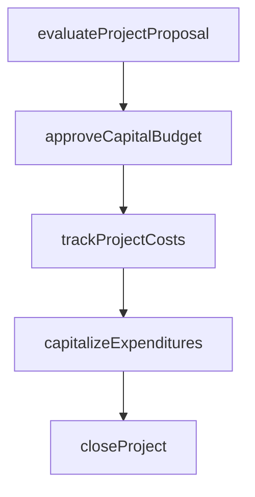

# Review and approve capital projects and fixed-asset acquisitions

> Business-as-Code definition for approve capital projects and fixed-asset acquisitions. Models the end-to-end process of review and approve capital projects and fixed-asset acquisitions as a programmable workflow.

## Overview

Evaluating and supporting capital investments in projects and fixed assets. Confirm details of capital projects against organizational investment criteria including net present value, internal rate of return, and payback period thresholds. Secure approvals from management for large investments by routing proposals through the appropriate authorization levels based on dollar amount and strategic classification. This gatekeeping process ensures that only financially sound and strategically aligned projects receive capital allocation.

## Process Hierarchy



## GraphDL

```yaml
review:
  object: And Approve Capital Projects And Fixed-asset Acquisitions
  actor: CapitalProjectAccountant
  result: ApproveCapitalProjectsAndFixedassetAcquisitionsReviewReport
```

## Actions

| Action | Description |
|--------|-------------|
| evaluateProjectProposal | Assess capital project requests against investment criteria |
| approveCapitalBudget | Authorize capital expenditure within approved funding limits |
| trackProjectCosts | Monitor actual capital expenditures against approved project budgets |
| capitalizeExpenditures | Reclassify qualifying costs from expense to fixed asset accounts |
| closeProject | Finalize project accounting and transfer assets to operating registers |

## Events

| Event | Description |
|-------|-------------|
| projectProposalEvaluated | Assess capital project requests against investment criteria |
| capitalBudgetApproved | Authorize capital expenditure within approved funding limits |
| projectCostsTracked | Monitor actual capital expenditures against approved project budgets |
| expendituresCapitalized | Qualifying costs reclassified from expense to fixed asset accounts |
| projectClosed | Finalize project accounting and transfer assets to operating registers |

## Searches

| Search | Description |
|--------|-------------|
| getApproveCapitalProjectsAndFixedassetAcquisitions | Retrieve approve capital projects and fixedasset acquisitions records filtered by status, date, or owner |
| findApproveCapitalProjectsAndFixedassetAcquisitionsByPeriod | Search approve capital projects and fixedasset acquisitions data for a specified date range |
| getApproveCapitalProjectsAndFixedassetAcquisitionsSummary | Retrieve summary statistics and trends for approve capital projects and fixedasset acquisitions |
| listApproveCapitalProjectsAndFixedassetAcquisitionsHistory | Query the audit trail and change history for approve capital projects and fixedasset acquisitions records |

## Process Flow



## RACI Matrix

| Activity | Responsible | Accountable | Consulted | Informed |
|----------|-------------|-------------|-----------|----------|
| evaluateProjectProposal | FinancialAnalyst | Controller | ProjectManager | BusinessUnitLeaders |
| approveCapitalBudget | CFO | BoardOfDirectors | Controller | FinancePlanning |
| trackProjectCosts | CapitalProjectAccountant | Controller | ProjectManager | CFO |
| capitalizeExpenditures | CapitalProjectAccountant | Controller | ExternalAuditors | FixedAssetManager |
| closeProject | CapitalProjectAccountant | Controller | InternalAudit | CFO |

## Related Processes

| Process | Relationship |
|---------|-------------|
| 9.4.1.2 Develop and approve capital expenditure plans and budgets | Upstream - approved budgets set funding envelope for project reviews |
| 9.4.1.4 Conduct financial justification for project approval | Downstream - approved projects require detailed financial justification |
| 9.4.2.1 Create project account codes | Downstream - approved projects need account codes for cost tracking |
| 9.4.1 | Parent - governing process group |

## Related Departments

| Department | Role |
|-----------|------|
| Capital Planning | Evaluates and approves capital investment proposals |
| Project Accounting | Tracks costs against approved capital budgets |
| Fixed Assets | Manages capitalization and depreciation |

## Related Occupations

| Occupation | Involvement |
|-----------|-------------|
| Capital Project Accountant | Project cost tracking and capitalization |
| Financial Analyst | Investment analysis and ROI evaluation |

## KPIs

| KPI | Description | Unit |
|-----|-------------|------|
| Capital Budget Utilization | Percentage of approved capital budget spent | % |
| Project Approval Cycle Time | Average elapsed time from proposal submission to approval decision | Days |
| Approval Rate | Percentage of submitted capital project proposals approved | % |
| Post-Approval Budget Adherence | Percentage of approved projects completed within original budget | % |

## Usage

```typescript
import { reviewAndApproveCapitalProjectsAndFixedassetAcquisitions } from '@headlessly/review-and-approve-capital-projects-and-fixed-asset-acquisitions'

const client = reviewAndApproveCapitalProjectsAndFixedassetAcquisitions()

// Assess capital project requests against investment criteria
const result = await client.evaluateProjectProposal({
  period: '2025-Q4',
  scope: 'enterprise'
})

// Track ongoing costs for an approved capital project
await client.trackProjectCosts({
  projectId: result.id,
  reportingPeriod: '2025-11'
})
```
