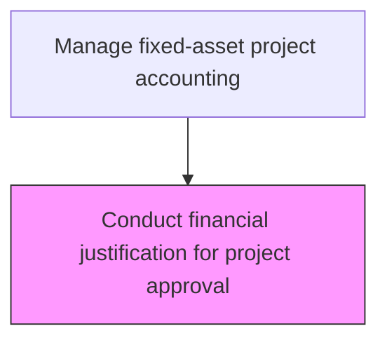
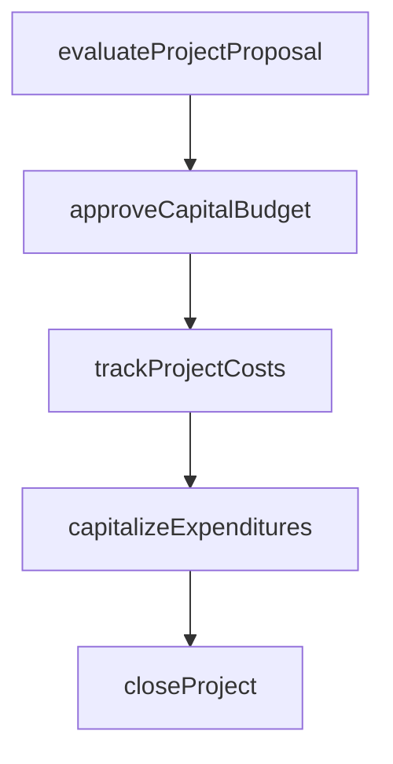

# Conduct financial justification for project approval

> Business-as-Code definition for financial justification for project approval. Models the end-to-end process of conduct financial justification for project approval as a programmable workflow.

## Overview

Reviewing all project business cases in order to substantiate projected financial gains. Validate any project's business case by performing discounted cash flow analysis, net present value calculations, and internal rate of return assessments. Juxtapose the benefits derived from moving a project forward against the associated costs, including opportunity costs of alternative investments. This rigorous financial justification ensures that capital is allocated to projects with the strongest risk-adjusted returns and strategic value.

## Process Hierarchy



## GraphDL

```yaml
conduct:
  object: Financial Justification For Project Approval
  actor: CapitalProjectAccountant
  result: FinancialJustificationForProjectApprovalRecord
```

## Actions

| Action | Description |
|--------|-------------|
| evaluateProjectProposal | Assess capital project requests against investment criteria |
| approveCapitalBudget | Authorize capital expenditure within approved funding limits |
| trackProjectCosts | Monitor actual capital expenditures against approved project budgets |
| capitalizeExpenditures | Reclassify qualifying costs from expense to fixed asset accounts |
| closeProject | Finalize project accounting and transfer assets to operating registers |

## Events

| Event | Description |
|-------|-------------|
| projectProposalEvaluated | Assess capital project requests against investment criteria |
| capitalBudgetApproved | Authorize capital expenditure within approved funding limits |
| projectCostsTracked | Monitor actual capital expenditures against approved project budgets |
| expendituresCapitalized | Qualifying costs reclassified from expense to fixed asset accounts |
| projectClosed | Finalize project accounting and transfer assets to operating registers |

## Searches

| Search | Description |
|--------|-------------|
| getFinancialJustificationForProjectApproval | Retrieve financial justification for project approval records filtered by status, date, or owner |
| findFinancialJustificationForProjectApprovalByPeriod | Search financial justification for project approval data for a specified date range |
| getFinancialJustificationForProjectApprovalSummary | Retrieve summary statistics and trends for financial justification for project approval |
| listFinancialJustificationForProjectApprovalHistory | Query the audit trail and change history for financial justification for project approval records |

## Process Flow



## RACI Matrix

| Activity | Responsible | Accountable | Consulted | Informed |
|----------|-------------|-------------|-----------|----------|
| evaluateProjectProposal | FinancialAnalyst | Controller | ProjectManager | BusinessUnitLeaders |
| approveCapitalBudget | Controller | CFO | FinancePlanning | BoardOfDirectors |
| trackProjectCosts | CapitalProjectAccountant | Controller | ProjectManager | CFO |
| capitalizeExpenditures | CapitalProjectAccountant | Controller | ExternalAuditors | TaxDepartment |
| closeProject | CapitalProjectAccountant | Controller | FixedAssetManager | InternalAudit |

## Related Processes

| Process | Relationship |
|---------|-------------|
| 9.4.1.3 Review and approve capital projects and fixed-asset acquisitions | Upstream - project approval triggers financial justification |
| 9.4.2.1 Create project account codes | Downstream - justified projects receive account codes |
| 9.4.2.5 Measure financial returns on completed capital projects | Related - post-completion returns validate justification assumptions |
| 9.4.1 | Parent - governing process group |

## Related Departments

| Department | Role |
|-----------|------|
| Capital Planning | Evaluates and approves capital investment proposals |
| Project Accounting | Tracks costs against approved capital budgets |
| Fixed Assets | Manages capitalization and depreciation |

## Related Occupations

| Occupation | Involvement |
|-----------|-------------|
| Capital Project Accountant | Project cost tracking and capitalization |
| Financial Analyst | Investment analysis and ROI evaluation |

## KPIs

| KPI | Description | Unit |
|-----|-------------|------|
| NPV Accuracy | Variance between projected and actual net present value at project completion | % |
| Business Case Approval Rate | Percentage of financial justifications that pass investment committee review | % |
| Payback Period Accuracy | Deviation between estimated and actual payback period | Months |
| IRR Achievement Rate | Percentage of completed projects meeting or exceeding target internal rate of return | % |

## Usage

```typescript
import { conductFinancialJustificationForProjectApproval } from '@headlessly/conduct-financial-justification-for-project-approval'

const client = conductFinancialJustificationForProjectApproval()

// Assess capital project requests against investment criteria
const result = await client.evaluateProjectProposal({
  period: '2025-Q4',
  scope: 'enterprise'
})

// Retrieve financial justification history for completed projects
const justifications = await client.getFinancialJustificationForProjectApprovalSummary({
  fiscalYear: 2025,
  status: 'approved'
})
```
