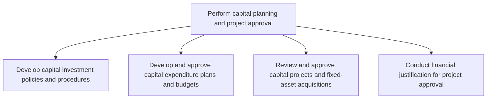
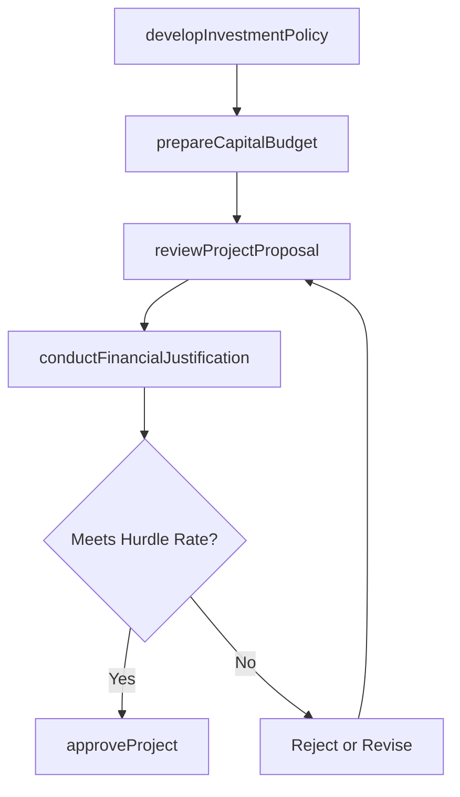

# Perform capital planning and project approval

> Business-as-Code definition for capital planning and project approval. Models investment policy development, capital expenditure budgeting, project review and authorization, and financial justification analysis as programmable APIs.

## Overview

Preparing a project finance report to solicit approvals in capital projects. Prepare budgets for projects that require heavy investments. Report on project finances to solicit approvals from management.

## Process Hierarchy



## GraphDL

```yaml
perform:
  object: Capital Planning And Project Approval
  actor: CapitalPlanningAnalyst
  result: ProjectApprovalDecision
```

## Actions

| Action | Description |
|--------|-------------|
| developInvestmentPolicy | Define capital investment criteria, hurdle rates, and approval thresholds |
| prepareCapitalBudget | Compile capital expenditure plans and funding requests |
| reviewProjectProposal | Evaluate project business cases against investment criteria |
| conductFinancialJustification | Perform NPV, IRR, and payback period analysis for proposed projects |
| approveProject | Authorize capital project funding and set spending limits |

## Events

| Event | Description |
|-------|-------------|
| investmentPolicyDeveloped | Capital investment policies and hurdle rates established |
| capitalBudgetPrepared | Capital expenditure plan compiled and submitted for review |
| projectProposalReviewed | Project business case evaluated against criteria |
| financialJustificationConducted | Financial return analysis completed for project proposal |
| projectApproved | Capital project authorized with approved funding |

## Searches

| Search | Description |
|--------|-------------|
| getCapitalBudget | Retrieve capital expenditure budget by year, department, or category |
| getProjectProposals | List project proposals by status, sponsor, or investment size |
| getFinancialJustification | Retrieve NPV, IRR, and payback analysis for a project |
| getApprovalHistory | Query capital project approval decisions and rationale |

## Process Flow



## RACI Matrix

| Activity | Responsible | Accountable | Consulted | Informed |
|----------|-------------|-------------|-----------|----------|
| developInvestmentPolicy | FP&A Manager | CFO | Treasury | Board of Directors |
| prepareCapitalBudget | Capital Planning Analyst | FP&A Manager | Department Heads | Controller |
| conductFinancialJustification | Financial Analyst | FP&A Manager | Project Sponsor | CFO |
| approveProject | Capital Committee | CFO | Legal | Controller |

## Sub-Processes

| ID | Name | Description |
|----|------|-------------|
| 9.4.1.1 | Develop capital investment policies and procedures | Creating procedures and policies to follow for investing in capital projects. Create rules and regul |
| 9.4.1.2 | Develop and approve capital expenditure plans and budgets | Creating budgets, and soliciting approvals for capital projects. Prepare budgets for projects that r |
| 9.4.1.3 | Review and approve capital projects and fixed-asset acquisitions | Evaluating and supporting capital investments in projects and fixed assets. Confirm details of capit |
| 9.4.1.4 | Conduct financial justification for project approval | Reviewing all project business cases in order to substantiate projected financial gains. Validate an |

## Related Processes

| Process | Relationship |
|---------|-------------|
| 9.4.2 Perform capital project accounting | Downstream - approved projects move to accounting and tracking |
| 9.1.1 Perform planning/budgeting/forecasting | Upstream - capital budget aligns with overall financial plan |
| 9.3.3 Perform fixed-asset accounting | Downstream - approved acquisitions become fixed assets |

## Related Departments

| Department | Role |
|-----------|------|
| Finance | Leads capital budgeting and financial justification |
| Engineering | Sponsors and scopes capital projects |
| Procurement | Provides cost estimates for equipment and construction |
| Executive Leadership | Approves projects above delegation thresholds |

## Related Occupations

| Occupation | Involvement |
|-----------|-------------|
| Capital Planning Analyst | Builds capital budgets and evaluates project proposals |
| Financial Analyst | Performs NPV, IRR, and payback analysis |
| Project Sponsor | Champions and justifies capital investment requests |

## KPIs

| KPI | Description | Unit |
|-----|-------------|------|
| Capital Budget Approval Cycle Time | Days from proposal submission to final approval | Days |
| Project Approval Rate | Percentage of submitted projects that receive approval | % |
| Average Hurdle Rate Achievement | Average IRR of approved projects relative to hurdle rate | % |
| Capital Plan Accuracy | Variance between planned and actual capital spending | % |

## Usage

```typescript
import { performCapitalPlanningAndProjectApproval } from '@headlessly/perform-capital-planning-and-project-approval'

const capPlan = performCapitalPlanningAndProjectApproval()

// Submit a project proposal for review
const proposal = await capPlan.reviewProjectProposal({
  projectName: 'Warehouse Automation Phase 3',
  sponsor: 'VP Operations',
  estimatedCost: 3200000,
  expectedBenefits: 'Reduce labor costs by 25% in fulfillment'
})

// Conduct financial justification
const justification = await capPlan.conductFinancialJustification({
  projectId: proposal.id,
  discountRate: 0.10,
  cashFlows: [0, 800000, 900000, 1000000, 1100000]
})
```
