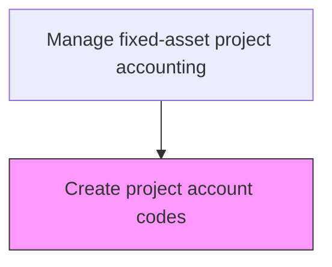
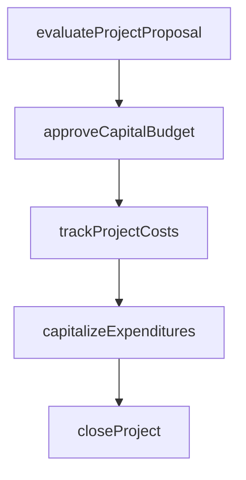

# Create project account codes

> Business-as-Code definition for project account codes. Models the end-to-end process of create project account codes as a programmable workflow.

## Overview

Establishing unique reference codes and account structures for each approved capital project within the general ledger and project accounting systems. Each project account code maps to the chart of accounts hierarchy, enabling granular cost capture across labor, materials, equipment, and overhead categories. Properly structured account codes ensure accurate cost accumulation, facilitate budget-to-actual variance reporting, and support downstream capitalization and fixed-asset transfer processes.

## Process Hierarchy



## GraphDL

```yaml
create:
  object: Project Account Codes
  actor: CapitalProjectAccountant
  result: ProjectAccountCodesRecord
```

## Actions

| Action | Description |
|--------|-------------|
| evaluateProjectProposal | Assess capital project requests against investment criteria |
| approveCapitalBudget | Authorize capital expenditure within approved funding limits |
| trackProjectCosts | Monitor actual capital expenditures against approved project budgets |
| capitalizeExpenditures | Reclassify qualifying costs from expense to fixed asset accounts |
| closeProject | Finalize project accounting and transfer assets to operating registers |

## Events

| Event | Description |
|-------|-------------|
| projectProposalEvaluated | Assess capital project requests against investment criteria |
| capitalBudgetApproved | Authorize capital expenditure within approved funding limits |
| projectCostsTracked | Monitor actual capital expenditures against approved project budgets |
| expendituresCapitalized | Qualifying costs reclassified from expense to fixed asset accounts |
| projectClosed | Finalize project accounting and transfer assets to operating registers |

## Searches

| Search | Description |
|--------|-------------|
| getProjectAccountCodes | Retrieve project account codes records filtered by status, date, or owner |
| findProjectAccountCodesByPeriod | Search project account codes data for a specified date range |
| getProjectAccountCodesSummary | Retrieve summary statistics and trends for project account codes |
| listProjectAccountCodesHistory | Query the audit trail and change history for project account codes records |

## Process Flow



## RACI Matrix

| Activity | Responsible | Accountable | Consulted | Informed |
|----------|-------------|-------------|-----------|----------|
| evaluateProjectProposal | CapitalProjectAccountant | Controller | ProjectManager | CFO |
| approveCapitalBudget | Controller | CFO | FinancePlanning | BusinessUnitLeaders |
| trackProjectCosts | CapitalProjectAccountant | Controller | ProjectManager | FinancePlanning |
| capitalizeExpenditures | CapitalProjectAccountant | Controller | ExternalAuditors | FixedAssetManager |
| closeProject | CapitalProjectAccountant | Controller | InternalAudit | CFO |

## Related Processes

| Process | Relationship |
|---------|-------------|
| 9.4.1.3 Review and approve capital projects and fixed-asset acquisitions | Upstream - approved projects trigger account code creation |
| 9.4.2.2 Record project-related transactions | Downstream - account codes enable transaction recording |
| 9.2.1 Perform general accounting | Related - account codes must align with chart of accounts |
| 9.4.2 | Parent - governing process group |

## Related Departments

| Department | Role |
|-----------|------|
| Capital Planning | Evaluates and approves capital investment proposals |
| Project Accounting | Tracks costs against approved capital budgets |
| Fixed Assets | Manages capitalization and depreciation |

## Related Occupations

| Occupation | Involvement |
|-----------|-------------|
| Capital Project Accountant | Project cost tracking and capitalization |
| Financial Analyst | Investment analysis and ROI evaluation |

## KPIs

| KPI | Description | Unit |
|-----|-------------|------|
| Account Code Setup Time | Average elapsed time from project approval to account code activation | Days |
| Account Code Accuracy | Percentage of project account codes correctly mapped to chart of accounts | % |
| Cost Element Coverage | Percentage of project cost categories with dedicated account codes | % |
| Duplicate Code Rate | Number of duplicate or redundant project account codes per period | Count |

## Usage

```typescript
import { createProjectAccountCodes } from '@headlessly/create-project-account-codes'

const client = createProjectAccountCodes()

// Assess capital project requests against investment criteria
const result = await client.evaluateProjectProposal({
  period: '2025-Q4',
  scope: 'enterprise'
})

// List all active project account codes for a given fiscal year
const codes = await client.getProjectAccountCodes({
  fiscalYear: 2025,
  status: 'active'
})
```
