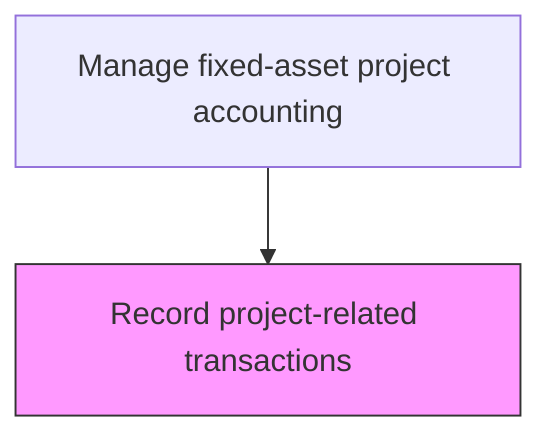
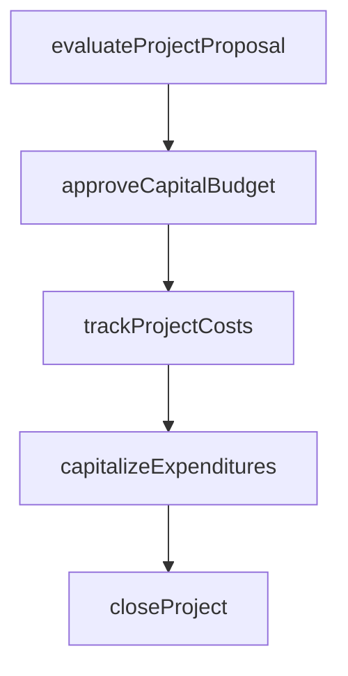

# Record project-related transactions

> Business-as-Code definition for project-related transactions. Models the end-to-end process of record project-related transactions as a programmable workflow.

## Overview

Noting every transaction during a project in a common financial database. Document all transactions associated with any project, including purchase orders, vendor invoices, labor charges, and material requisitions. Maintain a centralized repository of all such financial data to support real-time budget monitoring and audit trail requirements. Accurate and timely transaction recording is critical for reliable cost reporting, variance analysis, and eventual asset capitalization at project completion.

## Process Hierarchy



## GraphDL

```yaml
record:
  object: Project-related Transactions
  actor: CapitalProjectAccountant
  result: ProjectrelatedTransactionsJournalEntry
```

## Actions

| Action | Description |
|--------|-------------|
| evaluateProjectProposal | Assess capital project requests against investment criteria |
| approveCapitalBudget | Authorize capital expenditure within approved funding limits |
| trackProjectCosts | Monitor actual capital expenditures against approved project budgets |
| capitalizeExpenditures | Reclassify qualifying costs from expense to fixed asset accounts |
| closeProject | Finalize project accounting and transfer assets to operating registers |

## Events

| Event | Description |
|-------|-------------|
| projectProposalEvaluated | Assess capital project requests against investment criteria |
| capitalBudgetApproved | Authorize capital expenditure within approved funding limits |
| projectCostsTracked | Monitor actual capital expenditures against approved project budgets |
| expendituresCapitalized | Qualifying costs reclassified from expense to fixed asset accounts |
| projectClosed | Finalize project accounting and transfer assets to operating registers |

## Searches

| Search | Description |
|--------|-------------|
| getProjectrelatedTransactions | Retrieve projectrelated transactions records filtered by status, date, or owner |
| findProjectrelatedTransactionsByPeriod | Search projectrelated transactions data for a specified date range |
| getProjectrelatedTransactionsSummary | Retrieve summary statistics and trends for projectrelated transactions |
| listProjectrelatedTransactionsHistory | Query the audit trail and change history for projectrelated transactions records |

## Process Flow



## RACI Matrix

| Activity | Responsible | Accountable | Consulted | Informed |
|----------|-------------|-------------|-----------|----------|
| evaluateProjectProposal | CapitalProjectAccountant | Controller | ProjectManager | CFO |
| approveCapitalBudget | Controller | CFO | FinancePlanning | BusinessUnitLeaders |
| trackProjectCosts | CapitalProjectAccountant | Controller | ProjectManager | FinancePlanning |
| capitalizeExpenditures | CapitalProjectAccountant | Controller | ExternalAuditors | FixedAssetManager |
| closeProject | CapitalProjectAccountant | Controller | InternalAudit | CFO |

## Related Processes

| Process | Relationship |
|---------|-------------|
| 9.4.2.1 Create project account codes | Upstream - account codes must exist before transactions can be recorded |
| 9.4.2.3 Monitor and track capital projects and budget spending | Downstream - recorded transactions feed budget monitoring |
| 9.2.2 Perform fixed-asset accounting | Related - transactions contribute to fixed-asset ledger balances |
| 9.4.2 | Parent - governing process group |

## Related Departments

| Department | Role |
|-----------|------|
| Capital Planning | Evaluates and approves capital investment proposals |
| Project Accounting | Tracks costs against approved capital budgets |
| Fixed Assets | Manages capitalization and depreciation |

## Related Occupations

| Occupation | Involvement |
|-----------|-------------|
| Capital Project Accountant | Project cost tracking and capitalization |
| Financial Analyst | Investment analysis and ROI evaluation |

## KPIs

| KPI | Description | Unit |
|-----|-------------|------|
| Transaction Recording Timeliness | Average days between transaction occurrence and system entry | Days |
| Misclassification Rate | Percentage of project transactions posted to incorrect account codes | % |
| Project Cost Variance | Deviation between actual and budgeted project costs | % |
| Transaction Volume per Project | Average number of financial transactions recorded per capital project | Count |

## Usage

```typescript
import { recordProjectrelatedTransactions } from '@headlessly/record-project-related-transactions'

const client = recordProjectrelatedTransactions()

// Assess capital project requests against investment criteria
const result = await client.evaluateProjectProposal({
  period: '2025-Q4',
  scope: 'enterprise'
})

// Track project costs against the approved budget
await client.trackProjectCosts({
  projectId: result.id,
  reportingPeriod: '2025-11'
})
```
