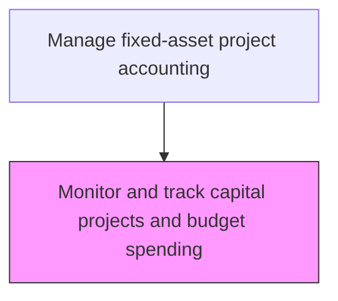
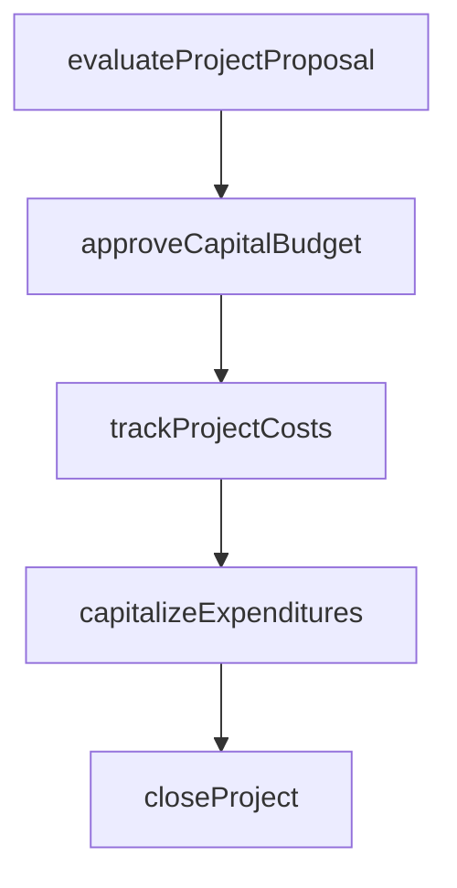

# Monitor and track capital projects and budget spending

> Business-as-Code definition for track capital projects and budget spending. Models the end-to-end process of monitor and track capital projects and budget spending as a programmable workflow.

## Overview

Evaluating project progress and funds invested against approved capital budgets on an ongoing basis. Observe and track significant funds invested on any long-term project, comparing actual expenditures to planned milestones and budget allocations. Generate variance reports that highlight cost overruns, schedule delays, and scope changes requiring management attention. This continuous monitoring enables proactive decision-making on whether to continue, modify, or terminate capital projects based on financial performance.

## Process Hierarchy



## GraphDL

```yaml
monitor:
  object: And Track Capital Projects And Budget Spending
  actor: CapitalProjectAccountant
  result: TrackCapitalProjectsAndBudgetSpendingDashboard
```

## Actions

| Action | Description |
|--------|-------------|
| evaluateProjectProposal | Assess capital project requests against investment criteria |
| approveCapitalBudget | Authorize capital expenditure within approved funding limits |
| trackProjectCosts | Monitor actual capital expenditures against approved project budgets |
| capitalizeExpenditures | Reclassify qualifying costs from expense to fixed asset accounts |
| closeProject | Finalize project accounting and transfer assets to operating registers |

## Events

| Event | Description |
|-------|-------------|
| projectProposalEvaluated | Assess capital project requests against investment criteria |
| capitalBudgetApproved | Authorize capital expenditure within approved funding limits |
| projectCostsTracked | Monitor actual capital expenditures against approved project budgets |
| expendituresCapitalized | Qualifying costs reclassified from expense to fixed asset accounts |
| projectClosed | Finalize project accounting and transfer assets to operating registers |

## Searches

| Search | Description |
|--------|-------------|
| getTrackCapitalProjectsAndBudgetSpending | Retrieve track capital projects and budget spending records filtered by status, date, or owner |
| findTrackCapitalProjectsAndBudgetSpendingByPeriod | Search track capital projects and budget spending data for a specified date range |
| getTrackCapitalProjectsAndBudgetSpendingSummary | Retrieve summary statistics and trends for track capital projects and budget spending |
| listTrackCapitalProjectsAndBudgetSpendingHistory | Query the audit trail and change history for track capital projects and budget spending records |

## Process Flow



## RACI Matrix

| Activity | Responsible | Accountable | Consulted | Informed |
|----------|-------------|-------------|-----------|----------|
| evaluateProjectProposal | CapitalProjectAccountant | Controller | ProjectManager | CFO |
| approveCapitalBudget | Controller | CFO | FinancePlanning | BoardOfDirectors |
| trackProjectCosts | CapitalProjectAccountant | Controller | ProjectManager | BusinessUnitLeaders |
| capitalizeExpenditures | CapitalProjectAccountant | Controller | ExternalAuditors | FixedAssetManager |
| closeProject | CapitalProjectAccountant | Controller | InternalAudit | CFO |

## Related Processes

| Process | Relationship |
|---------|-------------|
| 9.4.2.2 Record project-related transactions | Upstream - recorded transactions provide data for monitoring |
| 9.4.2.4 Close/capitalize projects | Downstream - monitoring informs project closure decisions |
| 9.4.1.2 Develop and approve capital expenditure plans and budgets | Related - approved budgets provide baselines for tracking |
| 9.4.2 | Parent - governing process group |

## Related Departments

| Department | Role |
|-----------|------|
| Capital Planning | Evaluates and approves capital investment proposals |
| Project Accounting | Tracks costs against approved capital budgets |
| Fixed Assets | Manages capitalization and depreciation |

## Related Occupations

| Occupation | Involvement |
|-----------|-------------|
| Capital Project Accountant | Project cost tracking and capitalization |
| Financial Analyst | Investment analysis and ROI evaluation |

## KPIs

| KPI | Description | Unit |
|-----|-------------|------|
| Capital Budget Utilization | Percentage of approved capital budget spent | % |
| Project Cost Variance | Deviation between actual and budgeted project costs | % |
| Schedule Variance | Deviation between planned and actual project milestone dates | Days |
| Budget Overrun Frequency | Percentage of active projects exceeding approved budget thresholds | % |

## Usage

```typescript
import { monitorAndTrackCapitalProjectsAndBudgetSpending } from '@headlessly/monitor-and-track-capital-projects-and-budget-spending'

const client = monitorAndTrackCapitalProjectsAndBudgetSpending()

// Assess capital project requests against investment criteria
const result = await client.evaluateProjectProposal({
  period: '2025-Q4',
  scope: 'enterprise'
})

// Retrieve budget spending summary across all active capital projects
const dashboard = await client.getTrackCapitalProjectsAndBudgetSpendingSummary({
  fiscalYear: 2025,
  includeVariances: true
})
```
