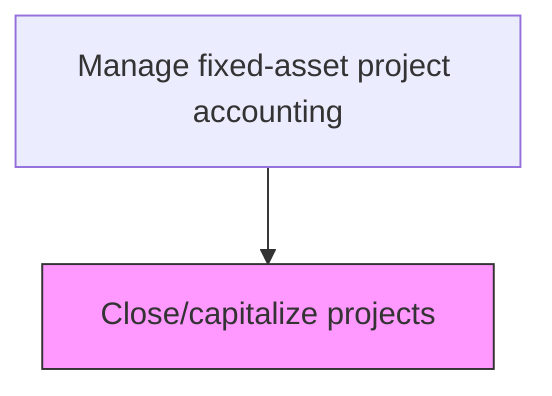
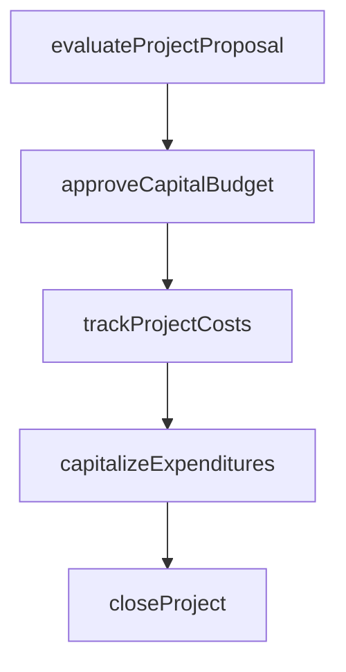

# Close/capitalize projects

> Business-as-Code definition for projects. Models the end-to-end process of close/capitalize projects as a programmable workflow.

## Overview

Finalizing capital project accounting and transferring accumulated costs to the fixed-asset register upon project completion. This process involves reconciling all project-related transactions, verifying that costs meet capitalization criteria under applicable accounting standards, and reclassifying qualifying expenditures from construction-in-progress to depreciable fixed-asset accounts. Proper project closure ensures accurate asset valuations, triggers depreciation schedules, and releases unused budget allocations back to the capital pool.

## Process Hierarchy



## GraphDL

```yaml
closecapitalize:
  object: Projects
  actor: CapitalProjectAccountant
  result: ProjectsRecord
```

## Actions

| Action | Description |
|--------|-------------|
| evaluateProjectProposal | Assess capital project requests against investment criteria |
| approveCapitalBudget | Authorize capital expenditure within approved funding limits |
| trackProjectCosts | Monitor actual capital expenditures against approved project budgets |
| capitalizeExpenditures | Reclassify qualifying costs from expense to fixed asset accounts |
| closeProject | Finalize project accounting and transfer assets to operating registers |

## Events

| Event | Description |
|-------|-------------|
| projectProposalEvaluated | Assess capital project requests against investment criteria |
| capitalBudgetApproved | Authorize capital expenditure within approved funding limits |
| projectCostsTracked | Monitor actual capital expenditures against approved project budgets |
| expendituresCapitalized | Qualifying costs reclassified from expense to fixed asset accounts |
| projectClosed | Project accounting finalized and assets transferred to operating registers |

## Searches

| Search | Description |
|--------|-------------|
| getProjects | Retrieve projects records filtered by status, date, or owner |
| findProjectsByPeriod | Search projects data for a specified date range |
| getProjectsSummary | Retrieve summary statistics and trends for projects |
| listProjectsHistory | Query the audit trail and change history for projects records |

## Process Flow



## RACI Matrix

| Activity | Responsible | Accountable | Consulted | Informed |
|----------|-------------|-------------|-----------|----------|
| evaluateProjectProposal | CapitalProjectAccountant | Controller | ProjectManager | CFO |
| approveCapitalBudget | Controller | CFO | FinancePlanning | BusinessUnitLeaders |
| trackProjectCosts | CapitalProjectAccountant | Controller | ProjectManager | FinancePlanning |
| capitalizeExpenditures | CapitalProjectAccountant | Controller | ExternalAuditors | FixedAssetManager |
| closeProject | CapitalProjectAccountant | Controller | InternalAudit | TaxDepartment |

## Related Processes

| Process | Relationship |
|---------|-------------|
| 9.4.2.3 Monitor and track capital projects and budget spending | Upstream - budget tracking confirms project readiness for closure |
| 9.4.2.5 Measure financial returns on completed capital projects | Downstream - closed projects undergo return measurement |
| 9.2.2 Perform fixed-asset accounting | Related - capitalized assets transfer to fixed-asset register |
| 9.4.2 | Parent - governing process group |

## Related Departments

| Department | Role |
|-----------|------|
| Capital Planning | Evaluates and approves capital investment proposals |
| Project Accounting | Tracks costs against approved capital budgets |
| Fixed Assets | Manages capitalization and depreciation |

## Related Occupations

| Occupation | Involvement |
|-----------|-------------|
| Capital Project Accountant | Project cost tracking and capitalization |
| Financial Analyst | Investment analysis and ROI evaluation |

## KPIs

| KPI | Description | Unit |
|-----|-------------|------|
| Capitalization Accuracy | Percentage of assets correctly capitalized per accounting standards | % |
| Project Closure Cycle Time | Average days from project completion to final accounting closure | Days |
| Budget Remaining at Closure | Average unspent budget released upon project closure | USD |
| Asset Transfer Accuracy | Percentage of assets transferred to fixed-asset register without reclassification | % |

## Usage

```typescript
import { closecapitalizeProjects } from '@headlessly/close-capitalize-projects'

const client = closecapitalizeProjects()

// Assess capital project requests against investment criteria
const result = await client.evaluateProjectProposal({
  period: '2025-Q4',
  scope: 'enterprise'
})

// Capitalize expenditures and transfer to fixed-asset register
await client.capitalizeExpenditures({
  projectId: result.id,
  assetClass: 'machinery-and-equipment',
  usefulLifeYears: 10
})
```
