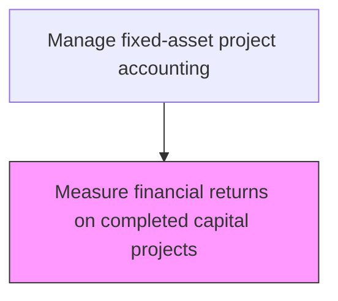
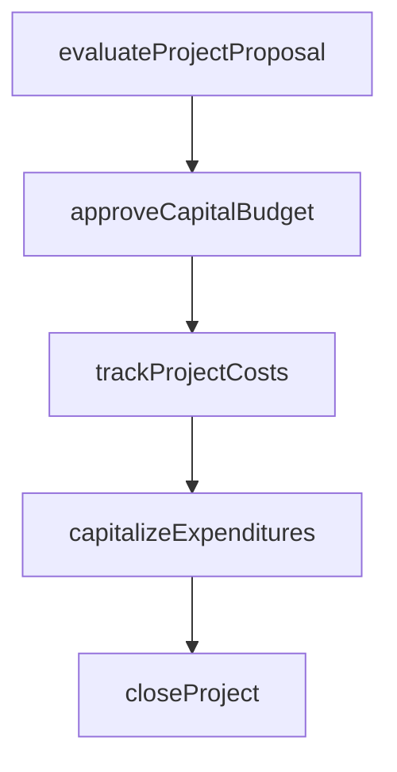

# Measure financial returns on completed capital projects

> Business-as-Code definition for financial returns on completed capital projects. Models the end-to-end process of measure financial returns on completed capital projects as a programmable workflow.

## Overview

Comparing a finished project's profitability with forecasted returns from the original business case and financial justification. Scrutinize revenues generated by completed projects that required heavy investments, calculating actual return on investment, payback period, and internal rate of return against projected targets. Determine profitability and document lessons learned to improve the accuracy of future capital investment forecasting. This post-completion review closes the feedback loop between capital planning and realized financial outcomes.

## Process Hierarchy



## GraphDL

```yaml
measure:
  object: Financial Returns On Completed Capital Projects
  actor: CapitalProjectAccountant
  result: FinancialReturnsOnCompletedCapitalProjectsMeasurement
```

## Actions

| Action | Description |
|--------|-------------|
| evaluateProjectProposal | Assess capital project requests against investment criteria |
| approveCapitalBudget | Authorize capital expenditure within approved funding limits |
| trackProjectCosts | Monitor actual capital expenditures against approved project budgets |
| capitalizeExpenditures | Reclassify qualifying costs from expense to fixed asset accounts |
| closeProject | Finalize project accounting and transfer assets to operating registers |

## Events

| Event | Description |
|-------|-------------|
| projectProposalEvaluated | Assess capital project requests against investment criteria |
| capitalBudgetApproved | Authorize capital expenditure within approved funding limits |
| projectCostsTracked | Monitor actual capital expenditures against approved project budgets |
| expendituresCapitalized | Qualifying costs reclassified from expense to fixed asset accounts |
| projectClosed | Finalize project accounting and transfer assets to operating registers |

## Searches

| Search | Description |
|--------|-------------|
| getFinancialReturnsOnCompletedCapitalProjects | Retrieve financial returns on completed capital projects records filtered by status, date, or owner |
| findFinancialReturnsOnCompletedCapitalProjectsByPeriod | Search financial returns on completed capital projects data for a specified date range |
| getFinancialReturnsOnCompletedCapitalProjectsSummary | Retrieve summary statistics and trends for financial returns on completed capital projects |
| listFinancialReturnsOnCompletedCapitalProjectsHistory | Query the audit trail and change history for financial returns on completed capital projects records |

## Process Flow



## RACI Matrix

| Activity | Responsible | Accountable | Consulted | Informed |
|----------|-------------|-------------|-----------|----------|
| evaluateProjectProposal | FinancialAnalyst | Controller | ProjectManager | CFO |
| approveCapitalBudget | Controller | CFO | FinancePlanning | BoardOfDirectors |
| trackProjectCosts | CapitalProjectAccountant | Controller | ProjectManager | BusinessUnitLeaders |
| capitalizeExpenditures | CapitalProjectAccountant | Controller | ExternalAuditors | FixedAssetManager |
| closeProject | CapitalProjectAccountant | Controller | InternalAudit | CFO |

## Related Processes

| Process | Relationship |
|---------|-------------|
| 9.4.2.4 Close/capitalize projects | Upstream - closed projects are ready for return measurement |
| 9.4.1.4 Conduct financial justification for project approval | Related - actual returns validate original justification assumptions |
| 9.4.1.1 Develop capital investment policies and procedures | Related - return measurements inform policy refinement |
| 9.4.2 | Parent - governing process group |

## Related Departments

| Department | Role |
|-----------|------|
| Capital Planning | Evaluates and approves capital investment proposals |
| Project Accounting | Tracks costs against approved capital budgets |
| Fixed Assets | Manages capitalization and depreciation |

## Related Occupations

| Occupation | Involvement |
|-----------|-------------|
| Capital Project Accountant | Project cost tracking and capitalization |
| Financial Analyst | Investment analysis and ROI evaluation |

## KPIs

| KPI | Description | Unit |
|-----|-------------|------|
| Actual vs. Projected ROI | Variance between actual and forecasted return on investment | % |
| Payback Period Accuracy | Deviation between estimated and realized payback period | Months |
| Post-Completion Review Rate | Percentage of completed projects receiving formal return analysis | % |
| Capital Forecast Accuracy | Percentage of projects where actual returns fell within projected range | % |

## Usage

```typescript
import { measureFinancialReturnsOnCompletedCapitalProjects } from '@headlessly/measure-financial-returns-on-completed-capital-projects'

const client = measureFinancialReturnsOnCompletedCapitalProjects()

// Assess capital project requests against investment criteria
const result = await client.evaluateProjectProposal({
  period: '2025-Q4',
  scope: 'enterprise'
})

// Retrieve return measurement data for completed projects in a fiscal year
const returns = await client.getFinancialReturnsOnCompletedCapitalProjectsSummary({
  fiscalYear: 2025,
  includeVarianceAnalysis: true
})
```
