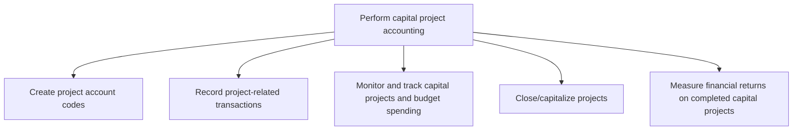
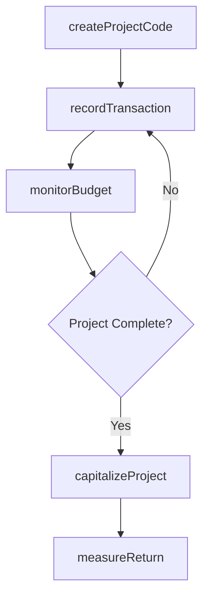

# Perform capital project accounting

> Business-as-Code definition for capital project accounting. Models project code creation, transaction recording, budget monitoring, project capitalization, and return measurement as programmable APIs.

## Overview

Accounting for large-scale and large-cost investments. Manage and account for ongoing activities related to capital projects, including setting up new projects, recording project transactions, monitoring and tracking spending, closing and capitalizing projects, and measuring the financial returns on completed projects.

## Process Hierarchy



## GraphDL

```yaml
perform:
  object: Capital Project Accounting
  actor: ProjectAccountant
  result: CapitalProjectLedger
```

## Actions

| Action | Description |
|--------|-------------|
| createProjectCode | Establish accounting codes and cost elements for a new project |
| recordTransaction | Post capital expenditures, labor, and materials to the project ledger |
| monitorBudget | Track actual spending against approved project budget |
| capitalizeProject | Transfer completed project costs to the fixed-asset register |
| measureReturn | Calculate actual ROI and compare to original financial justification |

## Events

| Event | Description |
|-------|-------------|
| projectCodeCreated | Project accounting structure established in the ledger |
| transactionRecorded | Capital expenditure posted to the project account |
| budgetMonitored | Project spending status reviewed and reported |
| projectCapitalized | Completed project costs transferred to fixed assets |
| returnMeasured | Post-completion financial return analysis completed |

## Searches

| Search | Description |
|--------|-------------|
| getProjectLedger | Retrieve all transactions for a specific capital project |
| getProjectBudgetStatus | Compare actual spend to approved budget by cost element |
| getOpenProjects | List active capital projects by status, budget, or sponsor |
| getCapitalizationHistory | Query projects capitalized in a given period |

## Process Flow



## RACI Matrix

| Activity | Responsible | Accountable | Consulted | Informed |
|----------|-------------|-------------|-----------|----------|
| createProjectCode | Project Accountant | Controller | Project Manager | FP&A |
| recordTransaction | Project Accountant | Controller | Procurement | Project Manager |
| monitorBudget | Project Accountant | Controller | Project Manager | CFO |
| capitalizeProject | Fixed-Asset Accountant | Controller | Tax Manager | Internal Audit |

## Sub-Processes

| ID | Name | Description |
|----|------|-------------|
| 9.4.2.1 | Create project account codes | Giving reference codes for every project. |
| 9.4.2.2 | Record project-related transactions | Noting every transaction during a project in a common financial database. Document all transactions  |
| 9.4.2.3 | Monitor and track capital projects and budget spending | Evaluating project progress and funds invested. Observe and track significant funds invested on any  |
| 9.4.2.4 | Close/capitalize projects | Checking for returns generated from projects for decision making. Evaluate capital projects that req |
| 9.4.2.5 | Measure financial returns on completed capital projects | Comparing a finished project's profitability with forecasted returns. Scrutinize revenues generated  |

## Related Processes

| Process | Relationship |
|---------|-------------|
| 9.4.1 Perform capital planning and project approval | Upstream - approved projects enter accounting phase |
| 9.3.3 Perform fixed-asset accounting | Downstream - capitalized projects become fixed assets |
| 9.6 Process accounts payable and expense reimbursements | Parallel - vendor payments for project expenses |

## Related Departments

| Department | Role |
|-----------|------|
| Accounting | Records project transactions and performs capitalization |
| Project Management | Provides project status and milestone data |
| Procurement | Sources vendors and manages project purchase orders |
| Finance | Monitors budget adherence and measures financial returns |

## Related Occupations

| Occupation | Involvement |
|-----------|-------------|
| Project Accountant | Records transactions, monitors budgets, and capitalizes projects |
| Fixed-Asset Accountant | Receives capitalized assets into the fixed-asset register |
| Financial Analyst | Measures post-completion financial returns |

## KPIs

| KPI | Description | Unit |
|-----|-------------|------|
| Project Cost Variance | Percentage deviation of actual costs from approved budget | % |
| Capitalization Timeliness | Days from project completion to asset capitalization | Days |
| Post-Completion ROI | Actual return on investment compared to original justification | % |
| Open Project Count | Number of active capital projects in progress | Count |

## Usage

```typescript
import { performCapitalProjectAccounting } from '@headlessly/perform-capital-project-accounting'

const projects = performCapitalProjectAccounting()

// Record a transaction against a capital project
await projects.recordTransaction({
  projectId: 'PROJ-2025-042',
  amount: 125000,
  costElement: 'construction-labor',
  vendor: 'VND-00892',
  date: '2025-11-15'
})

// Check budget status for a project
const budget = await projects.getProjectBudgetStatus({
  projectId: 'PROJ-2025-042'
})
```
