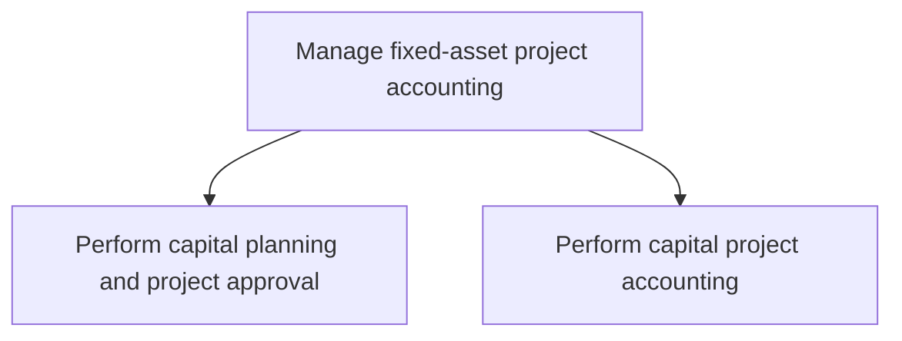
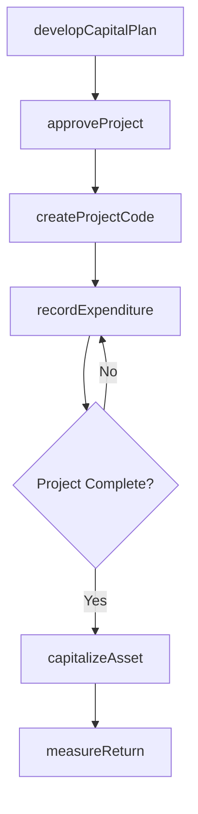

# Manage fixed-asset project accounting

> Business-as-Code definition for fixed-asset and capital project accounting. Models capital planning, project approval, expenditure tracking, asset capitalization, and return-on-investment measurement as programmable APIs.

## Overview

Managing accounts for large funds-invested projects. Manage and account for fixed assets projects (capital projects), which required significant capital investments over many years.

## Process Hierarchy



## GraphDL

```yaml
manage:
  object: Fixed-asset Project Accounting
  actor: CapitalProjectAccountant
  result: CapitalProjectLedger
```

## Actions

| Action | Description |
|--------|-------------|
| developCapitalPlan | Prepare capital expenditure budgets aligned with strategic priorities |
| approveProject | Review and authorize capital project proposals |
| createProjectCode | Establish accounting codes for tracking project costs |
| recordExpenditure | Capture capital project costs against approved budgets |
| capitalizeAsset | Transfer completed project costs to fixed-asset accounts |
| measureReturn | Calculate financial returns on completed capital investments |

## Events

| Event | Description |
|-------|-------------|
| capitalPlanDeveloped | Capital expenditure budget prepared and submitted for review |
| projectApproved | Capital project authorized with approved funding |
| projectCodeCreated | Accounting code established for project cost tracking |
| expenditureRecorded | Capital cost posted against the project budget |
| assetCapitalized | Completed project costs transferred to fixed-asset ledger |
| returnMeasured | Post-completion financial return analysis completed |

## Searches

| Search | Description |
|--------|-------------|
| getCapitalProjects | List capital projects filtered by status, budget, or department |
| getProjectBudgetStatus | Retrieve spending versus approved budget for a capital project |
| getCapitalizedAssets | Query assets capitalized from completed projects |
| getROIAnalysis | Retrieve return-on-investment metrics for completed projects |

## Process Flow



## RACI Matrix

| Activity | Responsible | Accountable | Consulted | Informed |
|----------|-------------|-------------|-----------|----------|
| developCapitalPlan | FP&A Manager | CFO | Business Unit Heads | Board of Directors |
| approveProject | Capital Committee | CFO | Project Manager | Controller |
| recordExpenditure | Project Accountant | Controller | Procurement | Project Manager |
| capitalizeAsset | Fixed-Asset Accountant | Controller | Tax Manager | Internal Audit |

## Sub-Processes

| ID | Name | Description |
|----|------|-------------|
| 9.4.1 | Perform capital planning and project approval | Preparing a project finance report to solicit approvals in capital projects. Prepare budgets for pro |
| 9.4.2 | Perform capital project accounting | Accounting for large-scale and large-cost investments. Manage and account for ongoing activities rel |

## Related Processes

| Process | Relationship |
|---------|-------------|
| 9.3.3 Perform fixed-asset accounting | Downstream - capitalized assets flow into fixed-asset ledger |
| 9.1.1 Perform planning/budgeting/forecasting | Upstream - capital budget aligns with overall financial plan |
| 9.6 Process accounts payable and expense reimbursements | Parallel - vendor payments for capital purchases |

## Related Departments

| Department | Role |
|-----------|------|
| Finance | Oversees capital planning, approval, and ROI measurement |
| Accounting | Records project transactions and performs capitalization |
| Facilities/Engineering | Sponsors and manages physical capital projects |
| Procurement | Sources vendors and manages capital purchase orders |

## Related Occupations

| Occupation | Involvement |
|-----------|-------------|
| Capital Project Accountant | Project cost tracking and capitalization entries |
| Fixed-Asset Accountant | Asset register maintenance and depreciation management |
| Financial Analyst | Capital budgeting, ROI analysis, and project evaluation |

## KPIs

| KPI | Description | Unit |
|-----|-------------|------|
| Capital Budget Utilization | Percentage of approved capital budget spent | % |
| Project Cost Variance | Deviation of actual project cost from approved budget | % |
| Time to Capitalize | Days from project completion to asset capitalization | Days |
| Return on Invested Capital | Financial return generated by completed capital projects | % |

## Usage

```typescript
import { manageFixedAssetProjectAccounting } from '@headlessly/manage-fixed-asset-project-accounting'

const capex = manageFixedAssetProjectAccounting()

// Approve a new capital project
const project = await capex.approveProject({
  projectName: 'Data Center Expansion Phase 2',
  approvedBudget: 2500000,
  currency: 'USD',
  sponsor: 'VP Infrastructure'
})

// Capitalize completed project as a fixed asset
await capex.capitalizeAsset({
  projectId: project.id,
  assetClass: 'Buildings',
  usefulLife: 20,
  depreciationMethod: 'straight-line'
})
```
