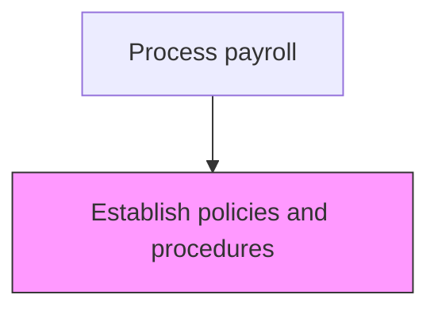
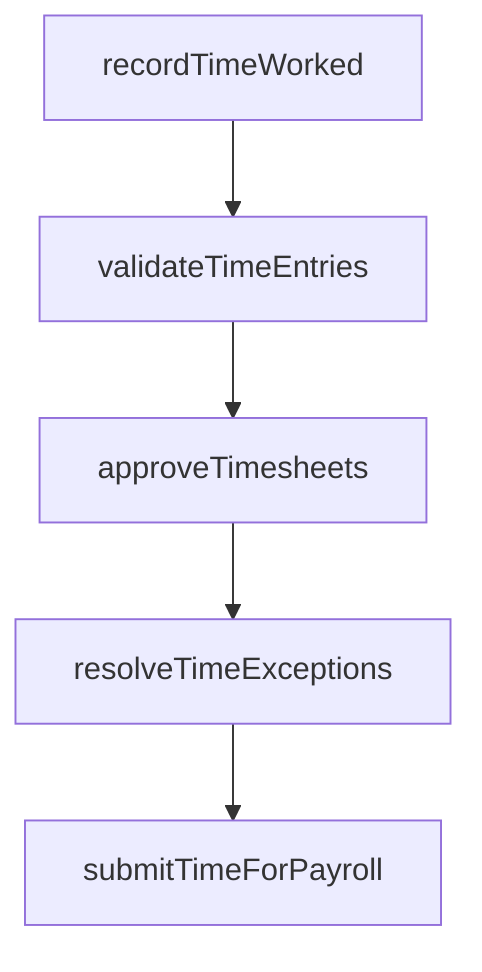

# Establish policies and procedures

> Business-as-Code definition for policies and procedures. Models the end-to-end process of establish policies and procedures as a programmable workflow.

## Overview

Developing policies and procedures for the HR function to calculate compensation, including rules for overtime eligibility, shift differentials, holiday pay, and leave accrual rates. These policies define the organizational standards for time reporting, approval workflows, and exception handling that govern the entire payroll cycle. Establishing clear, documented procedures ensures regulatory compliance with federal and state labor laws while providing consistent treatment of all employee compensation scenarios.

## Process Hierarchy



## GraphDL

```yaml
establish:
  object: Policies And Procedures
  actor: PayrollClerk
  result: PoliciesAndProceduresFramework
```

## Actions

| Action | Description |
|--------|-------------|
| recordTimeWorked | Capture employee hours worked including regular, overtime, and leave |
| validateTimeEntries | Verify time records against schedules and authorization rules |
| approveTimesheets | Route timesheets through the management approval workflow |
| resolveTimeExceptions | Investigate and correct timesheet discrepancies or violations |
| submitTimeForPayroll | Transfer approved time records to the payroll processing system |

## Events

| Event | Description |
|-------|-------------|
| timeWorkedRecorded | Capture employee hours worked including regular, overtime, and leave |
| timeEntriesValidated | Verify time records against schedules and authorization rules |
| timesheetsApproved | Route timesheets through the management approval workflow |
| timeExceptionsResolved | Investigate and correct timesheet discrepancies or violations |
| timeForPayrollSubmitted | Transfer approved time records to the payroll processing system |

## Searches

| Search | Description |
|--------|-------------|
| getPoliciesAndProcedures | Retrieve policies and procedures records filtered by status, date, or owner |
| findPoliciesAndProceduresByPeriod | Search policies and procedures data for a specified date range |
| getPoliciesAndProceduresSummary | Retrieve summary statistics and trends for policies and procedures |
| listPoliciesAndProceduresHistory | Query the audit trail and change history for policies and procedures records |

## Process Flow



## RACI Matrix

| Activity | Responsible | Accountable | Consulted | Informed |
|----------|-------------|-------------|-----------|----------|
| recordTimeWorked | PayrollClerk | PayrollManager | HumanResources | Employees |
| validateTimeEntries | PayrollClerk | PayrollManager | DepartmentManagers | HumanResources |
| approveTimesheets | DepartmentManagers | PayrollManager | HumanResources | PayrollClerk |
| resolveTimeExceptions | PayrollClerk | PayrollManager | DepartmentManagers | HumanResources |
| submitTimeForPayroll | PayrollClerk | PayrollManager | Finance | CFO |

## Related Processes

| Process | Relationship |
|---------|-------------|
| 9.5.1.2 Collect and record employee time worked | Downstream - policies govern how time is collected and recorded |
| 9.5.2.1 Enter employee time worked into payroll system | Downstream - time reporting policies determine payroll input requirements |
| 9.5.3.1 Develop tax plan | Related - payroll policies must align with tax withholding strategies |
| 9.5.1 | Parent - governing process group |

## Related Departments

| Department | Role |
|-----------|------|
| Payroll | Processes employee compensation and tax withholdings |
| Human Resources | Provides employee data and benefit elections |
| Finance | Reconciles payroll expenses to general ledger |

## Related Occupations

| Occupation | Involvement |
|-----------|-------------|
| Payroll Specialist | Compensation calculation and payment processing |
| Payroll Tax Analyst | Tax withholding computation and filing |

## KPIs

| KPI | Description | Unit |
|-----|-------------|------|
| Policy Compliance Rate | Percentage of time entries conforming to established policies | % |
| Policy Review Frequency | Number of policy reviews and updates completed per year | Count |
| Exception Rate | Percentage of time entries flagged as policy exceptions | % |
| Regulatory Compliance Score | Percentage of payroll policies aligned with current labor regulations | % |

## Usage

```typescript
import { establishPoliciesAndProcedures } from '@headlessly/establish-policies-and-procedures'

const client = establishPoliciesAndProcedures()

// Capture employee hours worked including regular, overtime, and leave
const result = await client.recordTimeWorked({
  period: '2025-Q4',
  scope: 'enterprise'
})

// Retrieve current policies and procedures with change history
const policies = await client.getPoliciesAndProcedures({
  status: 'active',
  category: 'overtime-eligibility'
})
```
