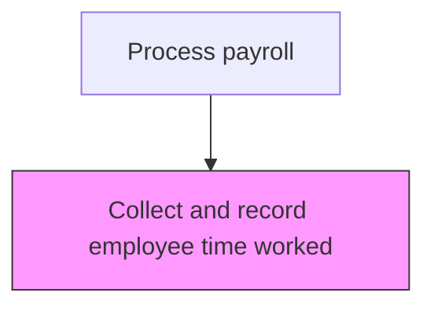
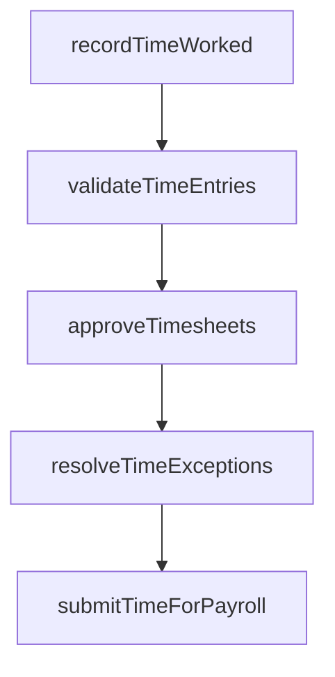

# Collect and record employee time worked

> Business-as-Code definition for record employee time worked. Models the end-to-end process of collect and record employee time worked as a programmable workflow.

## Overview

Tracking billing hours of each employee on a daily basis through electronic timekeeping systems, badge readers, or manual timesheets. This process captures regular hours, overtime, shift differentials, and project-specific time allocations for all active employees. Collected time data feeds directly into payroll processing and serves as the foundation for labor cost allocation, workforce planning, and regulatory compliance with wage-and-hour laws.

## Process Hierarchy



## GraphDL

```yaml
collect:
  object: And Record Employee Time Worked
  actor: PayrollClerk
  result: RecordEmployeeTimeWorkedCollection
```

## Actions

| Action | Description |
|--------|-------------|
| recordTimeWorked | Capture employee hours worked including regular, overtime, and leave |
| validateTimeEntries | Verify time records against schedules and authorization rules |
| approveTimesheets | Route timesheets through the management approval workflow |
| resolveTimeExceptions | Investigate and correct timesheet discrepancies or violations |
| submitTimeForPayroll | Transfer approved time records to the payroll processing system |

## Events

| Event | Description |
|-------|-------------|
| timeWorkedRecorded | Capture employee hours worked including regular, overtime, and leave |
| timeEntriesValidated | Verify time records against schedules and authorization rules |
| timesheetsApproved | Route timesheets through the management approval workflow |
| timeExceptionsResolved | Investigate and correct timesheet discrepancies or violations |
| timeForPayrollSubmitted | Transfer approved time records to the payroll processing system |

## Searches

| Search | Description |
|--------|-------------|
| getRecordEmployeeTimeWorked | Retrieve record employee time worked records filtered by status, date, or owner |
| findRecordEmployeeTimeWorkedByPeriod | Search record employee time worked data for a specified date range |
| getRecordEmployeeTimeWorkedSummary | Retrieve summary statistics and trends for record employee time worked |
| listRecordEmployeeTimeWorkedHistory | Query the audit trail and change history for record employee time worked records |

## Process Flow



## RACI Matrix

| Activity | Responsible | Accountable | Consulted | Informed |
|----------|-------------|-------------|-----------|----------|
| recordTimeWorked | Employees | DepartmentManagers | PayrollClerk | HumanResources |
| validateTimeEntries | PayrollClerk | PayrollManager | DepartmentManagers | HumanResources |
| approveTimesheets | DepartmentManagers | PayrollManager | HumanResources | PayrollClerk |
| resolveTimeExceptions | PayrollClerk | PayrollManager | DepartmentManagers | Employees |
| submitTimeForPayroll | PayrollClerk | PayrollManager | Finance | CFO |

## Related Processes

| Process | Relationship |
|---------|-------------|
| 9.5.1.1 Establish policies and procedures | Upstream - policies define time collection rules |
| 9.5.1.3 Analyze and report paid and unpaid leave | Downstream - recorded time enables leave analysis |
| 9.5.2.1 Enter employee time worked into payroll system | Downstream - collected time feeds payroll processing |
| 9.5.1 | Parent - governing process group |

## Related Departments

| Department | Role |
|-----------|------|
| Payroll | Processes employee compensation and tax withholdings |
| Human Resources | Provides employee data and benefit elections |
| Finance | Reconciles payroll expenses to general ledger |

## Related Occupations

| Occupation | Involvement |
|-----------|-------------|
| Payroll Specialist | Compensation calculation and payment processing |
| Payroll Tax Analyst | Tax withholding computation and filing |

## KPIs

| KPI | Description | Unit |
|-----|-------------|------|
| Timesheet Submission Rate | Percentage of employees submitting timesheets by deadline | % |
| Time Entry Error Rate | Percentage of time entries requiring correction after initial submission | % |
| Timesheet Approval Cycle Time | Average hours from employee submission to manager approval | Hours |
| Automated Capture Rate | Percentage of time entries captured through electronic systems vs. manual | % |

## Usage

```typescript
import { collectAndRecordEmployeeTimeWorked } from '@headlessly/collect-and-record-employee-time-worked'

const client = collectAndRecordEmployeeTimeWorked()

// Capture employee hours worked including regular, overtime, and leave
const result = await client.recordTimeWorked({
  period: '2025-Q4',
  scope: 'enterprise'
})

// Approve timesheets for a specific department
await client.approveTimesheets({
  department: 'engineering',
  payPeriodEnd: '2025-11-15'
})
```
