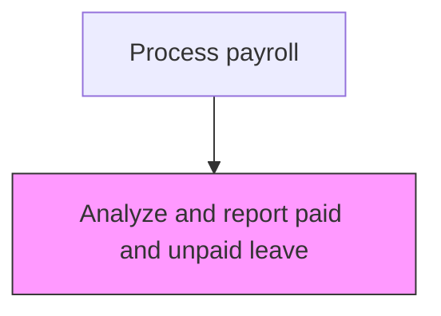
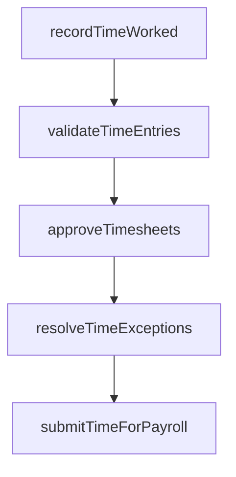

# Analyze and report paid and unpaid leave

> Business-as-Code definition for report paid and unpaid leave. Models the end-to-end process of analyze and report paid and unpaid leave as a programmable workflow.

## Overview

Tracking leaves allowed and taken by employees across all leave categories, including vacation, sick time, personal days, FMLA, and unpaid absences. This process involves analyzing leave accrual balances, monitoring usage patterns, and generating reports that highlight trends such as excessive absenteeism or approaching accrual limits. Accurate leave reporting supports payroll accuracy, ensures compliance with leave entitlement regulations, and provides management with workforce availability insights for capacity planning.

## Process Hierarchy



## GraphDL

```yaml
analyze:
  object: And Report Paid And Unpaid Leave
  actor: PayrollClerk
  result: ReportPaidAndUnpaidLeaveAnalysis
```

## Actions

| Action | Description |
|--------|-------------|
| recordTimeWorked | Capture employee hours worked including regular, overtime, and leave |
| validateTimeEntries | Verify time records against schedules and authorization rules |
| approveTimesheets | Route timesheets through the management approval workflow |
| resolveTimeExceptions | Investigate and correct timesheet discrepancies or violations |
| submitTimeForPayroll | Transfer approved time records to the payroll processing system |

## Events

| Event | Description |
|-------|-------------|
| timeWorkedRecorded | Capture employee hours worked including regular, overtime, and leave |
| timeEntriesValidated | Verify time records against schedules and authorization rules |
| timesheetsApproved | Route timesheets through the management approval workflow |
| timeExceptionsResolved | Investigate and correct timesheet discrepancies or violations |
| timeForPayrollSubmitted | Transfer approved time records to the payroll processing system |

## Searches

| Search | Description |
|--------|-------------|
| getReportPaidAndUnpaidLeave | Retrieve report paid and unpaid leave records filtered by status, date, or owner |
| findReportPaidAndUnpaidLeaveByPeriod | Search report paid and unpaid leave data for a specified date range |
| getReportPaidAndUnpaidLeaveSummary | Retrieve summary statistics and trends for report paid and unpaid leave |
| listReportPaidAndUnpaidLeaveHistory | Query the audit trail and change history for report paid and unpaid leave records |

## Process Flow



## RACI Matrix

| Activity | Responsible | Accountable | Consulted | Informed |
|----------|-------------|-------------|-----------|----------|
| recordTimeWorked | PayrollClerk | PayrollManager | HumanResources | Employees |
| validateTimeEntries | PayrollClerk | PayrollManager | DepartmentManagers | HumanResources |
| approveTimesheets | DepartmentManagers | PayrollManager | HumanResources | PayrollClerk |
| resolveTimeExceptions | PayrollClerk | PayrollManager | HumanResources | LegalCompliance |
| submitTimeForPayroll | PayrollClerk | PayrollManager | Finance | CFO |

## Related Processes

| Process | Relationship |
|---------|-------------|
| 9.5.1.2 Collect and record employee time worked | Upstream - collected time data includes leave entries |
| 9.5.1.4 Monitor regular, overtime, and other hours | Downstream - leave data complements hours monitoring |
| 9.5.2.2 Maintain and administer employee earnings information | Related - leave impacts gross pay calculations |
| 9.5.1 | Parent - governing process group |

## Related Departments

| Department | Role |
|-----------|------|
| Payroll | Processes employee compensation and tax withholdings |
| Human Resources | Provides employee data and benefit elections |
| Finance | Reconciles payroll expenses to general ledger |

## Related Occupations

| Occupation | Involvement |
|-----------|-------------|
| Payroll Specialist | Compensation calculation and payment processing |
| Payroll Tax Analyst | Tax withholding computation and filing |

## KPIs

| KPI | Description | Unit |
|-----|-------------|------|
| Leave Accrual Accuracy | Percentage of leave balances correctly calculated against policy | % |
| Unplanned Absence Rate | Percentage of total work hours lost to unplanned absences | % |
| Leave Utilization Rate | Percentage of accrued leave actually consumed by employees | % |
| FMLA Compliance Rate | Percentage of FMLA leave requests processed within regulatory timelines | % |

## Usage

```typescript
import { analyzeAndReportPaidAndUnpaidLeave } from '@headlessly/analyze-and-report-paid-and-unpaid-leave'

const client = analyzeAndReportPaidAndUnpaidLeave()

// Capture employee hours worked including regular, overtime, and leave
const result = await client.recordTimeWorked({
  period: '2025-Q4',
  scope: 'enterprise'
})

// Retrieve leave balance summary for a department
const leaveReport = await client.getReportPaidAndUnpaidLeaveSummary({
  department: 'operations',
  asOfDate: '2025-12-31'
})
```
