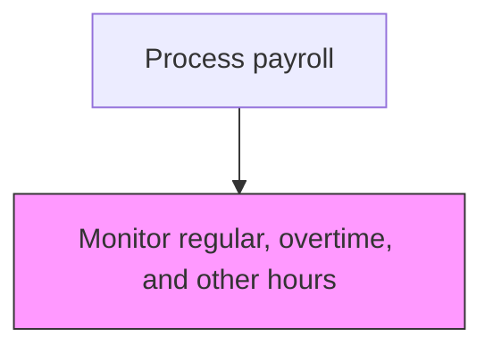
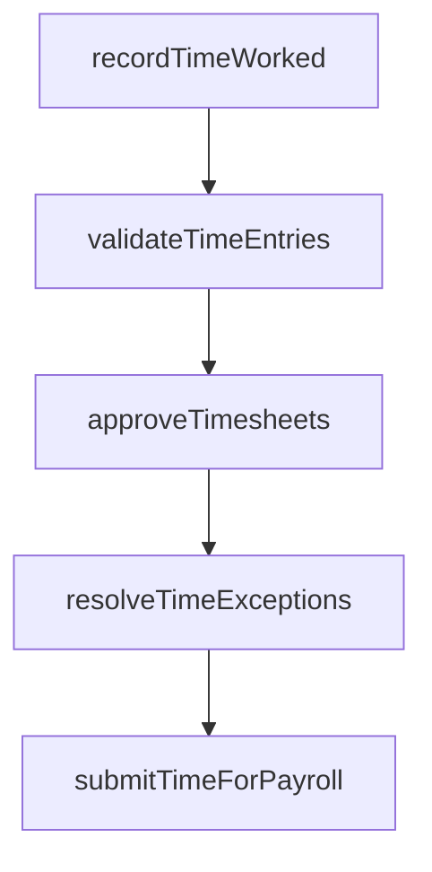

# Monitor regular, overtime, and other hours

> Business-as-Code definition for regular, overtime, and other hours. Models the end-to-end process of monitor regular, overtime, and other hours as a programmable workflow.

## Overview

Observing the number of hours worked by employees on a daily basis, with specific attention to overtime thresholds and premium-pay categories. Track the number of hours worked by an employee, as well as the number of hours worked beyond normal working hours according to company standards and applicable labor regulations. This monitoring ensures that overtime is properly authorized, double-time and holiday premiums are correctly applied, and managers have real-time visibility into labor costs to make informed staffing decisions.

## Process Hierarchy



## GraphDL

```yaml
monitor:
  object: Regular, Overtime, And Other Hours
  actor: PayrollClerk
  result: RegularOvertimeAndOtherHoursDashboard
```

## Actions

| Action | Description |
|--------|-------------|
| recordTimeWorked | Capture employee hours worked including regular, overtime, and leave |
| validateTimeEntries | Verify time records against schedules and authorization rules |
| approveTimesheets | Route timesheets through the management approval workflow |
| resolveTimeExceptions | Investigate and correct timesheet discrepancies or violations |
| submitTimeForPayroll | Transfer approved time records to the payroll processing system |

## Events

| Event | Description |
|-------|-------------|
| timeWorkedRecorded | Capture employee hours worked including regular, overtime, and leave |
| timeEntriesValidated | Verify time records against schedules and authorization rules |
| timesheetsApproved | Route timesheets through the management approval workflow |
| timeExceptionsResolved | Investigate and correct timesheet discrepancies or violations |
| timeForPayrollSubmitted | Transfer approved time records to the payroll processing system |

## Searches

| Search | Description |
|--------|-------------|
| getRegularOvertimeAndOtherHours | Retrieve regular overtime and other hours records filtered by status, date, or owner |
| findRegularOvertimeAndOtherHoursByPeriod | Search regular overtime and other hours data for a specified date range |
| getRegularOvertimeAndOtherHoursSummary | Retrieve summary statistics and trends for regular overtime and other hours |
| listRegularOvertimeAndOtherHoursHistory | Query the audit trail and change history for regular overtime and other hours records |

## Process Flow



## RACI Matrix

| Activity | Responsible | Accountable | Consulted | Informed |
|----------|-------------|-------------|-----------|----------|
| recordTimeWorked | PayrollClerk | PayrollManager | DepartmentManagers | Employees |
| validateTimeEntries | PayrollClerk | PayrollManager | DepartmentManagers | HumanResources |
| approveTimesheets | DepartmentManagers | PayrollManager | HumanResources | PayrollClerk |
| resolveTimeExceptions | PayrollClerk | PayrollManager | DepartmentManagers | LegalCompliance |
| submitTimeForPayroll | PayrollClerk | PayrollManager | Finance | CFO |

## Related Processes

| Process | Relationship |
|---------|-------------|
| 9.5.1.3 Analyze and report paid and unpaid leave | Upstream - leave data provides context for hours monitoring |
| 9.5.1.5 Analyze and report employee utilization | Downstream - hours data feeds utilization analysis |
| 9.5.2.1 Enter employee time worked into payroll system | Related - monitored hours transfer to payroll for compensation |
| 9.5.1 | Parent - governing process group |

## Related Departments

| Department | Role |
|-----------|------|
| Payroll | Processes employee compensation and tax withholdings |
| Human Resources | Provides employee data and benefit elections |
| Finance | Reconciles payroll expenses to general ledger |

## Related Occupations

| Occupation | Involvement |
|-----------|-------------|
| Payroll Specialist | Compensation calculation and payment processing |
| Payroll Tax Analyst | Tax withholding computation and filing |

## KPIs

| KPI | Description | Unit |
|-----|-------------|------|
| Overtime Rate | Overtime hours as a percentage of total hours worked | % |
| Unauthorized Overtime Incidents | Number of overtime hours worked without prior approval per period | Hours |
| Premium Pay Accuracy | Percentage of premium hours correctly classified and calculated | % |
| Labor Cost Variance | Deviation between budgeted and actual labor costs driven by hours worked | % |

## Usage

```typescript
import { monitorRegularOvertimeAndOtherHours } from '@headlessly/monitor-regular-overtime-and-other-hours'

const client = monitorRegularOvertimeAndOtherHours()

// Capture employee hours worked including regular, overtime, and leave
const result = await client.recordTimeWorked({
  period: '2025-Q4',
  scope: 'enterprise'
})

// Retrieve overtime summary by department for the pay period
const overtimeReport = await client.getRegularOvertimeAndOtherHoursSummary({
  department: 'manufacturing',
  payPeriod: '2025-W46'
})
```
