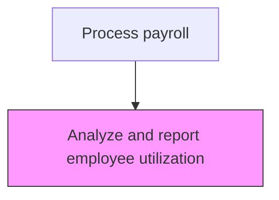
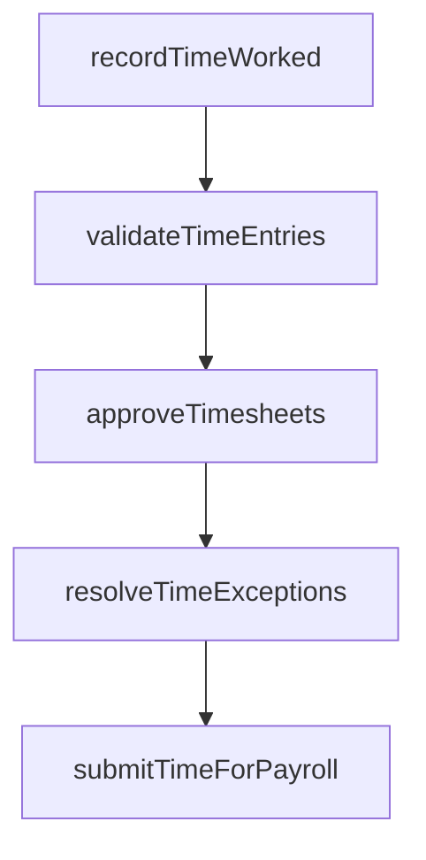

# Analyze and report employee utilization

> Business-as-Code definition for report employee utilization. Models the end-to-end process of analyze and report employee utilization as a programmable workflow.

## Overview

Monitoring the number of productive hours for employees relative to their available capacity and contracted hours. This process calculates utilization rates by comparing billable or productive time against total paid hours, identifying underutilization and overallocation across departments and roles. Utilization reports support resource planning, staffing decisions, and profitability analysis, particularly in professional services and project-based organizations where labor utilization directly impacts revenue.

## Process Hierarchy



## GraphDL

```yaml
analyze:
  object: And Report Employee Utilization
  actor: PayrollClerk
  result: ReportEmployeeUtilizationAnalysis
```

## Actions

| Action | Description |
|--------|-------------|
| recordTimeWorked | Capture employee hours worked including regular, overtime, and leave |
| validateTimeEntries | Verify time records against schedules and authorization rules |
| approveTimesheets | Route timesheets through the management approval workflow |
| resolveTimeExceptions | Investigate and correct timesheet discrepancies or violations |
| submitTimeForPayroll | Transfer approved time records to the payroll processing system |

## Events

| Event | Description |
|-------|-------------|
| timeWorkedRecorded | Capture employee hours worked including regular, overtime, and leave |
| timeEntriesValidated | Verify time records against schedules and authorization rules |
| timesheetsApproved | Route timesheets through the management approval workflow |
| timeExceptionsResolved | Investigate and correct timesheet discrepancies or violations |
| timeForPayrollSubmitted | Transfer approved time records to the payroll processing system |

## Searches

| Search | Description |
|--------|-------------|
| getReportEmployeeUtilization | Retrieve report employee utilization records filtered by status, date, or owner |
| findReportEmployeeUtilizationByPeriod | Search report employee utilization data for a specified date range |
| getReportEmployeeUtilizationSummary | Retrieve summary statistics and trends for report employee utilization |
| listReportEmployeeUtilizationHistory | Query the audit trail and change history for report employee utilization records |

## Process Flow



## RACI Matrix

| Activity | Responsible | Accountable | Consulted | Informed |
|----------|-------------|-------------|-----------|----------|
| recordTimeWorked | PayrollClerk | PayrollManager | DepartmentManagers | Employees |
| validateTimeEntries | PayrollClerk | PayrollManager | DepartmentManagers | HumanResources |
| approveTimesheets | DepartmentManagers | PayrollManager | HumanResources | PayrollClerk |
| resolveTimeExceptions | PayrollClerk | PayrollManager | DepartmentManagers | HumanResources |
| submitTimeForPayroll | PayrollClerk | PayrollManager | Finance | CFO |

## Related Processes

| Process | Relationship |
|---------|-------------|
| 9.5.1.4 Monitor regular, overtime, and other hours | Upstream - hours data feeds utilization calculations |
| 9.5.2.1 Enter employee time worked into payroll system | Downstream - utilization data supports payroll cost allocation |
| 9.5.1.2 Collect and record employee time worked | Related - collected time records provide source data for analysis |
| 9.5.1 | Parent - governing process group |

## Related Departments

| Department | Role |
|-----------|------|
| Payroll | Processes employee compensation and tax withholdings |
| Human Resources | Provides employee data and benefit elections |
| Finance | Reconciles payroll expenses to general ledger |

## Related Occupations

| Occupation | Involvement |
|-----------|-------------|
| Payroll Specialist | Compensation calculation and payment processing |
| Payroll Tax Analyst | Tax withholding computation and filing |

## KPIs

| KPI | Description | Unit |
|-----|-------------|------|
| Employee Utilization Rate | Ratio of productive hours to total available hours | % |
| Billable Utilization | Percentage of employee hours classified as billable to clients | % |
| Capacity Variance | Deviation between planned and actual resource utilization | % |
| Utilization Report Timeliness | Percentage of utilization reports delivered within reporting deadline | % |

## Usage

```typescript
import { analyzeAndReportEmployeeUtilization } from '@headlessly/analyze-and-report-employee-utilization'

const client = analyzeAndReportEmployeeUtilization()

// Capture employee hours worked including regular, overtime, and leave
const result = await client.recordTimeWorked({
  period: '2025-Q4',
  scope: 'enterprise'
})

// Retrieve utilization report for a specific department
const utilization = await client.getReportEmployeeUtilizationSummary({
  department: 'consulting',
  period: '2025-Q4'
})
```
