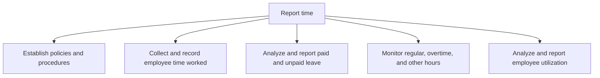
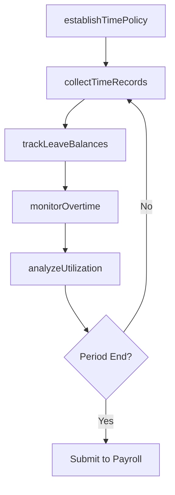

# Report time

> Business-as-Code definition for employee time reporting. Models time and attendance policy management, time collection, leave tracking, overtime monitoring, and utilization analysis as programmable APIs.

## Overview

Recording the reporting time of employees on-site. Track working days, salary calculations, holidays taken, number of hours spend in the office, billing hours, etc.

## Process Hierarchy



## GraphDL

```yaml
report:
  object: Time
  actor: TimekeepingAdministrator
  result: TimesheetSummary
```

## Actions

| Action | Description |
|--------|-------------|
| establishTimePolicy | Define rules for time tracking, leave accrual, and overtime eligibility |
| collectTimeRecords | Capture employee clock-in/out, project hours, and absence data |
| trackLeaveBalances | Monitor paid and unpaid leave accruals and usage by employee |
| monitorOvertime | Identify and flag overtime hours against policy thresholds |
| analyzeUtilization | Calculate productive hours as a percentage of available hours |

## Events

| Event | Description |
|-------|-------------|
| timePolicyEstablished | Time and attendance policies published |
| timeRecordsCollected | Employee timesheets submitted and validated for the period |
| leaveBalancesTracked | Leave accrual and usage report updated |
| overtimeMonitored | Overtime hours reviewed against policy limits |
| utilizationAnalyzed | Employee utilization report generated |

## Searches

| Search | Description |
|--------|-------------|
| getTimesheets | Retrieve timesheets by employee, department, or pay period |
| getLeaveBalances | Query leave accruals and remaining balances by employee |
| getOvertimeReport | List overtime hours by employee, department, or period |
| getUtilizationReport | Get utilization percentages by team or individual |

## Process Flow



## RACI Matrix

| Activity | Responsible | Accountable | Consulted | Informed |
|----------|-------------|-------------|-----------|----------|
| establishTimePolicy | HR Manager | VP HR | Legal | Payroll Manager |
| collectTimeRecords | Timekeeping Administrator | Payroll Manager | Department Managers | Employees |
| monitorOvertime | Timekeeping Administrator | Payroll Manager | Department Managers | HR |
| analyzeUtilization | HR Analyst | HR Manager | Finance | Department Managers |

## Sub-Processes

| ID | Name | Description |
|----|------|-------------|
| 9.5.1.1 | Establish policies and procedures | Developing policies and procedures for the HR function to calculate compensation. |
| 9.5.1.2 | Collect and record employee time worked | Tracking billing hours of each employee on daily basis. |
| 9.5.1.3 | Analyze and report paid and unpaid leave | Tracking leaves allowed and taken by employees. |
| 9.5.1.4 | Monitor regular, overtime, and other hours | Observing the number of hours worked by an employees on daily basis. Track the number of hours worke |
| 9.5.1.5 | Analyze and report employee utilization | Monitoring the number of productive hours for employees. |

## Related Processes

| Process | Relationship |
|---------|-------------|
| 9.5.2 Manage pay | Downstream - validated timesheets feed payroll calculation |
| 8.1 Create and manage human resources planning | Upstream - staffing plans influence time tracking requirements |

## Related Departments

| Department | Role |
|-----------|------|
| Payroll | Primary consumer of time data for pay processing |
| Human Resources | Sets time and attendance policies |
| All Departments | Employees submit timesheets and absence requests |
| IT | Maintains time tracking systems |

## Related Occupations

| Occupation | Involvement |
|-----------|-------------|
| Timekeeping Administrator | Manages time collection systems and validates entries |
| HR Analyst | Analyzes utilization and leave data |
| Payroll Clerk | Receives validated time data for payroll processing |

## KPIs

| KPI | Description | Unit |
|-----|-------------|------|
| Timesheet Submission Rate | Percentage of employees submitting timesheets on time | % |
| Overtime as Percentage of Total Hours | Overtime hours relative to total hours worked | % |
| Employee Utilization Rate | Productive hours divided by total available hours | % |
| Leave Accrual Accuracy | Percentage of leave balances matching policy calculations | % |

## Usage

```typescript
import { reportTime } from '@headlessly/report-time'

const time = reportTime()

// Collect timesheets for the pay period
const timesheets = await time.collectTimeRecords({
  payPeriod: '2025-12-01',
  department: 'Engineering'
})

// Get overtime report for the month
const overtime = await time.getOvertimeReport({
  period: '2025-12',
  threshold: 40
})
```
