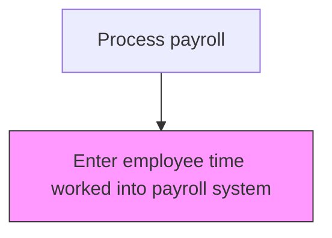
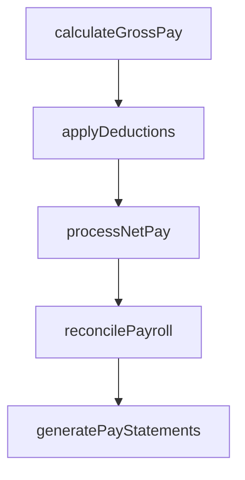

# Enter employee time worked into payroll system

> Business-as-Code definition for employee time worked into payroll system. Models the end-to-end process of enter employee time worked into payroll system as a programmable workflow.

## Overview

Tracking the number of hours worked for the payroll system. Register the number of hours worked by an employee into the payroll system for the purpose of calculating salaries or wages, including regular, overtime, and premium hours. This process involves importing approved time records from timekeeping systems, validating data integrity through automated edit checks, and resolving any discrepancies before gross pay calculation begins. Accurate time entry is the critical first step in the pay processing cycle that determines compensation accuracy for all hourly and non-exempt employees.

## Process Hierarchy



## GraphDL

```yaml
enter:
  object: Employee Time Worked Into Payroll System
  actor: PayrollManager
  result: EmployeeTimeWorkedIntoPayrollSystemRecord
```

## Actions

| Action | Description |
|--------|-------------|
| calculateGrossPay | Compute gross compensation including base pay, overtime, and differentials |
| applyDeductions | Process all authorized deductions including benefits, garnishments, and taxes |
| processNetPay | Calculate and disburse net pay to employees via direct deposit or check |
| reconcilePayroll | Verify payroll register totals against general ledger postings |
| generatePayStatements | Produce and distribute employee pay statements and earnings summaries |

## Events

| Event | Description |
|-------|-------------|
| grossPayCalculated | Compute gross compensation including base pay, overtime, and differentials |
| deductionsApplied | Process all authorized deductions including benefits, garnishments, and taxes |
| netPayProcessed | Calculate and disburse net pay to employees via direct deposit or check |
| payrollReconciled | Verify payroll register totals against general ledger postings |
| payStatementsGenerated | Produce and distribute employee pay statements and earnings summaries |

## Searches

| Search | Description |
|--------|-------------|
| getEmployeeTimeWorkedIntoPayrollSystem | Retrieve employee time worked into payroll system records filtered by status, date, or owner |
| findEmployeeTimeWorkedIntoPayrollSystemByPeriod | Search employee time worked into payroll system data for a specified date range |
| getEmployeeTimeWorkedIntoPayrollSystemSummary | Retrieve summary statistics and trends for employee time worked into payroll system |
| listEmployeeTimeWorkedIntoPayrollSystemHistory | Query the audit trail and change history for employee time worked into payroll system records |

## Process Flow



## RACI Matrix

| Activity | Responsible | Accountable | Consulted | Informed |
|----------|-------------|-------------|-----------|----------|
| calculateGrossPay | PayrollClerk | PayrollManager | HumanResources | Employees |
| applyDeductions | PayrollClerk | PayrollManager | BenefitsAdministrator | HumanResources |
| processNetPay | PayrollManager | Controller | Finance | Employees |
| reconcilePayroll | PayrollClerk | PayrollManager | Finance | InternalAudit |
| generatePayStatements | PayrollClerk | PayrollManager | HumanResources | Employees |

## Related Processes

| Process | Relationship |
|---------|-------------|
| 9.5.1.2 Collect and record employee time worked | Upstream - approved time records feed payroll entry |
| 9.5.2.2 Maintain and administer employee earnings information | Downstream - time data combines with earnings records for pay calculation |
| 9.5.2.5 Process and distribute payments | Downstream - entered time drives payment amounts |
| 9.5.2 | Parent - governing process group |

## Related Departments

| Department | Role |
|-----------|------|
| Payroll | Processes employee compensation and tax withholdings |
| Human Resources | Provides employee data and benefit elections |
| Finance | Reconciles payroll expenses to general ledger |

## Related Occupations

| Occupation | Involvement |
|-----------|-------------|
| Payroll Specialist | Compensation calculation and payment processing |
| Payroll Tax Analyst | Tax withholding computation and filing |

## KPIs

| KPI | Description | Unit |
|-----|-------------|------|
| Time Import Accuracy | Percentage of time records imported without data errors | % |
| Payroll Entry Cycle Time | Average hours from time approval to payroll system entry | Hours |
| Edit Check Failure Rate | Percentage of time entries flagged by automated validation rules | % |
| On-Time Entry Rate | Percentage of pay periods where all time data is entered by cutoff deadline | % |

## Usage

```typescript
import { enterEmployeeTimeWorkedIntoPayrollSystem } from '@headlessly/enter-employee-time-worked-into-payroll-system'

const client = enterEmployeeTimeWorkedIntoPayrollSystem()

// Compute gross compensation including base pay, overtime, and differentials
const result = await client.calculateGrossPay({
  period: '2025-Q4',
  scope: 'enterprise'
})

// Reconcile imported time records against approved timesheets
await client.reconcilePayroll({
  payPeriodEnd: '2025-11-15',
  department: 'all'
})
```
