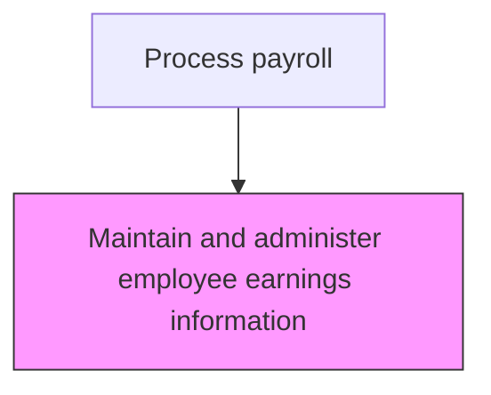
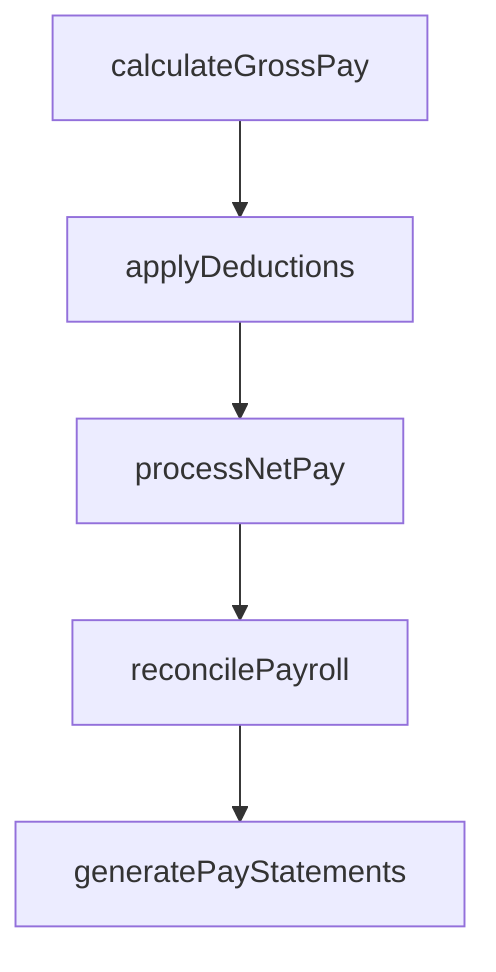

# Maintain and administer employee earnings information

> Business-as-Code definition for administer employee earnings information. Models the end-to-end process of maintain and administer employee earnings information as a programmable workflow.

## Overview

Tracking and oversee salary breakups of employees. This process requires the organization to manage and update information pertaining to the structure of every employee's salary. This would involve the updating any changes to the salary structures of the employees, in a central repository which can be accessed by pertinent departments.

## Process Hierarchy



## GraphDL

```yaml
maintain:
  object: And Administer Employee Earnings Information
  actor: PayrollManager
  result: AdministerEmployeeEarningsInformationRegister
```

## Actions

| Action | Description |
|--------|-------------|
| calculateGrossPay | Compute gross compensation including base pay, overtime, and differentials |
| applyDeductions | Process all authorized deductions including benefits, garnishments, and taxes |
| processNetPay | Calculate and disburse net pay to employees via direct deposit or check |
| reconcilePayroll | Verify payroll register totals against general ledger postings |
| generatePayStatements | Produce and distribute employee pay statements and earnings summaries |

## Events

| Event | Description |
|-------|-------------|
| grossPayCalculated | Compute gross compensation including base pay, overtime, and differentials |
| deductionsApplied | Process all authorized deductions including benefits, garnishments, and taxes |
| netPayProcessed | Calculate and disburse net pay to employees via direct deposit or check |
| payrollReconciled | Verify payroll register totals against general ledger postings |
| payStatementsGenerated | Produce and distribute employee pay statements and earnings summaries |

## Searches

| Search | Description |
|--------|-------------|
| getAdministerEmployeeEarningsInformation | Retrieve administer employee earnings information records filtered by status, date, or owner |
| findAdministerEmployeeEarningsInformationByPeriod | Search administer employee earnings information data for a specified date range |
| getAdministerEmployeeEarningsInformationSummary | Retrieve summary statistics and trends for administer employee earnings information |
| listAdministerEmployeeEarningsInformationHistory | Query the audit trail and change history for administer employee earnings information records |

## Process Flow



## RACI Matrix

| Activity | Responsible | Accountable | Consulted | Informed |
|----------|-------------|-------------|-----------|----------|
| calculateGrossPay | PayrollClerk | PayrollManager | HumanResources | Employees |
| applyDeductions | PayrollClerk | PayrollManager | BenefitsAdministrator | HumanResources |
| processNetPay | PayrollManager | Controller | Finance | Employees |
| reconcilePayroll | PayrollClerk | PayrollManager | Finance | InternalAudit |
| generatePayStatements | PayrollClerk | PayrollManager | HumanResources | Employees |

## Related Processes

| Process | Relationship |
|---------|-------------|
| 9.5.2.1 Enter employee time worked into payroll system | Upstream - time data combines with earnings records |
| 9.5.2.3 Maintain and administer applicable deductions | Downstream - earnings records inform deduction calculations |
| 9.5.2.5 Process and distribute payments | Downstream - earnings data drives net pay computation |
| 9.5.2 | Parent - governing process group |

## Related Departments

| Department | Role |
|-----------|------|
| Payroll | Processes employee compensation and tax withholdings |
| Human Resources | Provides employee data and benefit elections |
| Finance | Reconciles payroll expenses to general ledger |

## Related Occupations

| Occupation | Involvement |
|-----------|-------------|
| Payroll Specialist | Compensation calculation and payment processing |
| Payroll Tax Analyst | Tax withholding computation and filing |

## KPIs

| KPI | Description | Unit |
|-----|-------------|------|
| Earnings Record Accuracy | Percentage of employee earnings records without discrepancies | % |
| Salary Change Processing Time | Average days from HR approval to payroll system update | Days |
| Earnings Data Completeness | Percentage of active employees with fully populated earnings records | % |
| Pay Structure Compliance | Percentage of compensation changes processed in accordance with policy | % |

## Usage

```typescript
import { maintainAndAdministerEmployeeEarningsInformation } from '@headlessly/maintain-and-administer-employee-earnings-information'

const client = maintainAndAdministerEmployeeEarningsInformation()

// Compute gross compensation including base pay, overtime, and differentials
const result = await client.calculateGrossPay({
  period: '2025-Q4',
  scope: 'enterprise'
})

// Retrieve earnings information for employees with recent salary changes
const earnings = await client.getAdministerEmployeeEarningsInformation({
  changeType: 'salary-adjustment',
  effectiveAfter: '2025-10-01'
})
```
