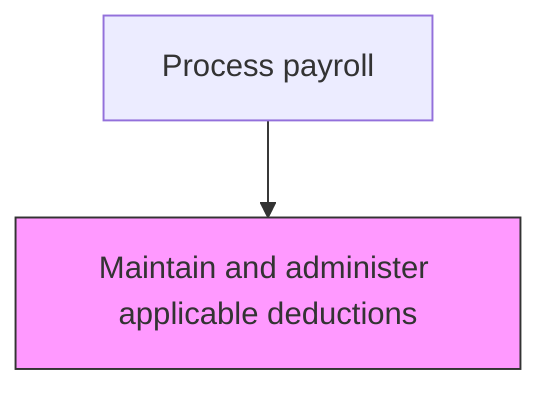
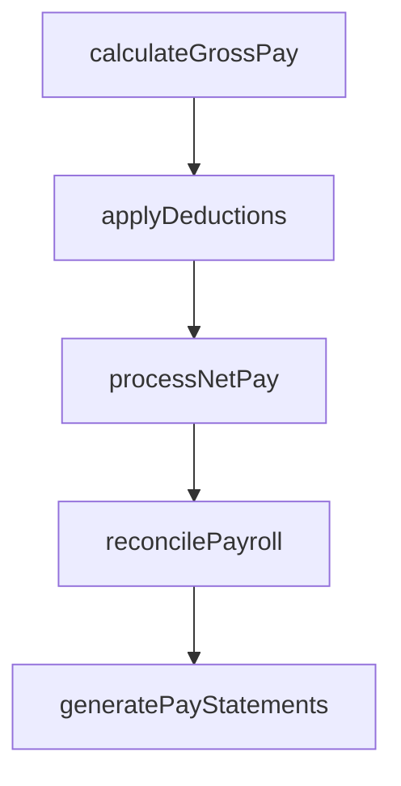

# Maintain and administer applicable deductions

> Business-as-Code definition for administer applicable deductions. Models the end-to-end process of maintain and administer applicable deductions as a programmable workflow.

## Overview

Processing salary deductions for tax purposes and employee benefit elections. Keep and manage the details of every employee's salary deductions, including health insurance premiums, retirement plan contributions, garnishments, union dues, and voluntary withholdings. This process requires maintaining accurate deduction configurations as employees change benefit elections, receive court-ordered garnishments, or update voluntary contribution levels. Proper deduction administration ensures employees receive correct net pay while the organization meets its fiduciary obligations to benefit providers and government agencies.

## Process Hierarchy



## GraphDL

```yaml
maintain:
  object: And Administer Applicable Deductions
  actor: PayrollManager
  result: AdministerApplicableDeductionsRegister
```

## Actions

| Action | Description |
|--------|-------------|
| calculateGrossPay | Compute gross compensation including base pay, overtime, and differentials |
| applyDeductions | Process all authorized deductions including benefits, garnishments, and taxes |
| processNetPay | Calculate and disburse net pay to employees via direct deposit or check |
| reconcilePayroll | Verify payroll register totals against general ledger postings |
| generatePayStatements | Produce and distribute employee pay statements and earnings summaries |

## Events

| Event | Description |
|-------|-------------|
| grossPayCalculated | Compute gross compensation including base pay, overtime, and differentials |
| deductionsApplied | Process all authorized deductions including benefits, garnishments, and taxes |
| netPayProcessed | Calculate and disburse net pay to employees via direct deposit or check |
| payrollReconciled | Verify payroll register totals against general ledger postings |
| payStatementsGenerated | Produce and distribute employee pay statements and earnings summaries |

## Searches

| Search | Description |
|--------|-------------|
| getAdministerApplicableDeductions | Retrieve administer applicable deductions records filtered by status, date, or owner |
| findAdministerApplicableDeductionsByPeriod | Search administer applicable deductions data for a specified date range |
| getAdministerApplicableDeductionsSummary | Retrieve summary statistics and trends for administer applicable deductions |
| listAdministerApplicableDeductionsHistory | Query the audit trail and change history for administer applicable deductions records |

## Process Flow



## RACI Matrix

| Activity | Responsible | Accountable | Consulted | Informed |
|----------|-------------|-------------|-----------|----------|
| calculateGrossPay | PayrollClerk | PayrollManager | HumanResources | Employees |
| applyDeductions | PayrollClerk | PayrollManager | BenefitsAdministrator | LegalCompliance |
| processNetPay | PayrollManager | Controller | Finance | Employees |
| reconcilePayroll | PayrollClerk | PayrollManager | Finance | InternalAudit |
| generatePayStatements | PayrollClerk | PayrollManager | HumanResources | Employees |

## Related Processes

| Process | Relationship |
|---------|-------------|
| 9.5.2.2 Maintain and administer employee earnings information | Upstream - earnings data determines deduction applicability |
| 9.5.2.4 Monitor changes in tax status of employees | Downstream - deduction changes may trigger tax status updates |
| 9.5.3.3 Calculate and pay applicable payroll taxes | Related - pre-tax deductions affect taxable income calculations |
| 9.5.2 | Parent - governing process group |

## Related Departments

| Department | Role |
|-----------|------|
| Payroll | Processes employee compensation and tax withholdings |
| Human Resources | Provides employee data and benefit elections |
| Finance | Reconciles payroll expenses to general ledger |

## Related Occupations

| Occupation | Involvement |
|-----------|-------------|
| Payroll Specialist | Compensation calculation and payment processing |
| Payroll Tax Analyst | Tax withholding computation and filing |

## KPIs

| KPI | Description | Unit |
|-----|-------------|------|
| Deduction Accuracy | Percentage of deductions correctly applied per pay period | % |
| Garnishment Compliance Rate | Percentage of court-ordered garnishments processed within required timeframe | % |
| Benefit Deduction Reconciliation | Percentage of benefit deductions matching carrier invoices | % |
| Deduction Change Processing Time | Average days from deduction change request to system implementation | Days |

## Usage

```typescript
import { maintainAndAdministerApplicableDeductions } from '@headlessly/maintain-and-administer-applicable-deductions'

const client = maintainAndAdministerApplicableDeductions()

// Compute gross compensation including base pay, overtime, and differentials
const result = await client.calculateGrossPay({
  period: '2025-Q4',
  scope: 'enterprise'
})

// Retrieve deduction details for employees with pending changes
const deductions = await client.getAdministerApplicableDeductions({
  status: 'pending-update',
  effectivePeriod: '2025-12'
})
```
