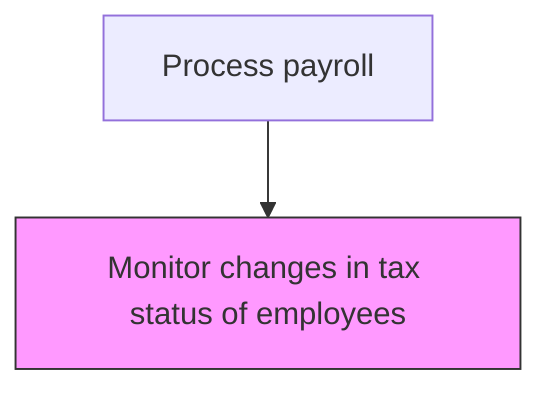
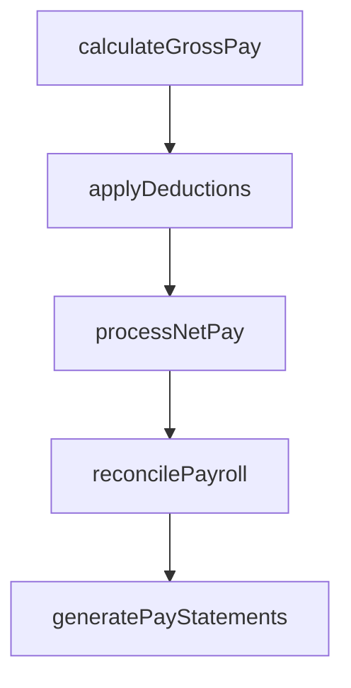

# Monitor changes in tax status of employees

> Business-as-Code definition for changes in tax status of employees. Models the end-to-end process of monitor changes in tax status of employees as a programmable workflow.

## Overview

Tracking changes in the tax status and withholding elections of employees that affect payroll tax calculations. This includes monitoring updates to W-4 filing status, state and local residency changes, multi-state work arrangements, and life events such as marriage or dependent changes that alter withholding requirements. Timely detection and processing of tax status changes ensures accurate withholding calculations, prevents under- or over-withholding, and maintains compliance with federal, state, and local tax regulations.

## Process Hierarchy



## GraphDL

```yaml
monitor:
  object: Changes In Tax Status Of Employees
  actor: PayrollManager
  result: ChangesInTaxStatusOfEmployeesDashboard
```

## Actions

| Action | Description |
|--------|-------------|
| calculateGrossPay | Compute gross compensation including base pay, overtime, and differentials |
| applyDeductions | Process all authorized deductions including benefits, garnishments, and taxes |
| processNetPay | Calculate and disburse net pay to employees via direct deposit or check |
| reconcilePayroll | Verify payroll register totals against general ledger postings |
| generatePayStatements | Produce and distribute employee pay statements and earnings summaries |

## Events

| Event | Description |
|-------|-------------|
| grossPayCalculated | Compute gross compensation including base pay, overtime, and differentials |
| deductionsApplied | Process all authorized deductions including benefits, garnishments, and taxes |
| netPayProcessed | Calculate and disburse net pay to employees via direct deposit or check |
| payrollReconciled | Verify payroll register totals against general ledger postings |
| payStatementsGenerated | Produce and distribute employee pay statements and earnings summaries |

## Searches

| Search | Description |
|--------|-------------|
| getChangesInTaxStatusOfEmployees | Retrieve changes in tax status of employees records filtered by status, date, or owner |
| findChangesInTaxStatusOfEmployeesByPeriod | Search changes in tax status of employees data for a specified date range |
| getChangesInTaxStatusOfEmployeesSummary | Retrieve summary statistics and trends for changes in tax status of employees |
| listChangesInTaxStatusOfEmployeesHistory | Query the audit trail and change history for changes in tax status of employees records |

## Process Flow



## RACI Matrix

| Activity | Responsible | Accountable | Consulted | Informed |
|----------|-------------|-------------|-----------|----------|
| calculateGrossPay | PayrollClerk | PayrollManager | HumanResources | Employees |
| applyDeductions | PayrollClerk | PayrollManager | PayrollTaxSpecialist | HumanResources |
| processNetPay | PayrollManager | Controller | Finance | Employees |
| reconcilePayroll | PayrollClerk | PayrollManager | PayrollTaxSpecialist | InternalAudit |
| generatePayStatements | PayrollClerk | PayrollManager | HumanResources | Employees |

## Related Processes

| Process | Relationship |
|---------|-------------|
| 9.5.2.3 Maintain and administer applicable deductions | Upstream - deduction changes may signal tax status updates |
| 9.5.2.5 Process and distribute payments | Downstream - updated tax status affects net pay calculations |
| 9.5.3.3 Calculate and pay applicable payroll taxes | Related - tax status changes directly impact withholding computations |
| 9.5.2 | Parent - governing process group |

## Related Departments

| Department | Role |
|-----------|------|
| Payroll | Processes employee compensation and tax withholdings |
| Human Resources | Provides employee data and benefit elections |
| Finance | Reconciles payroll expenses to general ledger |

## Related Occupations

| Occupation | Involvement |
|-----------|-------------|
| Payroll Specialist | Compensation calculation and payment processing |
| Payroll Tax Analyst | Tax withholding computation and filing |

## KPIs

| KPI | Description | Unit |
|-----|-------------|------|
| Tax Status Change Processing Time | Average days from employee notification to payroll system update | Days |
| Withholding Accuracy | Percentage of employees with correctly applied tax withholding rates | % |
| Multi-State Compliance Rate | Percentage of multi-state employees with correctly configured state withholdings | % |
| W-4 Update Timeliness | Percentage of W-4 changes processed within the current pay period | % |

## Usage

```typescript
import { monitorChangesInTaxStatusOfEmployees } from '@headlessly/monitor-changes-in-tax-status-of-employees'

const client = monitorChangesInTaxStatusOfEmployees()

// Compute gross compensation including base pay, overtime, and differentials
const result = await client.calculateGrossPay({
  period: '2025-Q4',
  scope: 'enterprise'
})

// Retrieve employees with pending tax status changes
const changes = await client.getChangesInTaxStatusOfEmployees({
  status: 'pending',
  effectiveAfter: '2025-10-01'
})
```
