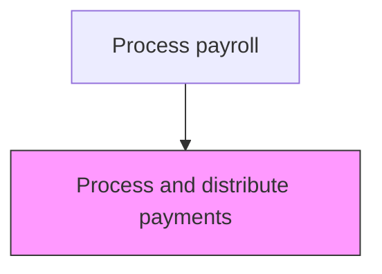
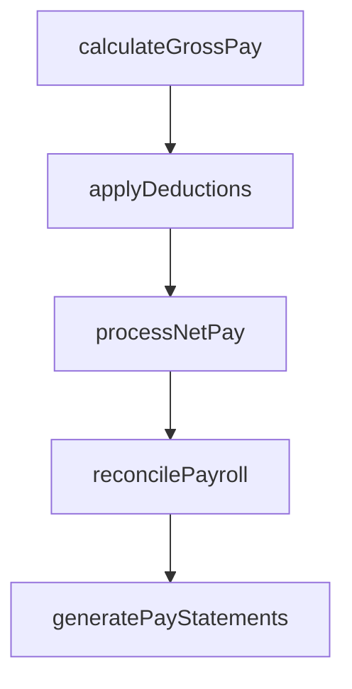

# Process and distribute payments

> Business-as-Code definition for distribute payments. Models the end-to-end process of process and distribute payments as a programmable workflow.

## Overview

Processing and distributing salaries to all employees. Execute the payroll management function through the dispensation of employee salaries. Leverage a centralized database of all payroll expenses.

## Process Hierarchy



## GraphDL

```yaml
process:
  object: And Distribute Payments
  actor: PayrollManager
  result: DistributePaymentsRecord
```

## Actions

| Action | Description |
|--------|-------------|
| calculateGrossPay | Compute gross compensation including base pay, overtime, and differentials |
| applyDeductions | Process all authorized deductions including benefits, garnishments, and taxes |
| processNetPay | Calculate and disburse net pay to employees via direct deposit or check |
| reconcilePayroll | Verify payroll register totals against general ledger postings |
| generatePayStatements | Produce and distribute employee pay statements and earnings summaries |

## Events

| Event | Description |
|-------|-------------|
| grossPayCalculated | Compute gross compensation including base pay, overtime, and differentials |
| deductionsApplied | Process all authorized deductions including benefits, garnishments, and taxes |
| netPayProcessed | Calculate and disburse net pay to employees via direct deposit or check |
| payrollReconciled | Verify payroll register totals against general ledger postings |
| payStatementsGenerated | Produce and distribute employee pay statements and earnings summaries |

## Searches

| Search | Description |
|--------|-------------|
| getDistributePayments | Retrieve distribute payments records filtered by status, date, or owner |
| findDistributePaymentsByPeriod | Search distribute payments data for a specified date range |
| getDistributePaymentsSummary | Retrieve summary statistics and trends for distribute payments |
| listDistributePaymentsHistory | Query the audit trail and change history for distribute payments records |

## Process Flow



## RACI Matrix

| Activity | Responsible | Accountable | Consulted | Informed |
|----------|-------------|-------------|-----------|----------|
| calculateGrossPay | PayrollClerk | PayrollManager | HumanResources | Employees |
| applyDeductions | PayrollClerk | PayrollManager | BenefitsAdministrator | Finance |
| processNetPay | PayrollManager | Controller | Treasury | Employees |
| reconcilePayroll | PayrollClerk | PayrollManager | Finance | InternalAudit |
| generatePayStatements | PayrollClerk | PayrollManager | HumanResources | Employees |

## Related Processes

| Process | Relationship |
|---------|-------------|
| 9.5.2.4 Monitor changes in tax status of employees | Upstream - tax status determines withholding amounts on payments |
| 9.5.2.6 Process and distribute manual checks | Downstream - failed payments require manual check processing |
| 9.5.3.3 Calculate and pay applicable payroll taxes | Related - payment processing generates tax remittance obligations |
| 9.5.2 | Parent - governing process group |

## Related Departments

| Department | Role |
|-----------|------|
| Payroll | Processes employee compensation and tax withholdings |
| Human Resources | Provides employee data and benefit elections |
| Finance | Reconciles payroll expenses to general ledger |

## Related Occupations

| Occupation | Involvement |
|-----------|-------------|
| Payroll Specialist | Compensation calculation and payment processing |
| Payroll Tax Analyst | Tax withholding computation and filing |

## KPIs

| KPI | Description | Unit |
|-----|-------------|------|
| On-Time Payment Rate | Percentage of employees paid by scheduled pay date | % |
| Payroll Error Rate | Number of pay corrections required per payroll cycle | Count |
| Direct Deposit Adoption | Percentage of employees enrolled in direct deposit vs. paper checks | % |
| Payroll Processing Cost | Total cost of payroll processing per employee per pay period | USD |

## Usage

```typescript
import { processAndDistributePayments } from '@headlessly/process-and-distribute-payments'

const client = processAndDistributePayments()

// Compute gross compensation including base pay, overtime, and differentials
const result = await client.calculateGrossPay({
  period: '2025-Q4',
  scope: 'enterprise'
})

// Disburse net pay via direct deposit for the pay period
await client.processNetPay({
  payPeriodEnd: '2025-11-15',
  disbursementMethod: 'direct-deposit'
})
```
