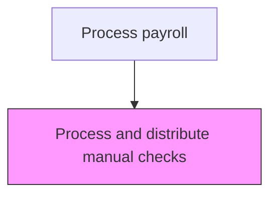
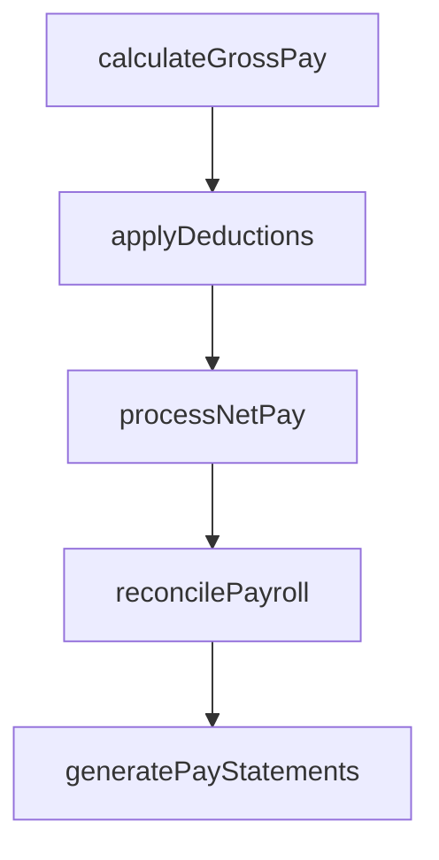

# Process and distribute manual checks

> Business-as-Code definition for distribute manual checks. Models the end-to-end process of process and distribute manual checks as a programmable workflow.

## Overview

Handling incorrect or omitted salary payments by issuing manual checks outside the regular payroll cycle. This process addresses situations such as missed direct deposits, terminated employee final pay requirements, retroactive pay adjustments, and emergency compensation needs. Manual check processing requires additional controls including dual authorization, off-cycle tax calculation verification, and reconciliation with the payroll register to maintain accurate records and prevent duplicate payments.

## Process Hierarchy



## GraphDL

```yaml
process:
  object: And Distribute Manual Checks
  actor: PayrollManager
  result: DistributeManualChecksRecord
```

## Actions

| Action | Description |
|--------|-------------|
| calculateGrossPay | Compute gross compensation including base pay, overtime, and differentials |
| applyDeductions | Process all authorized deductions including benefits, garnishments, and taxes |
| processNetPay | Calculate and disburse net pay to employees via direct deposit or check |
| reconcilePayroll | Verify payroll register totals against general ledger postings |
| generatePayStatements | Produce and distribute employee pay statements and earnings summaries |

## Events

| Event | Description |
|-------|-------------|
| grossPayCalculated | Compute gross compensation including base pay, overtime, and differentials |
| deductionsApplied | Process all authorized deductions including benefits, garnishments, and taxes |
| netPayProcessed | Calculate and disburse net pay to employees via direct deposit or check |
| payrollReconciled | Verify payroll register totals against general ledger postings |
| payStatementsGenerated | Produce and distribute employee pay statements and earnings summaries |

## Searches

| Search | Description |
|--------|-------------|
| getDistributeManualChecks | Retrieve distribute manual checks records filtered by status, date, or owner |
| findDistributeManualChecksByPeriod | Search distribute manual checks data for a specified date range |
| getDistributeManualChecksSummary | Retrieve summary statistics and trends for distribute manual checks |
| listDistributeManualChecksHistory | Query the audit trail and change history for distribute manual checks records |

## Process Flow



## RACI Matrix

| Activity | Responsible | Accountable | Consulted | Informed |
|----------|-------------|-------------|-----------|----------|
| calculateGrossPay | PayrollClerk | PayrollManager | HumanResources | Employees |
| applyDeductions | PayrollClerk | PayrollManager | PayrollTaxSpecialist | Finance |
| processNetPay | PayrollManager | Controller | Treasury | Employees |
| reconcilePayroll | PayrollClerk | PayrollManager | Finance | InternalAudit |
| generatePayStatements | PayrollClerk | PayrollManager | HumanResources | Employees |

## Related Processes

| Process | Relationship |
|---------|-------------|
| 9.5.2.5 Process and distribute payments | Upstream - manual checks address exceptions from regular payment processing |
| 9.5.2.7 Process period-end adjustments | Downstream - manual checks may require period-end adjustment entries |
| 9.5.2.8 Respond to employee payroll inquiries | Related - inquiries often trigger manual check issuance |
| 9.5.2 | Parent - governing process group |

## Related Departments

| Department | Role |
|-----------|------|
| Payroll | Processes employee compensation and tax withholdings |
| Human Resources | Provides employee data and benefit elections |
| Finance | Reconciles payroll expenses to general ledger |

## Related Occupations

| Occupation | Involvement |
|-----------|-------------|
| Payroll Specialist | Compensation calculation and payment processing |
| Payroll Tax Analyst | Tax withholding computation and filing |

## KPIs

| KPI | Description | Unit |
|-----|-------------|------|
| Manual Check Volume | Number of manual checks issued per payroll cycle | Count |
| Manual Check Turnaround | Average hours from request to manual check issuance | Hours |
| Root Cause Resolution Rate | Percentage of manual check causes addressed to prevent recurrence | % |
| Off-Cycle Tax Accuracy | Percentage of manual checks with correctly computed tax withholdings | % |

## Usage

```typescript
import { processAndDistributeManualChecks } from '@headlessly/process-and-distribute-manual-checks'

const client = processAndDistributeManualChecks()

// Compute gross compensation including base pay, overtime, and differentials
const result = await client.calculateGrossPay({
  period: '2025-Q4',
  scope: 'enterprise'
})

// Issue a manual check for a terminated employee's final pay
await client.processNetPay({
  employeeId: 'EMP-4521',
  checkType: 'manual',
  reason: 'termination-final-pay'
})
```
