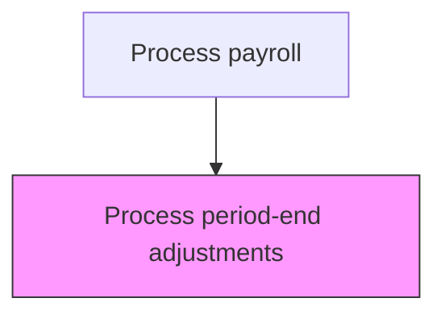
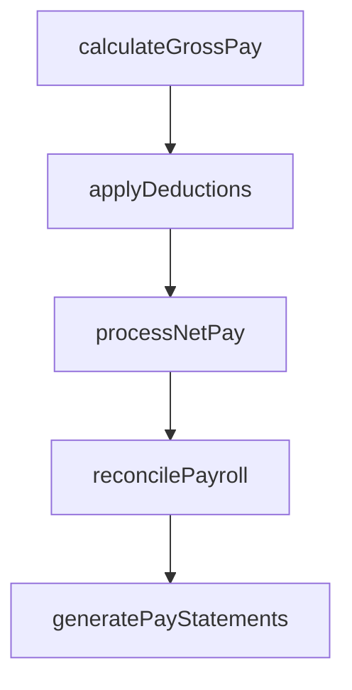

# Process period-end adjustments

> Business-as-Code definition for period-end adjustments. Models the end-to-end process of process period-end adjustments as a programmable workflow.

## Overview

Adjusting salary deductions, accruals, and payroll postings at the end of a pay period, quarter, or fiscal year. This process addresses retroactive pay corrections, bonus and commission true-ups, accrued vacation liability adjustments, and year-end tax reconciliation entries. Period-end adjustments ensure that financial statements accurately reflect compensation expenses and related liabilities, and that employees receive correct cumulative earnings and tax withholding totals for tax reporting purposes.

## Process Hierarchy



## GraphDL

```yaml
process:
  object: Period-end Adjustments
  actor: PayrollManager
  result: PeriodendAdjustmentsRecord
```

## Actions

| Action | Description |
|--------|-------------|
| calculateGrossPay | Compute gross compensation including base pay, overtime, and differentials |
| applyDeductions | Process all authorized deductions including benefits, garnishments, and taxes |
| processNetPay | Calculate and disburse net pay to employees via direct deposit or check |
| reconcilePayroll | Verify payroll register totals against general ledger postings |
| generatePayStatements | Produce and distribute employee pay statements and earnings summaries |

## Events

| Event | Description |
|-------|-------------|
| grossPayCalculated | Compute gross compensation including base pay, overtime, and differentials |
| deductionsApplied | Process all authorized deductions including benefits, garnishments, and taxes |
| netPayProcessed | Calculate and disburse net pay to employees via direct deposit or check |
| payrollReconciled | Verify payroll register totals against general ledger postings |
| payStatementsGenerated | Produce and distribute employee pay statements and earnings summaries |

## Searches

| Search | Description |
|--------|-------------|
| getPeriodendAdjustments | Retrieve periodend adjustments records filtered by status, date, or owner |
| findPeriodendAdjustmentsByPeriod | Search periodend adjustments data for a specified date range |
| getPeriodendAdjustmentsSummary | Retrieve summary statistics and trends for periodend adjustments |
| listPeriodendAdjustmentsHistory | Query the audit trail and change history for periodend adjustments records |

## Process Flow



## RACI Matrix

| Activity | Responsible | Accountable | Consulted | Informed |
|----------|-------------|-------------|-----------|----------|
| calculateGrossPay | PayrollClerk | PayrollManager | HumanResources | Employees |
| applyDeductions | PayrollClerk | PayrollManager | BenefitsAdministrator | Finance |
| processNetPay | PayrollManager | Controller | Treasury | Employees |
| reconcilePayroll | PayrollClerk | PayrollManager | Finance | InternalAudit |
| generatePayStatements | PayrollClerk | PayrollManager | HumanResources | ExternalAuditors |

## Related Processes

| Process | Relationship |
|---------|-------------|
| 9.5.2.6 Process and distribute manual checks | Upstream - manual checks may create adjustment requirements |
| 9.5.2.8 Respond to employee payroll inquiries | Downstream - adjustments may generate employee questions |
| 9.5.3.4 Produce and distribute employee annual tax statements | Related - year-end adjustments affect annual tax statement amounts |
| 9.5.2 | Parent - governing process group |

## Related Departments

| Department | Role |
|-----------|------|
| Payroll | Processes employee compensation and tax withholdings |
| Human Resources | Provides employee data and benefit elections |
| Finance | Reconciles payroll expenses to general ledger |

## Related Occupations

| Occupation | Involvement |
|-----------|-------------|
| Payroll Specialist | Compensation calculation and payment processing |
| Payroll Tax Analyst | Tax withholding computation and filing |

## KPIs

| KPI | Description | Unit |
|-----|-------------|------|
| Adjustment Volume | Number of period-end payroll adjustments processed per cycle | Count |
| Adjustment Processing Timeliness | Percentage of adjustments completed before period close deadline | % |
| Accrual Accuracy | Variance between estimated and actual payroll accruals at period end | % |
| Year-End Reconciliation Accuracy | Percentage of employee records reconciled without discrepancies at year-end | % |

## Usage

```typescript
import { processPeriodendAdjustments } from '@headlessly/process-period-end-adjustments'

const client = processPeriodendAdjustments()

// Compute gross compensation including base pay, overtime, and differentials
const result = await client.calculateGrossPay({
  period: '2025-Q4',
  scope: 'enterprise'
})

// Reconcile payroll after period-end adjustments
await client.reconcilePayroll({
  period: '2025-Q4',
  adjustmentTypes: ['retroactive-pay', 'bonus-true-up', 'accrual-adjustment']
})
```
