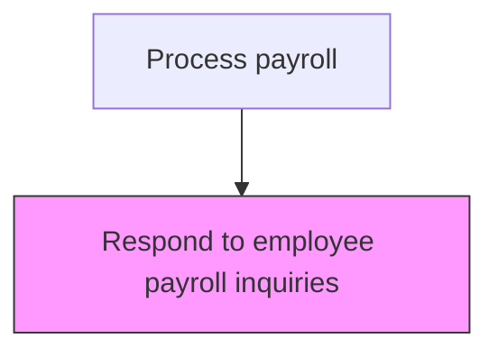
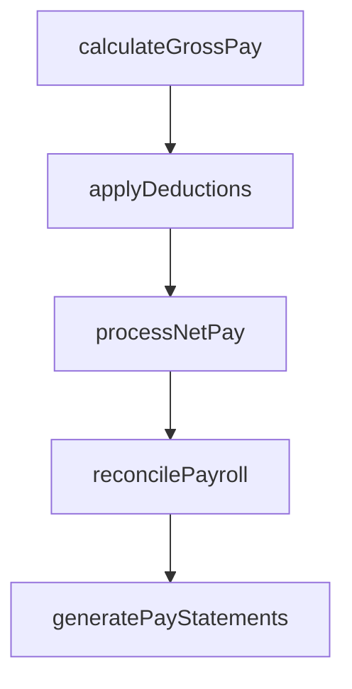

# Respond to employee payroll inquiries

> Business-as-Code definition for to employee payroll inquiries. Models the end-to-end process of respond to employee payroll inquiries as a programmable workflow.

## Overview

Addressing salary-related queries raised by employees regarding pay discrepancies, deduction questions, tax withholding concerns, and pay statement clarifications. This process involves receiving inquiries through designated channels, researching the root cause by examining pay records and system configurations, and providing timely resolutions or explanations. Effective inquiry management improves employee satisfaction, identifies systemic payroll issues for correction, and reduces the volume of repeat inquiries through proactive communication and self-service access to pay information.

## Process Hierarchy



## GraphDL

```yaml
respond:
  object: To Employee Payroll Inquiries
  actor: PayrollManager
  result: ToEmployeePayrollInquiriesRecord
```

## Actions

| Action | Description |
|--------|-------------|
| calculateGrossPay | Compute gross compensation including base pay, overtime, and differentials |
| applyDeductions | Process all authorized deductions including benefits, garnishments, and taxes |
| processNetPay | Calculate and disburse net pay to employees via direct deposit or check |
| reconcilePayroll | Verify payroll register totals against general ledger postings |
| generatePayStatements | Produce and distribute employee pay statements and earnings summaries |

## Events

| Event | Description |
|-------|-------------|
| grossPayCalculated | Compute gross compensation including base pay, overtime, and differentials |
| deductionsApplied | Process all authorized deductions including benefits, garnishments, and taxes |
| netPayProcessed | Calculate and disburse net pay to employees via direct deposit or check |
| payrollReconciled | Verify payroll register totals against general ledger postings |
| payStatementsGenerated | Produce and distribute employee pay statements and earnings summaries |

## Searches

| Search | Description |
|--------|-------------|
| getToEmployeePayrollInquiries | Retrieve to employee payroll inquiries records filtered by status, date, or owner |
| findToEmployeePayrollInquiriesByPeriod | Search to employee payroll inquiries data for a specified date range |
| getToEmployeePayrollInquiriesSummary | Retrieve summary statistics and trends for to employee payroll inquiries |
| listToEmployeePayrollInquiriesHistory | Query the audit trail and change history for to employee payroll inquiries records |

## Process Flow



## RACI Matrix

| Activity | Responsible | Accountable | Consulted | Informed |
|----------|-------------|-------------|-----------|----------|
| calculateGrossPay | PayrollClerk | PayrollManager | HumanResources | Employees |
| applyDeductions | PayrollClerk | PayrollManager | BenefitsAdministrator | Employees |
| processNetPay | PayrollManager | Controller | Finance | Employees |
| reconcilePayroll | PayrollClerk | PayrollManager | Finance | InternalAudit |
| generatePayStatements | PayrollClerk | PayrollManager | HumanResources | Employees |

## Related Processes

| Process | Relationship |
|---------|-------------|
| 9.5.2.7 Process period-end adjustments | Upstream - period-end adjustments may generate employee inquiries |
| 9.5.2.6 Process and distribute manual checks | Related - inquiry resolution may require manual check issuance |
| 9.5.2.5 Process and distribute payments | Related - most inquiries stem from regular payment discrepancies |
| 9.5.2 | Parent - governing process group |

## Related Departments

| Department | Role |
|-----------|------|
| Payroll | Processes employee compensation and tax withholdings |
| Human Resources | Provides employee data and benefit elections |
| Finance | Reconciles payroll expenses to general ledger |

## Related Occupations

| Occupation | Involvement |
|-----------|-------------|
| Payroll Specialist | Compensation calculation and payment processing |
| Payroll Tax Analyst | Tax withholding computation and filing |

## KPIs

| KPI | Description | Unit |
|-----|-------------|------|
| Inquiry Response Time | Average hours from inquiry receipt to initial response | Hours |
| First-Contact Resolution Rate | Percentage of inquiries resolved without escalation | % |
| Inquiry Volume per Pay Period | Number of payroll inquiries received per payroll cycle | Count |
| Employee Satisfaction Score | Employee satisfaction rating with payroll inquiry resolution | Score (1-5) |

## Usage

```typescript
import { respondToEmployeePayrollInquiries } from '@headlessly/respond-to-employee-payroll-inquiries'

const client = respondToEmployeePayrollInquiries()

// Compute gross compensation including base pay, overtime, and differentials
const result = await client.calculateGrossPay({
  period: '2025-Q4',
  scope: 'enterprise'
})

// Retrieve open payroll inquiries for resolution
const inquiries = await client.getToEmployeePayrollInquiries({
  status: 'open',
  payPeriod: '2025-11'
})
```
