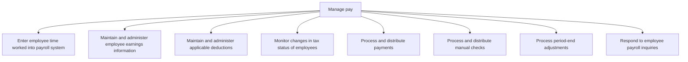
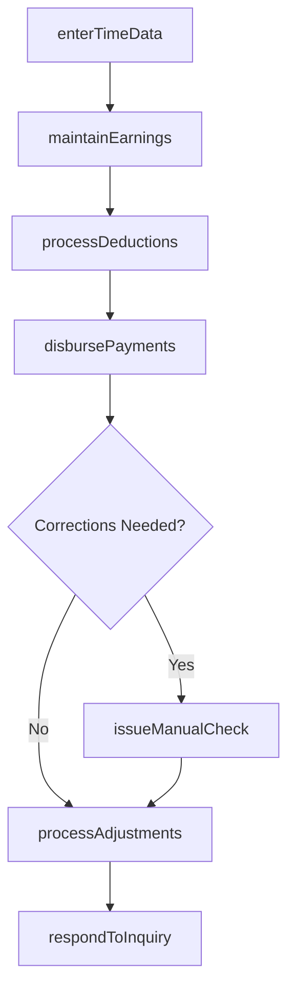

# Manage pay

> Business-as-Code definition for pay management. Models time entry into payroll, earnings administration, deduction processing, payment disbursement, manual check handling, period-end adjustments, and inquiry resolution as programmable APIs.

## Overview

Managing the total payments made in employees payroll, including bonuses and compensation.

## Process Hierarchy



## GraphDL

```yaml
manage:
  object: Pay
  actor: PayrollSpecialist
  result: PayrollRegister
```

## Actions

| Action | Description |
|--------|-------------|
| enterTimeData | Import validated time records into the payroll system |
| maintainEarnings | Update employee salary, bonus, and compensation data |
| processDeductions | Apply tax withholdings, benefit premiums, and voluntary deductions |
| disbursePayments | Execute direct deposits and issue paychecks |
| issueManualCheck | Process off-cycle or correction payments via manual check |
| processAdjustments | Record period-end payroll adjustments and retroactive changes |
| respondToInquiry | Address employee questions about pay, deductions, or tax status |

## Events

| Event | Description |
|-------|-------------|
| timeDataEntered | Time records imported into the payroll system |
| earningsMaintained | Employee compensation records updated |
| deductionsProcessed | Withholdings and deductions calculated and applied |
| paymentsDisbursed | Employee payments executed for the pay period |
| manualCheckIssued | Off-cycle payment processed and distributed |
| adjustmentsProcessed | Period-end payroll adjustments recorded |
| inquiryRespondedTo | Employee payroll inquiry investigated and resolved |

## Searches

| Search | Description |
|--------|-------------|
| getPayrollRegister | Retrieve payroll summary for a pay period by department or group |
| getEmployeePayHistory | Query pay records for a specific employee over time |
| getDeductionSummary | Get breakdown of deductions by type for the pay period |
| getOpenInquiries | List unresolved employee payroll inquiries |

## Process Flow



## RACI Matrix

| Activity | Responsible | Accountable | Consulted | Informed |
|----------|-------------|-------------|-----------|----------|
| enterTimeData | Payroll Clerk | Payroll Manager | Timekeeping | Department Managers |
| processDeductions | Payroll Specialist | Payroll Manager | Tax Manager | Benefits Admin |
| disbursePayments | Payroll Specialist | Payroll Manager | Treasury | Employees |
| respondToInquiry | Payroll Clerk | Payroll Manager | HR | Employee |

## Sub-Processes

| ID | Name | Description |
|----|------|-------------|
| 9.5.2.1 | Enter employee time worked into payroll system | Tracking the number of hours worked for the payroll system. Register the number of hours worked by a |
| 9.5.2.2 | Maintain and administer employee earnings information | Tracking and oversee salary breakups of employees. This process requires the organization to manage  |
| 9.5.2.3 | Maintain and administer applicable deductions | Processing salary deductions for tax purposes. Keep and manage the details of every employee's salar |
| 9.5.2.4 | Monitor changes in tax status of employees | Tracking changes in the salary structure of employees for tax deductions. |
| 9.5.2.5 | Process and distribute payments | Processing and distributing salaries to all employees. Execute the payroll management function throu |
| 9.5.2.6 | Process and distribute manual checks | Handling incorrect/omitted salary payments. |
| 9.5.2.7 | Process period-end adjustments | Adjusting salary deductions for tax purposes at the end of the year. |
| 9.5.2.8 | Respond to employee payroll inquiries | Addressing salary-related queries raised by employees. |

## Related Processes

| Process | Relationship |
|---------|-------------|
| 9.5.1 Report time | Upstream - validated time data feeds payroll calculation |
| 9.5.3 Manage and process payroll taxes | Downstream - gross pay drives tax withholding calculations |
| 9.3.2 Perform general accounting | Downstream - payroll journal entries post to the general ledger |

## Related Departments

| Department | Role |
|-----------|------|
| Payroll | Primary owner of compensation processing and disbursement |
| Human Resources | Provides employee data, salary changes, and benefits elections |
| Treasury | Manages funding for payroll disbursements |
| Finance | Records payroll expense in the general ledger |

## Related Occupations

| Occupation | Involvement |
|-----------|-------------|
| Payroll Specialist | Processes earnings, deductions, and payment disbursement |
| Payroll Manager | Oversees payroll operations and resolves escalations |
| Compensation Analyst | Maintains salary structures and bonus calculations |

## KPIs

| KPI | Description | Unit |
|-----|-------------|------|
| Payroll Accuracy | Percentage of payroll runs without errors | % |
| On-Time Payment Rate | Percentage of payments disbursed by scheduled pay date | % |
| Manual Check Rate | Percentage of payments requiring off-cycle manual processing | % |
| Inquiry Resolution Time | Average days to resolve employee payroll inquiries | Days |

## Usage

```typescript
import { managePay } from '@headlessly/manage-pay'

const pay = managePay()

// Process payroll for the current pay period
const register = await pay.disbursePayments({
  payPeriod: '2025-12-15',
  payGroup: 'biweekly-hourly',
  method: 'direct-deposit'
})

// Respond to an employee payroll inquiry
await pay.respondToInquiry({
  employeeId: 'EMP-3045',
  inquiryType: 'deduction-question',
  resolution: 'Explained 401k contribution increase per election change'
})
```
