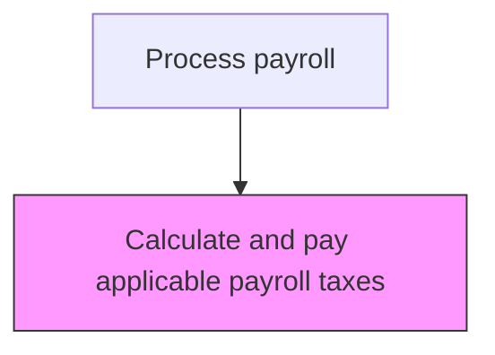
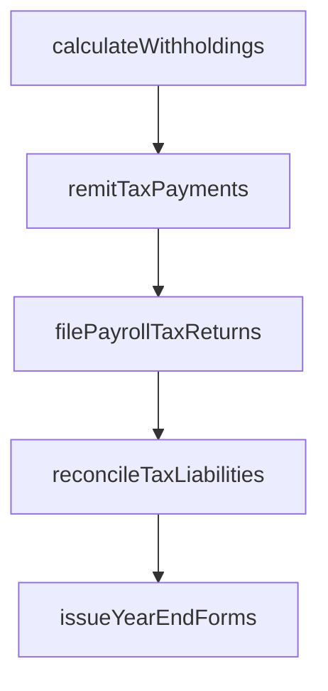

# Calculate and pay applicable payroll taxes

> Business-as-Code definition for pay applicable payroll taxes. Models the end-to-end process of calculate and pay applicable payroll taxes as a programmable workflow.

## Overview

Paying tax according to appropriate deductions made from salaries. Calculate and pay the tax liabilities according to the salaries and tax regulations of employees with the help of certified chartered accountants.

## Process Hierarchy



## GraphDL

```yaml
calculate:
  object: And Pay Applicable Payroll Taxes
  actor: PayrollTaxSpecialist
  result: PayApplicablePayrollTaxesCalculation
```

## Actions

| Action | Description |
|--------|-------------|
| calculateWithholdings | Compute federal, state, and local income tax withholdings |
| remitTaxPayments | Submit withheld taxes to appropriate taxing authorities by due dates |
| filePayrollTaxReturns | Prepare and file quarterly and annual payroll tax returns |
| reconcileTaxLiabilities | Match tax remittances against calculated withholding amounts |
| issueYearEndForms | Generate and distribute W-2s, 1099s, and other tax reporting forms |

## Events

| Event | Description |
|-------|-------------|
| withholdingsCalculated | Compute federal, state, and local income tax withholdings |
| taxPaymentsRemitted | Submit withheld taxes to appropriate taxing authorities by due dates |
| payrollTaxReturnsFiled | Prepare and file quarterly and annual payroll tax returns |
| taxLiabilitiesReconciled | Match tax remittances against calculated withholding amounts |
| yearEndFormsIssued | Generate and distribute W-2s, 1099s, and other tax reporting forms |

## Searches

| Search | Description |
|--------|-------------|
| getPayApplicablePayrollTaxes | Retrieve pay applicable payroll taxes records filtered by status, date, or owner |
| findPayApplicablePayrollTaxesByPeriod | Search pay applicable payroll taxes data for a specified date range |
| getPayApplicablePayrollTaxesSummary | Retrieve summary statistics and trends for pay applicable payroll taxes |
| listPayApplicablePayrollTaxesHistory | Query the audit trail and change history for pay applicable payroll taxes records |

## Process Flow



## RACI Matrix

| Activity | Responsible | Accountable | Consulted | Informed |
|----------|-------------|-------------|-----------|----------|
| calculateWithholdings | PayrollTaxSpecialist | PayrollManager | HumanResources | Employees |
| remitTaxPayments | PayrollTaxSpecialist | Controller | Treasury | CFO |
| filePayrollTaxReturns | PayrollTaxSpecialist | PayrollManager | ExternalAuditors | LegalCompliance |
| reconcileTaxLiabilities | PayrollTaxSpecialist | PayrollManager | Finance | InternalAudit |
| issueYearEndForms | PayrollTaxSpecialist | PayrollManager | HumanResources | Employees |

## Related Processes

| Process | Relationship |
|---------|-------------|
| 9.5.3.2 Manage tax plan | Upstream - tax plan strategies determine withholding optimization |
| 9.5.3.4 Produce and distribute employee annual tax statements | Downstream - calculated taxes feed annual statement generation |
| 9.5.2.5 Process and distribute payments | Related - payment processing triggers tax remittance obligations |
| 9.5.3 | Parent - governing process group |

## Related Departments

| Department | Role |
|-----------|------|
| Payroll | Processes employee compensation and tax withholdings |
| Human Resources | Provides employee data and benefit elections |
| Finance | Reconciles payroll expenses to general ledger |

## Related Occupations

| Occupation | Involvement |
|-----------|-------------|
| Payroll Specialist | Compensation calculation and payment processing |
| Payroll Tax Analyst | Tax withholding computation and filing |

## KPIs

| KPI | Description | Unit |
|-----|-------------|------|
| Tax Calculation Accuracy | Percentage of payroll tax calculations without errors or adjustments | % |
| Tax Remittance Timeliness | Percentage of tax payments submitted by regulatory due dates | % |
| Penalty and Interest Incidence | Total penalties and interest assessed by taxing authorities per year | USD |
| Tax Reconciliation Variance | Average variance between calculated and remitted tax amounts | % |

## Usage

```typescript
import { calculateAndPayApplicablePayrollTaxes } from '@headlessly/calculate-and-pay-applicable-payroll-taxes'

const client = calculateAndPayApplicablePayrollTaxes()

// Compute federal, state, and local income tax withholdings
const result = await client.calculateWithholdings({
  period: '2025-Q4',
  scope: 'enterprise'
})

// Remit calculated taxes to federal and state authorities
await client.remitTaxPayments({
  taxPeriod: '2025-Q4',
  jurisdictions: ['federal', 'state-CA', 'state-NY']
})
```
