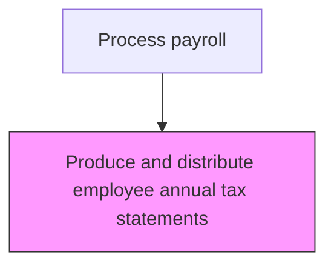
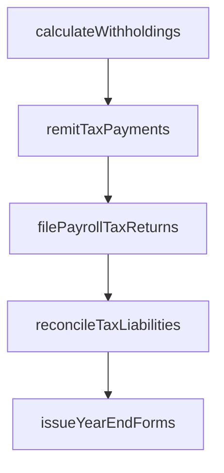

# Produce and distribute employee annual tax statements

> Business-as-Code definition for distribute employee annual tax statements. Models the end-to-end process of produce and distribute employee annual tax statements as a programmable workflow.

## Overview

Providing annual tax statements such as W-2s, 1099s, and state-specific wage and tax summaries to every employee for their tax filing reference. This process involves compiling year-to-date earnings, withholding totals, and benefit deduction data into standardized forms that comply with IRS and state tax authority formatting requirements. Statements must be produced, verified for accuracy, and distributed to employees by regulatory deadlines, with electronic copies filed with the appropriate government agencies.

## Process Hierarchy



## GraphDL

```yaml
produce:
  object: And Distribute Employee Annual Tax Statements
  actor: PayrollTaxSpecialist
  result: DistributeEmployeeAnnualTaxStatementsRecord
```

## Actions

| Action | Description |
|--------|-------------|
| calculateWithholdings | Compute federal, state, and local income tax withholdings |
| remitTaxPayments | Submit withheld taxes to appropriate taxing authorities by due dates |
| filePayrollTaxReturns | Prepare and file quarterly and annual payroll tax returns |
| reconcileTaxLiabilities | Match tax remittances against calculated withholding amounts |
| issueYearEndForms | Generate and distribute W-2s, 1099s, and other tax reporting forms |

## Events

| Event | Description |
|-------|-------------|
| withholdingsCalculated | Compute federal, state, and local income tax withholdings |
| taxPaymentsRemitted | Submit withheld taxes to appropriate taxing authorities by due dates |
| payrollTaxReturnsFiled | Prepare and file quarterly and annual payroll tax returns |
| taxLiabilitiesReconciled | Match tax remittances against calculated withholding amounts |
| yearEndFormsIssued | Generate and distribute W-2s, 1099s, and other tax reporting forms |

## Searches

| Search | Description |
|--------|-------------|
| getDistributeEmployeeAnnualTaxStatements | Retrieve distribute employee annual tax statements records filtered by status, date, or owner |
| findDistributeEmployeeAnnualTaxStatementsByPeriod | Search distribute employee annual tax statements data for a specified date range |
| getDistributeEmployeeAnnualTaxStatementsSummary | Retrieve summary statistics and trends for distribute employee annual tax statements |
| listDistributeEmployeeAnnualTaxStatementsHistory | Query the audit trail and change history for distribute employee annual tax statements records |

## Process Flow



## RACI Matrix

| Activity | Responsible | Accountable | Consulted | Informed |
|----------|-------------|-------------|-----------|----------|
| calculateWithholdings | PayrollTaxSpecialist | PayrollManager | HumanResources | Employees |
| remitTaxPayments | PayrollTaxSpecialist | Controller | Treasury | CFO |
| filePayrollTaxReturns | PayrollTaxSpecialist | PayrollManager | ExternalAuditors | LegalCompliance |
| reconcileTaxLiabilities | PayrollTaxSpecialist | PayrollManager | Finance | InternalAudit |
| issueYearEndForms | PayrollTaxSpecialist | PayrollManager | HumanResources | Employees |

## Related Processes

| Process | Relationship |
|---------|-------------|
| 9.5.3.3 Calculate and pay applicable payroll taxes | Upstream - tax calculations provide data for annual statements |
| 9.5.3.5 File regulatory payroll tax forms | Downstream - annual statements accompany regulatory tax filings |
| 9.5.2.7 Process period-end adjustments | Related - year-end adjustments affect annual statement totals |
| 9.5.3 | Parent - governing process group |

## Related Departments

| Department | Role |
|-----------|------|
| Payroll | Processes employee compensation and tax withholdings |
| Human Resources | Provides employee data and benefit elections |
| Finance | Reconciles payroll expenses to general ledger |

## Related Occupations

| Occupation | Involvement |
|-----------|-------------|
| Payroll Specialist | Compensation calculation and payment processing |
| Payroll Tax Analyst | Tax withholding computation and filing |

## KPIs

| KPI | Description | Unit |
|-----|-------------|------|
| W-2 Distribution Timeliness | Percentage of W-2 forms distributed by January 31 regulatory deadline | % |
| Statement Accuracy Rate | Percentage of annual tax statements issued without corrections (W-2c) | % |
| Electronic Delivery Adoption | Percentage of employees receiving tax statements electronically | % |
| Correction Rate | Number of corrected W-2c forms issued as a percentage of total W-2s | % |

## Usage

```typescript
import { produceAndDistributeEmployeeAnnualTaxStatements } from '@headlessly/produce-and-distribute-employee-annual-tax-statements'

const client = produceAndDistributeEmployeeAnnualTaxStatements()

// Compute federal, state, and local income tax withholdings
const result = await client.calculateWithholdings({
  period: '2025-Q4',
  scope: 'enterprise'
})

// Generate and distribute W-2 forms for all employees
await client.issueYearEndForms({
  taxYear: 2025,
  formType: 'W-2',
  deliveryMethod: 'electronic'
})
```
