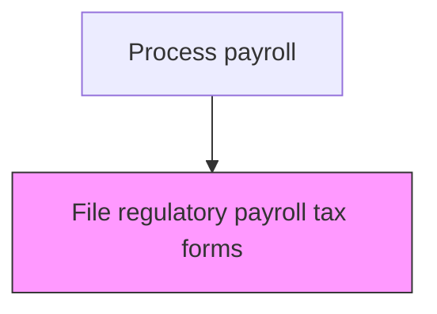
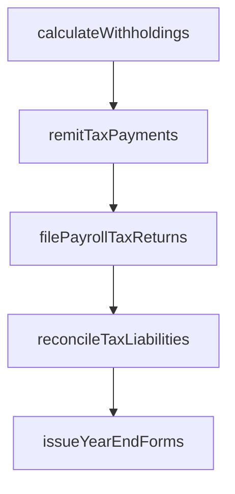

# File regulatory payroll tax forms

> Business-as-Code definition for regulatory payroll tax forms. Models the end-to-end process of file regulatory payroll tax forms as a programmable workflow.

## Overview

Filing required payroll tax forms with federal, state, and local government agencies on quarterly and annual schedules. This includes preparing and submitting Form 941 (quarterly federal tax return), Form 940 (annual federal unemployment tax), and state-specific unemployment and withholding returns. The process requires reconciling tax deposits against calculated liabilities, ensuring all forms match previously remitted payments, and maintaining documentation to support regulatory audits and compliance reviews.

## Process Hierarchy



## GraphDL

```yaml
file:
  object: Regulatory Payroll Tax Forms
  actor: PayrollTaxSpecialist
  result: RegulatoryPayrollTaxFormsRecord
```

## Actions

| Action | Description |
|--------|-------------|
| calculateWithholdings | Compute federal, state, and local income tax withholdings |
| remitTaxPayments | Submit withheld taxes to appropriate taxing authorities by due dates |
| filePayrollTaxReturns | Prepare and file quarterly and annual payroll tax returns |
| reconcileTaxLiabilities | Match tax remittances against calculated withholding amounts |
| issueYearEndForms | Generate and distribute W-2s, 1099s, and other tax reporting forms |

## Events

| Event | Description |
|-------|-------------|
| withholdingsCalculated | Compute federal, state, and local income tax withholdings |
| taxPaymentsRemitted | Submit withheld taxes to appropriate taxing authorities by due dates |
| payrollTaxReturnsFiled | Prepare and file quarterly and annual payroll tax returns |
| taxLiabilitiesReconciled | Match tax remittances against calculated withholding amounts |
| yearEndFormsIssued | Generate and distribute W-2s, 1099s, and other tax reporting forms |

## Searches

| Search | Description |
|--------|-------------|
| getRegulatoryPayrollTaxForms | Retrieve regulatory payroll tax forms records filtered by status, date, or owner |
| findRegulatoryPayrollTaxFormsByPeriod | Search regulatory payroll tax forms data for a specified date range |
| getRegulatoryPayrollTaxFormsSummary | Retrieve summary statistics and trends for regulatory payroll tax forms |
| listRegulatoryPayrollTaxFormsHistory | Query the audit trail and change history for regulatory payroll tax forms records |

## Process Flow



## RACI Matrix

| Activity | Responsible | Accountable | Consulted | Informed |
|----------|-------------|-------------|-----------|----------|
| calculateWithholdings | PayrollTaxSpecialist | PayrollManager | HumanResources | Employees |
| remitTaxPayments | PayrollTaxSpecialist | Controller | Treasury | CFO |
| filePayrollTaxReturns | PayrollTaxSpecialist | PayrollManager | ExternalAuditors | LegalCompliance |
| reconcileTaxLiabilities | PayrollTaxSpecialist | PayrollManager | Finance | InternalAudit |
| issueYearEndForms | PayrollTaxSpecialist | PayrollManager | HumanResources | Employees |

## Related Processes

| Process | Relationship |
|---------|-------------|
| 9.5.3.4 Produce and distribute employee annual tax statements | Upstream - annual statements must reconcile with filed tax forms |
| 9.5.3.3 Calculate and pay applicable payroll taxes | Related - tax calculations and payments are reconciled in filings |
| 9.5.3.1 Develop tax plan | Related - tax plan strategies are validated through filing outcomes |
| 9.5.3 | Parent - governing process group |

## Related Departments

| Department | Role |
|-----------|------|
| Payroll | Processes employee compensation and tax withholdings |
| Human Resources | Provides employee data and benefit elections |
| Finance | Reconciles payroll expenses to general ledger |

## Related Occupations

| Occupation | Involvement |
|-----------|-------------|
| Payroll Specialist | Compensation calculation and payment processing |
| Payroll Tax Analyst | Tax withholding computation and filing |

## KPIs

| KPI | Description | Unit |
|-----|-------------|------|
| Tax Filing Timeliness | Percentage of payroll tax returns filed by regulatory deadlines | % |
| Filing Accuracy Rate | Percentage of tax forms filed without amendments or corrections | % |
| Penalty Avoidance Rate | Percentage of filing periods with zero penalties or interest assessed | % |
| Electronic Filing Rate | Percentage of tax forms submitted through electronic filing channels | % |

## Usage

```typescript
import { fileRegulatoryPayrollTaxForms } from '@headlessly/file-regulatory-payroll-tax-forms'

const client = fileRegulatoryPayrollTaxForms()

// Compute federal, state, and local income tax withholdings
const result = await client.calculateWithholdings({
  period: '2025-Q4',
  scope: 'enterprise'
})

// File quarterly Form 941 with the IRS
await client.filePayrollTaxReturns({
  formType: '941',
  quarter: 'Q4-2025',
  filingMethod: 'electronic'
})
```
