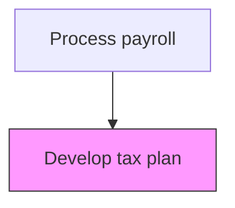
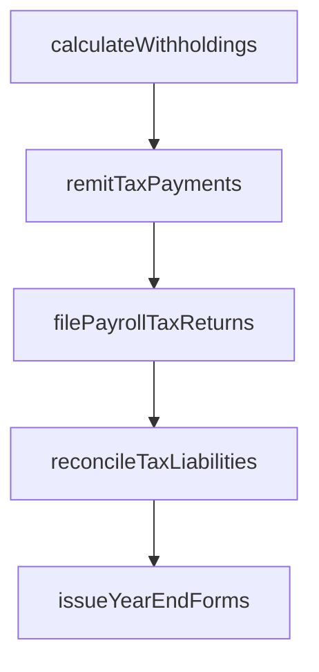

# Develop tax plan

> Business-as-Code definition for tax plan. Models the end-to-end process of develop tax plan as a programmable workflow.

## Overview

Devising a method to minimize payroll tax liability by means of allowances, deductions, exclusions, or exemptions while maintaining full regulatory compliance. This process involves analyzing current and projected tax obligations across all jurisdictions, evaluating pre-tax benefit program structures, and identifying strategies such as retirement plan matching, health savings account contributions, and qualified transportation benefits that reduce taxable payroll. The resulting tax plan provides a roadmap for optimizing the organization's total employment tax burden while ensuring employees benefit from available tax-advantaged programs.

## Process Hierarchy



## GraphDL

```yaml
develop:
  object: Tax Plan
  actor: PayrollTaxSpecialist
  result: TaxPlanPlan
```

## Actions

| Action | Description |
|--------|-------------|
| calculateWithholdings | Compute federal, state, and local income tax withholdings |
| remitTaxPayments | Submit withheld taxes to appropriate taxing authorities by due dates |
| filePayrollTaxReturns | Prepare and file quarterly and annual payroll tax returns |
| reconcileTaxLiabilities | Match tax remittances against calculated withholding amounts |
| issueYearEndForms | Generate and distribute W-2s, 1099s, and other tax reporting forms |

## Events

| Event | Description |
|-------|-------------|
| withholdingsCalculated | Compute federal, state, and local income tax withholdings |
| taxPaymentsRemitted | Submit withheld taxes to appropriate taxing authorities by due dates |
| payrollTaxReturnsFiled | Prepare and file quarterly and annual payroll tax returns |
| taxLiabilitiesReconciled | Match tax remittances against calculated withholding amounts |
| yearEndFormsIssued | Generate and distribute W-2s, 1099s, and other tax reporting forms |

## Searches

| Search | Description |
|--------|-------------|
| getTaxPlan | Retrieve tax plan records filtered by status, date, or owner |
| findTaxPlanByPeriod | Search tax plan data for a specified date range |
| getTaxPlanSummary | Retrieve summary statistics and trends for tax plan |
| listTaxPlanHistory | Query the audit trail and change history for tax plan records |

## Process Flow



## RACI Matrix

| Activity | Responsible | Accountable | Consulted | Informed |
|----------|-------------|-------------|-----------|----------|
| calculateWithholdings | PayrollTaxSpecialist | PayrollManager | ExternalTaxAdvisor | CFO |
| remitTaxPayments | PayrollTaxSpecialist | Controller | Treasury | Finance |
| filePayrollTaxReturns | PayrollTaxSpecialist | PayrollManager | ExternalAuditors | LegalCompliance |
| reconcileTaxLiabilities | PayrollTaxSpecialist | PayrollManager | Finance | InternalAudit |
| issueYearEndForms | PayrollTaxSpecialist | PayrollManager | HumanResources | Employees |

## Related Processes

| Process | Relationship |
|---------|-------------|
| 9.5.3.2 Manage tax plan | Downstream - developed plan requires ongoing management and monitoring |
| 9.5.3.3 Calculate and pay applicable payroll taxes | Downstream - tax plan strategies inform withholding calculations |
| 9.5.2.3 Maintain and administer applicable deductions | Related - pre-tax deduction strategies are part of the tax plan |
| 9.5.3 | Parent - governing process group |

## Related Departments

| Department | Role |
|-----------|------|
| Payroll | Processes employee compensation and tax withholdings |
| Human Resources | Provides employee data and benefit elections |
| Finance | Reconciles payroll expenses to general ledger |

## Related Occupations

| Occupation | Involvement |
|-----------|-------------|
| Payroll Specialist | Compensation calculation and payment processing |
| Payroll Tax Analyst | Tax withholding computation and filing |

## KPIs

| KPI | Description | Unit |
|-----|-------------|------|
| Tax Savings Achieved | Total payroll tax savings realized from plan strategies vs. baseline | USD |
| Pre-Tax Benefit Participation | Percentage of eligible employees enrolled in pre-tax benefit programs | % |
| Effective Tax Rate | Organization's effective payroll tax rate compared to statutory rate | % |
| Tax Plan Review Frequency | Number of tax plan reviews and updates completed per year | Count |

## Usage

```typescript
import { developTaxPlan } from '@headlessly/develop-tax-plan'

const client = developTaxPlan()

// Compute federal, state, and local income tax withholdings
const result = await client.calculateWithholdings({
  period: '2025-Q4',
  scope: 'enterprise'
})

// Retrieve tax plan summary with savings projections
const plan = await client.getTaxPlanSummary({
  fiscalYear: 2026,
  includeProjections: true
})
```
