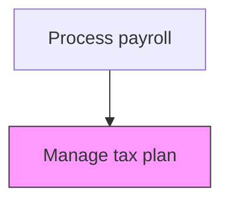
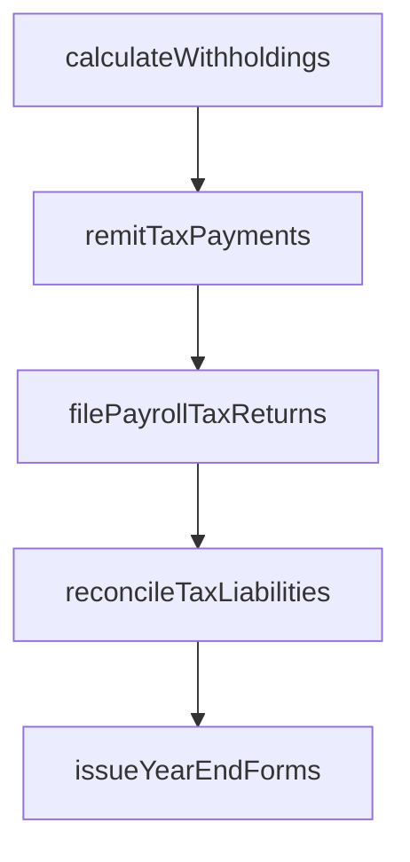

# Manage tax plan

> Business-as-Code definition for tax plan. Models the end-to-end process of manage tax plan as a programmable workflow.

## Overview

Overseeing and maintaining the payroll tax reduction strategies developed in the tax plan. This process involves monitoring the effectiveness of implemented tax strategies, tracking changes in federal, state, and local tax laws that may impact the plan, and adjusting withholding approaches and benefit program structures accordingly. Regular management of the tax plan ensures continued optimization of the organization's payroll tax position while adapting to regulatory changes, workforce composition shifts, and new tax-advantaged program opportunities.

## Process Hierarchy



## GraphDL

```yaml
manage:
  object: Tax Plan
  actor: PayrollTaxSpecialist
  result: TaxPlanReport
```

## Actions

| Action | Description |
|--------|-------------|
| calculateWithholdings | Compute federal, state, and local income tax withholdings |
| remitTaxPayments | Submit withheld taxes to appropriate taxing authorities by due dates |
| filePayrollTaxReturns | Prepare and file quarterly and annual payroll tax returns |
| reconcileTaxLiabilities | Match tax remittances against calculated withholding amounts |
| issueYearEndForms | Generate and distribute W-2s, 1099s, and other tax reporting forms |

## Events

| Event | Description |
|-------|-------------|
| withholdingsCalculated | Compute federal, state, and local income tax withholdings |
| taxPaymentsRemitted | Submit withheld taxes to appropriate taxing authorities by due dates |
| payrollTaxReturnsFiled | Prepare and file quarterly and annual payroll tax returns |
| taxLiabilitiesReconciled | Match tax remittances against calculated withholding amounts |
| yearEndFormsIssued | Generate and distribute W-2s, 1099s, and other tax reporting forms |

## Searches

| Search | Description |
|--------|-------------|
| getTaxPlan | Retrieve tax plan records filtered by status, date, or owner |
| findTaxPlanByPeriod | Search tax plan data for a specified date range |
| getTaxPlanSummary | Retrieve summary statistics and trends for tax plan |
| listTaxPlanHistory | Query the audit trail and change history for tax plan records |

## Process Flow



## RACI Matrix

| Activity | Responsible | Accountable | Consulted | Informed |
|----------|-------------|-------------|-----------|----------|
| calculateWithholdings | PayrollTaxSpecialist | PayrollManager | ExternalTaxAdvisor | CFO |
| remitTaxPayments | PayrollTaxSpecialist | Controller | Treasury | Finance |
| filePayrollTaxReturns | PayrollTaxSpecialist | PayrollManager | ExternalAuditors | LegalCompliance |
| reconcileTaxLiabilities | PayrollTaxSpecialist | PayrollManager | Finance | InternalAudit |
| issueYearEndForms | PayrollTaxSpecialist | PayrollManager | HumanResources | Employees |

## Related Processes

| Process | Relationship |
|---------|-------------|
| 9.5.3.1 Develop tax plan | Upstream - developed plan requires ongoing management |
| 9.5.3.3 Calculate and pay applicable payroll taxes | Downstream - managed plan strategies guide tax calculations |
| 9.5.2.4 Monitor changes in tax status of employees | Related - employee tax status changes may require plan adjustments |
| 9.5.3 | Parent - governing process group |

## Related Departments

| Department | Role |
|-----------|------|
| Payroll | Processes employee compensation and tax withholdings |
| Human Resources | Provides employee data and benefit elections |
| Finance | Reconciles payroll expenses to general ledger |

## Related Occupations

| Occupation | Involvement |
|-----------|-------------|
| Payroll Specialist | Compensation calculation and payment processing |
| Payroll Tax Analyst | Tax withholding computation and filing |

## KPIs

| KPI | Description | Unit |
|-----|-------------|------|
| Tax Plan Variance | Deviation between planned and actual payroll tax savings | % |
| Regulatory Change Response Time | Average days from tax law change to plan adjustment implementation | Days |
| Tax Credit Utilization | Percentage of available payroll tax credits successfully claimed | % |
| Plan Compliance Rate | Percentage of tax plan strategies maintaining regulatory compliance | % |

## Usage

```typescript
import { manageTaxPlan } from '@headlessly/manage-tax-plan'

const client = manageTaxPlan()

// Compute federal, state, and local income tax withholdings
const result = await client.calculateWithholdings({
  period: '2025-Q4',
  scope: 'enterprise'
})

// Review tax plan performance against projected savings
const planHistory = await client.listTaxPlanHistory({
  fiscalYear: 2025,
  includeVarianceAnalysis: true
})
```
