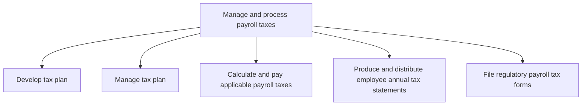
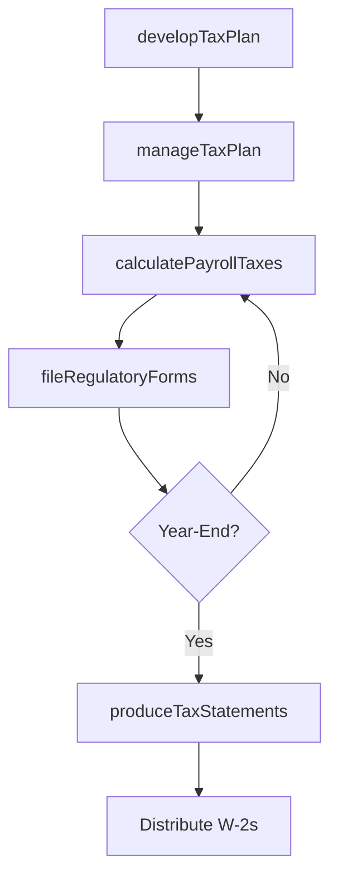

# Manage and process payroll taxes

> Business-as-Code definition for payroll tax management. Models tax planning, tax plan administration, withholding calculation, annual statement production, and regulatory tax filing as programmable APIs.

## Overview

Deducting and paying taxes from employees' salaries.

## Process Hierarchy



## GraphDL

```yaml
manage:
  object: And Process Payroll Taxes
  actor: PayrollTaxAnalyst
  result: PayrollTaxFiling
```

## Actions

| Action | Description |
|--------|-------------|
| developTaxPlan | Design payroll tax strategies to optimize withholding and compliance |
| manageTaxPlan | Monitor and adjust tax plans in response to regulatory changes |
| calculatePayrollTaxes | Compute federal, state, and local tax withholdings for each employee |
| produceTaxStatements | Generate annual W-2 and other tax statements for employees |
| fileRegulatoryForms | Submit quarterly and annual payroll tax returns to authorities |

## Events

| Event | Description |
|-------|-------------|
| taxPlanDeveloped | Payroll tax strategy established for the fiscal year |
| taxPlanManaged | Tax plan updated to reflect regulatory or rate changes |
| payrollTaxesCalculated | Employee tax withholdings computed for the pay period |
| taxStatementsProduced | Annual employee tax statements generated and distributed |
| regulatoryFormsFiled | Payroll tax returns submitted to federal, state, and local agencies |

## Searches

| Search | Description |
|--------|-------------|
| getTaxLiabilities | Query outstanding payroll tax obligations by jurisdiction |
| getWithholdingSummary | Retrieve tax withholding totals by employee or period |
| getFilingStatus | Check status of payroll tax filings by jurisdiction and period |
| getTaxRateChanges | List recent changes to tax rates affecting payroll |

## Process Flow



## RACI Matrix

| Activity | Responsible | Accountable | Consulted | Informed |
|----------|-------------|-------------|-----------|----------|
| developTaxPlan | Payroll Tax Analyst | Payroll Manager | Tax Manager | CFO |
| calculatePayrollTaxes | Payroll Specialist | Payroll Manager | Tax Advisor | Controller |
| produceTaxStatements | Payroll Tax Analyst | Payroll Manager | HR | Employees |
| fileRegulatoryForms | Payroll Tax Analyst | Payroll Manager | Tax Manager | CFO |

## Sub-Processes

| ID | Name | Description |
|----|------|-------------|
| 9.5.3.1 | Develop tax plan | Devising a method to minimize payroll tax liability by means of allowances, deductions, exclusions o |
| 9.5.3.2 | Manage tax plan | Overseeing maintaining the reduction of payroll taxes [14075]. |
| 9.5.3.3 | Calculate and pay applicable payroll taxes | Paying tax according to appropriate deductions made from salaries. Calculate and pay the tax liabili |
| 9.5.3.4 | Produce and distribute employee annual tax statements | Providing tax deductions statements created by certified chartered accountants to every employee for |
| 9.5.3.5 | File regulatory payroll tax forms | Filling taxes, and highlighting different sources of income and expenditures made. |

## Related Processes

| Process | Relationship |
|---------|-------------|
| 9.5.2 Manage pay | Upstream - gross pay data drives tax calculations |
| 9.9 Manage taxes | Parallel - payroll taxes are a component of overall tax management |
| 9.3.2 Perform general accounting | Downstream - tax liabilities post to the general ledger |

## Related Departments

| Department | Role |
|-----------|------|
| Payroll | Primary owner of tax withholding calculation and remittance |
| Tax | Advises on tax rates, regulatory changes, and filing requirements |
| Finance | Records tax liabilities and ensures proper GL coding |
| Human Resources | Provides employee tax status and W-4 data |

## Related Occupations

| Occupation | Involvement |
|-----------|-------------|
| Payroll Tax Analyst | Calculates withholdings, prepares filings, and produces tax statements |
| Tax Manager | Oversees compliance strategy and manages audits |
| Payroll Manager | Ensures on-time tax remittance and filing |

## KPIs

| KPI | Description | Unit |
|-----|-------------|------|
| Tax Filing Compliance Rate | Percentage of payroll tax returns filed on time | % |
| Tax Withholding Accuracy | Percentage of employee withholdings calculated correctly | % |
| W-2 Distribution Timeliness | Days before deadline that W-2s are distributed to employees | Days |
| Payroll Tax Penalty Amount | Total penalties incurred for late or incorrect filings | USD |

## Usage

```typescript
import { manageAndProcessPayrollTaxes } from '@headlessly/manage-and-process-payroll-taxes'

const taxes = manageAndProcessPayrollTaxes()

// Calculate payroll taxes for the pay period
const liability = await taxes.calculatePayrollTaxes({
  payPeriod: '2025-12-15',
  jurisdictions: ['federal', 'state-CA', 'local-SF']
})

// Produce annual tax statements
await taxes.produceTaxStatements({
  taxYear: 2025,
  formType: 'W-2',
  distributeBy: '2026-01-31'
})
```
