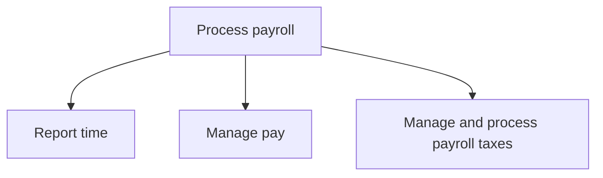
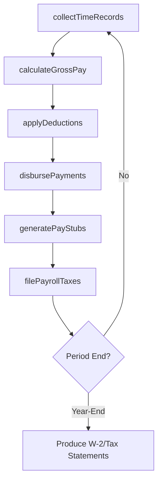

# Process payroll

> Business-as-Code definition for payroll processing. Models time reporting, compensation calculation, tax withholding, payment disbursement, and payroll tax filing as programmable APIs.

## Overview

Handling reporting time, managing pay, and processing taxes from salaries. Pay employees. Withhold taxes. Confirm the correct funds are paid to the correct government agency.

## Process Hierarchy



## GraphDL

```yaml
process:
  object: Payroll
  actor: PayrollManager
  result: PayrollRegister
```

## Actions

| Action | Description |
|--------|-------------|
| collectTimeRecords | Gather employee hours worked, leave taken, and overtime |
| calculateGrossPay | Compute gross earnings from base salary, overtime, and bonuses |
| applyDeductions | Withhold taxes, benefits, and voluntary deductions from gross pay |
| disbursePayments | Process direct deposits and issue paychecks to employees |
| filePayrollTaxes | Calculate, remit, and report payroll tax obligations to authorities |
| generatePayStubs | Produce itemized earnings statements for each employee |

## Events

| Event | Description |
|-------|-------------|
| timeRecordsCollected | Employee time data gathered and validated for the pay period |
| grossPayCalculated | Gross earnings computed for all employees |
| deductionsApplied | Tax withholdings and benefit deductions processed |
| paymentsDisbursed | Employee payments issued via direct deposit or check |
| payrollTaxesFiled | Payroll tax returns submitted to federal, state, and local agencies |
| payStubsGenerated | Earnings statements produced and distributed to employees |

## Searches

| Search | Description |
|--------|-------------|
| getPayrollRegister | Retrieve payroll summary by period, department, or pay group |
| findEmployeeEarnings | Search employee compensation records by name, ID, or period |
| getTaxLiabilities | Get outstanding payroll tax obligations by jurisdiction |
| getLeaveBalances | Retrieve paid and unpaid leave balances for employees |

## Process Flow



## RACI Matrix

| Activity | Responsible | Accountable | Consulted | Informed |
|----------|-------------|-------------|-----------|----------|
| collectTimeRecords | Payroll Clerk | Payroll Manager | Department Managers | HR Director |
| calculateGrossPay | Payroll Specialist | Payroll Manager | Compensation Analyst | Controller |
| applyDeductions | Payroll Specialist | Payroll Manager | Tax Manager | Benefits Administrator |
| disbursePayments | Payroll Manager | VP Finance | Treasury | Employees |
| filePayrollTaxes | Payroll Tax Analyst | Payroll Manager | Tax Manager | CFO |

## Sub-Processes

| ID | Name | Description |
|----|------|-------------|
| 9.5.1 | Report time | Recording the reporting time of employees on-site. Track working days, salary calculations, holidays |
| 9.5.2 | Manage pay | Managing the total payments made in employees payroll, including bonuses and compensation. |
| 9.5.3 | Manage and process payroll taxes | Deducting and paying taxes from employees' salaries. |

## Related Processes

| Process | Relationship |
|---------|-------------|
| 9.3 Perform general accounting and reporting | Downstream - payroll journal entries post to the general ledger |
| 9.9 Manage taxes | Parallel - payroll tax obligations feed into overall tax management |
| 8.2 Reward and retain employees | Upstream - compensation policies drive payroll calculations |

## Related Departments

| Department | Role |
|-----------|------|
| Payroll | Primary owner of compensation processing and tax compliance |
| Human Resources | Provides employee data, benefits elections, and leave records |
| Finance | Records payroll expenses and ensures budget alignment |
| Tax | Advises on withholding rates and regulatory filing requirements |
| IT | Maintains payroll systems and integration with time tracking |

## Related Occupations

| Occupation | Involvement |
|-----------|-------------|
| Payroll Manager | Oversight of payroll operations and compliance |
| Payroll Specialist | Day-to-day payroll processing and adjustments |
| Payroll Tax Analyst | Tax calculation, filing, and regulatory reporting |

## KPIs

| KPI | Description | Unit |
|-----|-------------|------|
| Payroll Accuracy Rate | Percentage of payroll runs without calculation errors | % |
| On-Time Payment Rate | Percentage of payments disbursed by scheduled pay date | % |
| Cost per Payroll Run | Total payroll processing cost divided by number of runs | USD |
| Tax Filing Compliance Rate | Percentage of payroll tax filings submitted on time | % |

## Usage

```typescript
import { processPayroll } from '@headlessly/process-payroll'

const payroll = processPayroll()

// Run payroll for the current pay period
const register = await payroll.calculateGrossPay({
  payPeriod: '2025-12-15',
  payGroup: 'biweekly-salaried',
  includeOvertime: true
})

// Disburse payments after deductions
await payroll.disbursePayments({
  payrollRunId: register.id,
  method: 'direct-deposit',
  effectiveDate: '2025-12-20'
})
```
