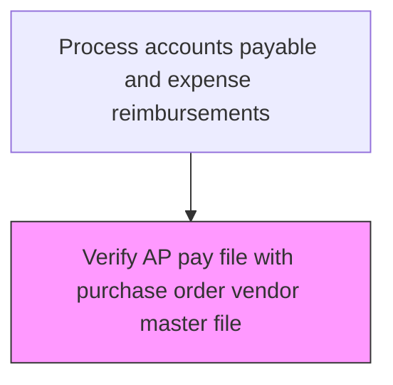
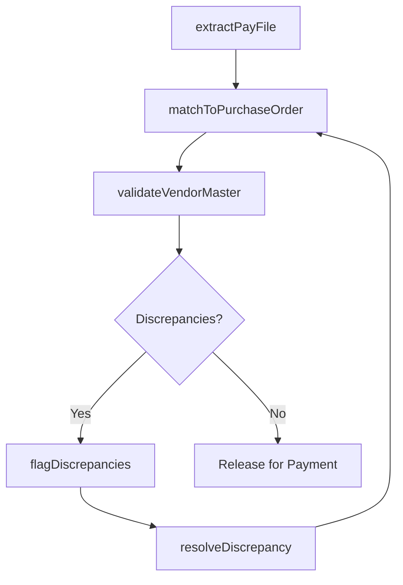

# Verify AP pay file with purchase order vendor master file

> Business-as-Code definition for ap pay file with purchase order vendor master file. Models the end-to-end process of verify ap pay file with purchase order vendor master file as a programmable workflow.

## Overview

Matching records of bills to be paid against approved purchase orders and the vendor master file to ensure payment accuracy and prevent unauthorized disbursements. This three-way match validates that the invoice amount, purchase order terms, and goods receipt are consistent before payment authorization. The process detects discrepancies such as duplicate invoices, pricing variances, and unauthorized vendors, reducing fraud risk and ensuring only legitimate obligations are settled.

## Process Hierarchy



## GraphDL

```yaml
verify:
  object: AP Pay File With Purchase Order Vendor Master File
  actor: AccountsPayableClerk
  result: ApPayFileWithPurchaseOrderVendorMasterFileVerificationReport
```

## Actions

| Action | Description |
|--------|-------------|
| extractPayFile | Pull the AP pay file containing invoices queued for payment |
| matchToPurchaseOrder | Compare each pay file entry against the corresponding purchase order for terms and amounts |
| validateVendorMaster | Verify that the payee exists in the vendor master file with active status and correct banking details |
| flagDiscrepancies | Identify mismatches between invoice, PO, and vendor master records |
| resolveDiscrepancy | Investigate and clear flagged discrepancies before payment release |

## Events

| Event | Description |
|-------|-------------|
| payFileExtracted | AP pay file pulled for verification processing |
| purchaseOrderMatched | Invoice successfully matched to its purchase order |
| vendorMasterValidated | Vendor confirmed as active with correct payment details |
| discrepancyFlagged | Mismatch identified between pay file, PO, or vendor master |
| discrepancyResolved | Flagged discrepancy investigated and cleared |

## Searches

| Search | Description |
|--------|-------------|
| getApPayFileWithPurchaseOrderVendorMasterFile | Retrieve ap pay file with purchase order vendor master file records filtered by status, date, or owner |
| findApPayFileWithPurchaseOrderVendorMasterFileByPeriod | Search ap pay file with purchase order vendor master file data for a specified date range |
| getApPayFileWithPurchaseOrderVendorMasterFileSummary | Retrieve summary statistics and trends for ap pay file with purchase order vendor master file |
| listApPayFileWithPurchaseOrderVendorMasterFileHistory | Query the audit trail and change history for ap pay file with purchase order vendor master file records |

## Process Flow



## RACI Matrix

| Activity | Responsible | Accountable | Consulted | Informed |
|----------|-------------|-------------|-----------|----------|
| extractPayFile | AccountsPayableClerk | APManager | ITSystems | Controller |
| matchToPurchaseOrder | AccountsPayableClerk | APManager | Procurement | Receiving |
| validateVendorMaster | AccountsPayableClerk | APManager | VendorManagement | Treasury |
| flagDiscrepancies | AccountsPayableClerk | APManager | Procurement | Vendor |

## Related Processes

| Process | Relationship |
|---------|-------------|
| 9.6.1.2 Maintain/Manage electronic commerce | Downstream - electronic invoices feed verification |
| 9.6.1.3 Audit invoices and key data in AP system | Downstream - verified invoices proceed to audit |
| 9.6.1.8 Process payments | Downstream - verified pay file released for disbursement |
| 9.6.1 | Parent - governing process group |

## Related Departments

| Department | Role |
|-----------|------|
| Accounts Payable | Processes vendor invoices and payments |
| Procurement | Provides purchase order data for invoice matching |
| Expense Management | Handles employee reimbursement claims |

## Related Occupations

| Occupation | Involvement |
|-----------|-------------|
| Accounts Payable Clerk | Invoice processing and payment execution |
| Expense Auditor | Expense report review and policy compliance |

## KPIs

| KPI | Description | Unit |
|-----|-------------|------|
| Three-Way Match Rate | Percentage of invoices matching PO and receipt on first attempt | % |
| Discrepancy Rate | Percentage of pay file entries flagged with mismatches | % |
| Verification Cycle Time | Average hours to complete pay file verification | Hours |
| Vendor Master Accuracy | Percentage of vendor records confirmed current and accurate | % |

## Usage

```typescript
import { verifyApPayFileWithPurchaseOrderVendorMasterFile } from '@headlessly/verify-ap-pay-file-with-purchase-order-vendor-master-file'

const client = verifyApPayFileWithPurchaseOrderVendorMasterFile()

// Extract and match the pay file against purchase orders
const verification = await client.matchToPurchaseOrder({
  payFileId: 'PAY-2025-03-15',
  matchType: 'three-way',
  tolerancePercent: 2.0
})

// Validate vendor master records for flagged entries
const vendorCheck = await client.validateVendorMaster({
  vendorIds: verification.flaggedVendorIds,
  checkBankingDetails: true,
  checkActiveStatus: true
})
```
