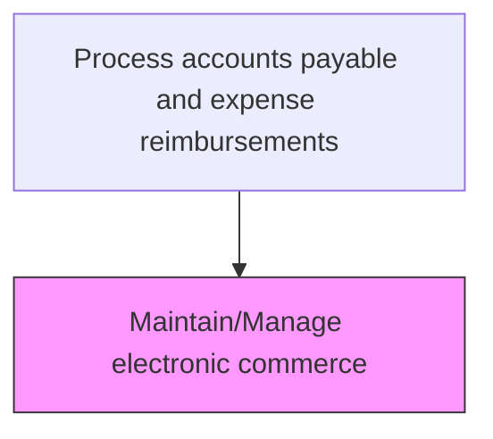
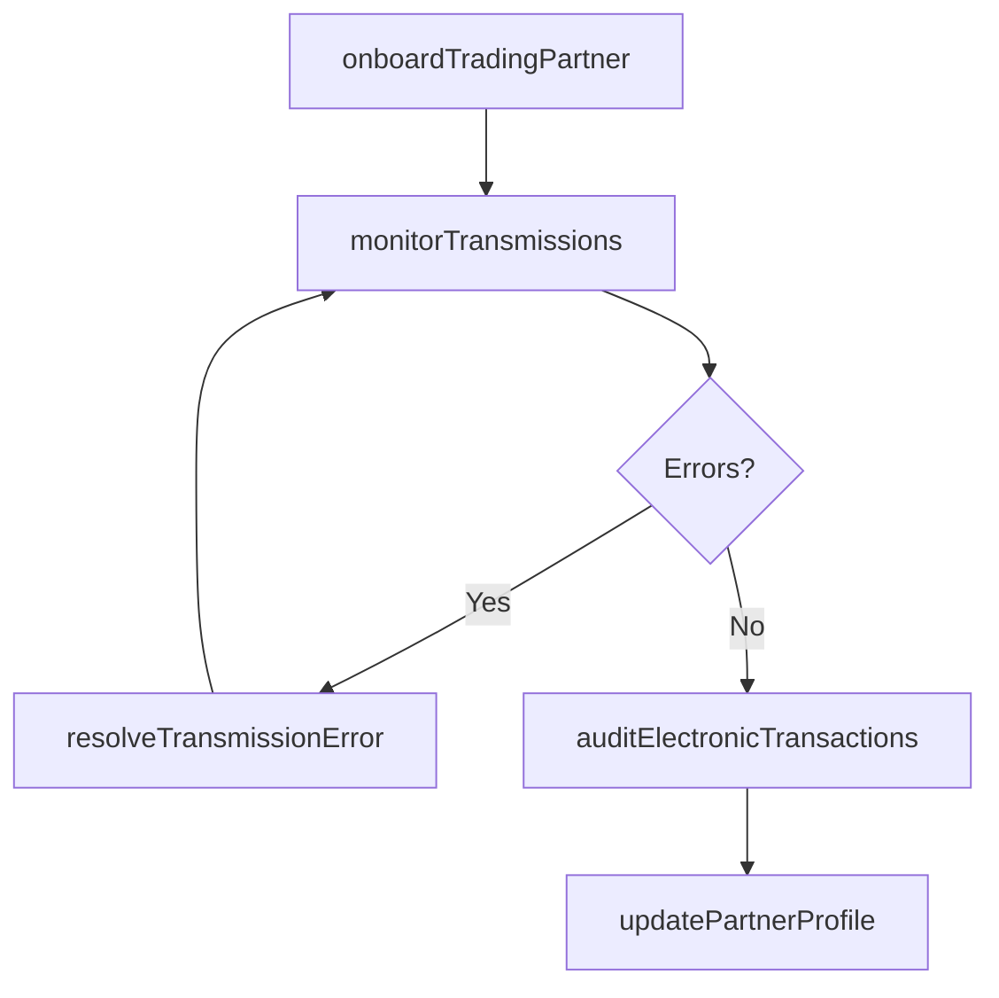

# Maintain/Manage electronic commerce

> Business-as-Code definition for electronic commerce. Models the end-to-end process of maintain/manage electronic commerce as a programmable workflow.

## Overview

Administering the electronic commerce infrastructure that supports accounts payable transactions, including EDI connections, e-invoicing portals, and supplier network integrations. This process ensures that electronic trading partner agreements are current, transaction formats comply with standards such as cXML or EDI 810/850, and data flows securely between the organization and its vendors. Ongoing maintenance includes monitoring transmission errors, updating partner profiles, and onboarding new suppliers to electronic channels.

## Process Hierarchy



## GraphDL

```yaml
maintainmanage:
  object: Electronic Commerce
  actor: AccountsPayableClerk
  result: ElectronicCommerceRecord
```

## Actions

| Action | Description |
|--------|-------------|
| onboardTradingPartner | Configure a new vendor for electronic invoicing and payment |
| monitorTransmissions | Track EDI and e-invoicing transmissions for errors and failures |
| resolveTransmissionError | Investigate and correct failed electronic transactions |
| updatePartnerProfile | Modify trading partner settings such as formats, endpoints, or certificates |
| auditElectronicTransactions | Review electronic commerce logs for compliance and data integrity |

## Events

| Event | Description |
|-------|-------------|
| tradingPartnerOnboarded | New vendor configured for electronic invoicing |
| transmissionMonitored | Electronic transaction batch processing status reviewed |
| transmissionErrorResolved | Failed electronic transaction investigated and corrected |
| partnerProfileUpdated | Trading partner configuration settings modified |
| electronicTransactionsAudited | E-commerce transaction logs reviewed for compliance |

## Searches

| Search | Description |
|--------|-------------|
| getElectronicCommerce | Retrieve electronic commerce records filtered by status, date, or owner |
| findElectronicCommerceByPeriod | Search electronic commerce data for a specified date range |
| getElectronicCommerceSummary | Retrieve summary statistics and trends for electronic commerce |
| listElectronicCommerceHistory | Query the audit trail and change history for electronic commerce records |

## Process Flow



## RACI Matrix

| Activity | Responsible | Accountable | Consulted | Informed |
|----------|-------------|-------------|-----------|----------|
| onboardTradingPartner | APSystemsAnalyst | APManager | ITIntegration | Procurement |
| monitorTransmissions | APSystemsAnalyst | APManager | ITOperations | VendorManagement |
| resolveTransmissionError | APSystemsAnalyst | APManager | VendorSupport | Controller |
| auditElectronicTransactions | APAuditor | APManager | InternalAudit | CFO |

## Related Processes

| Process | Relationship |
|---------|-------------|
| 9.6.1.1 | Upstream - prior step in process sequence |
| 9.6.1.3 | Downstream - next step in process sequence |
| 9.6.1 | Parent - governing process group |

## Related Departments

| Department | Role |
|-----------|------|
| Accounts Payable | Manages electronic invoicing processes and partner onboarding |
| Information Technology | Maintains EDI infrastructure and integration middleware |
| Procurement | Coordinates vendor onboarding to electronic channels |

## Related Occupations

| Occupation | Involvement |
|-----------|-------------|
| AP Systems Analyst | Configures and monitors electronic commerce integrations |
| EDI Coordinator | Manages electronic data interchange mappings and transmissions |

## KPIs

| KPI | Description | Unit |
|-----|-------------|------|
| Electronic Invoice Adoption | Percentage of vendors transacting via electronic channels | % |
| Transmission Success Rate | Percentage of electronic transactions processed without errors | % |
| Error Resolution Time | Average hours to resolve a failed electronic transmission | Hours |
| Partner Onboarding Cycle Time | Average days to onboard a new electronic trading partner | Days |

## Usage

```typescript
import { maintainmanageElectronicCommerce } from '@headlessly/maintain-manage-electronic-commerce'

const client = maintainmanageElectronicCommerce()

// Monitor recent EDI transmissions for errors
const transmissions = await client.monitorTransmissions({
  dateRange: { from: '2025-03-01', to: '2025-03-15' },
  statusFilter: 'failed',
  format: 'EDI-810'
})

// Onboard a new trading partner for e-invoicing
const partner = await client.onboardTradingPartner({
  vendorId: 'V-30421',
  format: 'cXML',
  endpoint: 'https://vendor.example.com/invoices',
  testMode: true
})
```
