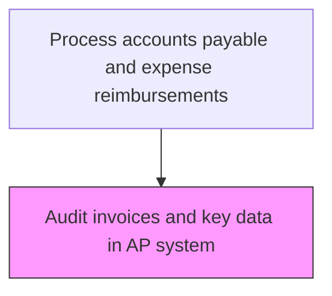
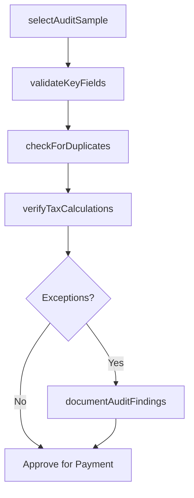

# Audit invoices and key data in AP system

> Business-as-Code definition for invoices and key data in ap system. Models the end-to-end process of audit invoices and key data in ap system as a programmable workflow.

## Overview

Systematically reviewing invoices entered into the accounts payable system to verify data accuracy, completeness, and compliance with organizational policies. This process validates key fields such as vendor name, invoice amount, GL coding, tax calculations, and payment terms against source documents. Auditors check for duplicate entries, unauthorized charges, and data entry errors to prevent erroneous payments and ensure the integrity of the AP sub-ledger.

## Process Hierarchy



## GraphDL

```yaml
audit:
  object: Invoices And Key Data In AP System
  actor: AccountsPayableClerk
  result: InvoicesAndKeyDataInApSystemAuditReport
```

## Actions

| Action | Description |
|--------|-------------|
| selectAuditSample | Choose invoices for review based on risk criteria, amount thresholds, or random sampling |
| validateKeyFields | Verify invoice number, vendor, amount, GL coding, and payment terms against source documents |
| checkForDuplicates | Scan for duplicate invoices by matching vendor, amount, date, and invoice number |
| verifyTaxCalculations | Confirm that sales tax, use tax, and withholding amounts are correctly computed |
| documentAuditFindings | Record identified errors, exceptions, and recommended corrections |

## Events

| Event | Description |
|-------|-------------|
| auditSampleSelected | Invoice audit sample selected based on risk and materiality criteria |
| keyFieldsValidated | Invoice key data fields verified against source documentation |
| duplicatesChecked | Duplicate invoice scan completed for the audit sample |
| taxCalculationsVerified | Tax amounts confirmed as correctly computed |
| auditFindingsDocumented | Audit exceptions and recommended corrections recorded |

## Searches

| Search | Description |
|--------|-------------|
| getInvoicesAndKeyDataInApSystem | Retrieve invoices and key data in ap system records filtered by status, date, or owner |
| findInvoicesAndKeyDataInApSystemByPeriod | Search invoices and key data in ap system data for a specified date range |
| getInvoicesAndKeyDataInApSystemSummary | Retrieve summary statistics and trends for invoices and key data in ap system |
| listInvoicesAndKeyDataInApSystemHistory | Query the audit trail and change history for invoices and key data in ap system records |

## Process Flow



## RACI Matrix

| Activity | Responsible | Accountable | Consulted | Informed |
|----------|-------------|-------------|-----------|----------|
| selectAuditSample | APAuditor | APManager | InternalAudit | Controller |
| validateKeyFields | APAuditor | APManager | Procurement | VendorManagement |
| checkForDuplicates | APAuditor | APManager | ITSystems | Treasury |
| documentAuditFindings | APAuditor | APManager | Controller | ExternalAuditor |

## Related Processes

| Process | Relationship |
|---------|-------------|
| 9.6.1.2 | Upstream - prior step in process sequence |
| 9.6.1.4 | Downstream - next step in process sequence |
| 9.6.1 | Parent - governing process group |

## Related Departments

| Department | Role |
|-----------|------|
| Accounts Payable | Enters invoices and provides source documents for audit |
| Internal Audit | Provides audit methodology and sampling guidelines |
| Procurement | Supplies purchase order data for cross-referencing |

## Related Occupations

| Occupation | Involvement |
|-----------|-------------|
| AP Auditor | Reviews invoices for accuracy and compliance |
| Internal Auditor | Validates audit procedures and reviews findings |

## KPIs

| KPI | Description | Unit |
|-----|-------------|------|
| Invoice Error Rate | Percentage of audited invoices with data entry errors | % |
| Duplicate Invoice Detection Rate | Number of duplicate invoices caught per audit cycle | Count |
| Audit Coverage Rate | Percentage of total invoice volume reviewed per period | % |
| Audit Cycle Time | Average days to complete a full invoice audit cycle | Days |

## Usage

```typescript
import { auditInvoicesAndKeyDataInApSystem } from '@headlessly/audit-invoices-and-key-data-in-ap-system'

const client = auditInvoicesAndKeyDataInApSystem()

// Select a risk-based audit sample for the current period
const sample = await client.selectAuditSample({
  period: '2025-03',
  minimumAmount: 10000,
  samplingMethod: 'risk-based',
  sampleSize: 50
})

// Check the sample for duplicate invoices
const duplicates = await client.checkForDuplicates({
  invoiceIds: sample.invoiceIds,
  lookbackDays: 180,
  matchFields: ['vendorId', 'amount', 'invoiceDate']
})
```
