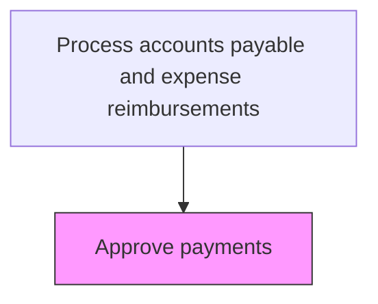
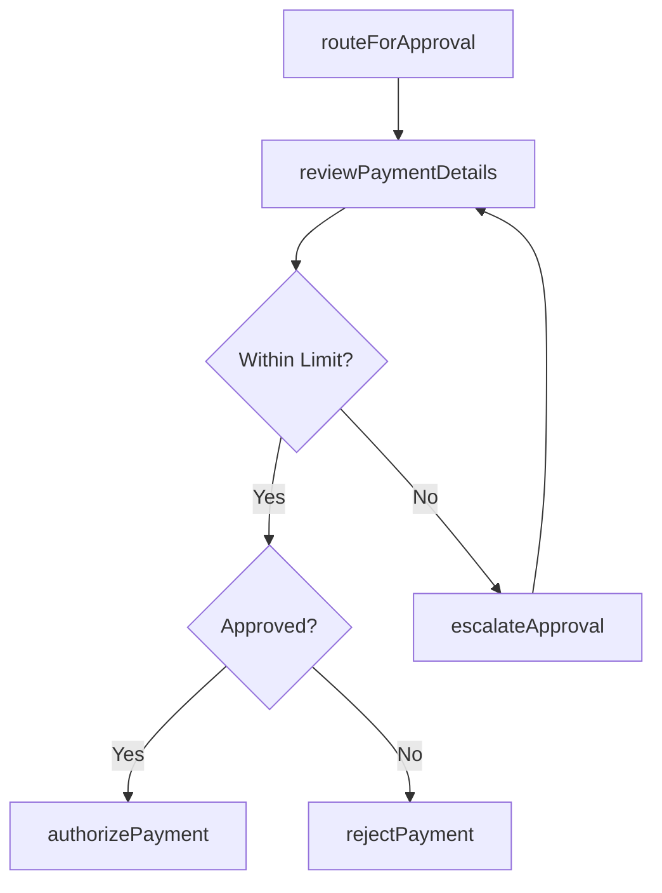

# Approve payments

> Business-as-Code definition for payments. Models the end-to-end process of approve payments as a programmable workflow.

## Overview

Reviewing and authorizing vendor payment requests based on defined approval authority limits, budget availability, and policy compliance. This process routes invoices through single or multi-level approval workflows depending on payment amount and risk category. Approvers verify that goods or services were received, pricing matches contractual terms, and sufficient budget exists before authorizing disbursement. The approval process provides a critical internal control that prevents unauthorized or fraudulent payments.

## Process Hierarchy



## GraphDL

```yaml
approve:
  object: Payments
  actor: AccountsPayableClerk
  result: PaymentsApproval
```

## Actions

| Action | Description |
|--------|-------------|
| routeForApproval | Assign the payment to the appropriate approver based on amount and category |
| reviewPaymentDetails | Examine invoice, supporting documentation, and budget availability |
| authorizePayment | Approve the payment for processing within the disbursement cycle |
| rejectPayment | Deny the payment request with documented reason for return to submitter |
| escalateApproval | Forward the payment to a higher authority when it exceeds the current approver limit |

## Events

| Event | Description |
|-------|-------------|
| paymentRoutedForApproval | Payment assigned to the appropriate approver in the workflow |
| paymentDetailsReviewed | Invoice and supporting documentation examined by approver |
| paymentAuthorized | Payment approved and released for disbursement processing |
| paymentRejected | Payment denied and returned to submitter with documented reason |
| approvalEscalated | Payment forwarded to higher authority for approval |

## Searches

| Search | Description |
|--------|-------------|
| getPayments | Retrieve payments records filtered by status, date, or owner |
| findPaymentsByPeriod | Search payments data for a specified date range |
| getPaymentsSummary | Retrieve summary statistics and trends for payments |
| listPaymentsHistory | Query the audit trail and change history for payments records |

## Process Flow



## RACI Matrix

| Activity | Responsible | Accountable | Consulted | Informed |
|----------|-------------|-------------|-----------|----------|
| routeForApproval | AccountsPayableClerk | APManager | ITSystems | Requester |
| reviewPaymentDetails | DepartmentManager | APManager | Procurement | BudgetOwner |
| authorizePayment | APManager | Controller | Treasury | Vendor |
| escalateApproval | APManager | Controller | CFO | DepartmentManager |

## Related Processes

| Process | Relationship |
|---------|-------------|
| 9.6.1.3 | Upstream - prior step in process sequence |
| 9.6.1.5 | Downstream - next step in process sequence |
| 9.6.1 | Parent - governing process group |

## Related Departments

| Department | Role |
|-----------|------|
| Accounts Payable | Routes payments through approval workflows |
| Business Units | Review and approve invoices within their authority |
| Treasury | Validates cash availability for payment batches |

## Related Occupations

| Occupation | Involvement |
|-----------|-------------|
| AP Manager | Approves payments within defined authority limits |
| Department Manager | Reviews and authorizes payments for their cost center |

## KPIs

| KPI | Description | Unit |
|-----|-------------|------|
| Approval Cycle Time | Average days from submission to approval decision | Days |
| Auto-Approval Rate | Percentage of payments approved automatically by rules engine | % |
| Rejection Rate | Percentage of payment requests rejected by approvers | % |
| Discount Capture Rate | Percentage of early payment discounts captured due to timely approval | % |

## Usage

```typescript
import { approvePayments } from '@headlessly/approve-payments'

const client = approvePayments()

// Route a batch of invoices for approval
const routed = await client.routeForApproval({
  batchId: 'AP-2025-0315',
  prioritize: 'discount-eligible',
  urgency: 'standard'
})

// Authorize a specific payment
const authorization = await client.authorizePayment({
  invoiceId: 'INV-2025-08821',
  approverNotes: 'Goods received and PO terms confirmed',
  approvalCode: 'AUTH-MGR-4421'
})
```
