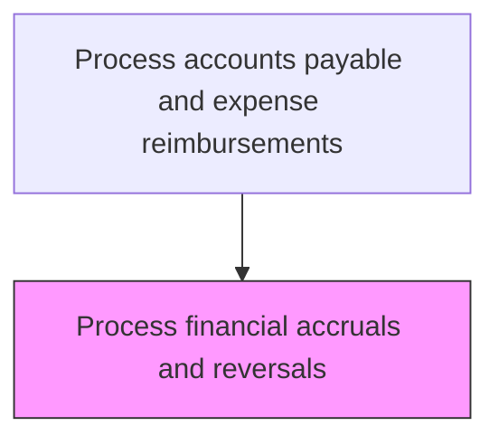
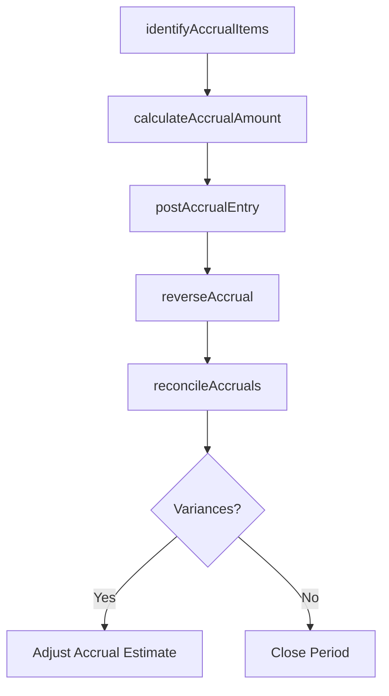

# Process financial accruals and reversals

> Business-as-Code definition for financial accruals and reversals. Models the end-to-end process of process financial accruals and reversals as a programmable workflow.

## Overview

Handling transactions for accruals and reversals. Record transactions in the books of accounts on an accrual basis (irrespective of the actual cash flow) and reversals basis (cancel out the adjusting entries) for balancing accounts.

## Process Hierarchy



## GraphDL

```yaml
process:
  object: Financial Accruals And Reversals
  actor: AccountsPayableClerk
  result: FinancialAccrualsAndReversalsRecord
```

## Actions

| Action | Description |
|--------|-------------|
| identifyAccrualItems | Determine goods received or services consumed but not yet invoiced at period end |
| calculateAccrualAmount | Estimate the liability amount based on POs, contracts, or historical data |
| postAccrualEntry | Record the accrual journal entry in the general ledger |
| reverseAccrual | Automatically or manually reverse the accrual in the subsequent period |
| reconcileAccruals | Match accruals against actual invoices received and resolve variances |

## Events

| Event | Description |
|-------|-------------|
| accrualItemsIdentified | Uninvoiced obligations identified at period end |
| accrualAmountCalculated | Estimated liability amount determined for accrual posting |
| accrualEntryPosted | Accrual journal entry recorded in the general ledger |
| accrualReversed | Prior period accrual reversed in the subsequent period |
| accrualsReconciled | Accruals matched against actual invoices with variances resolved |

## Searches

| Search | Description |
|--------|-------------|
| getFinancialAccrualsAndReversals | Retrieve financial accruals and reversals records filtered by status, date, or owner |
| findFinancialAccrualsAndReversalsByPeriod | Search financial accruals and reversals data for a specified date range |
| getFinancialAccrualsAndReversalsSummary | Retrieve summary statistics and trends for financial accruals and reversals |
| listFinancialAccrualsAndReversalsHistory | Query the audit trail and change history for financial accruals and reversals records |

## Process Flow



## RACI Matrix

| Activity | Responsible | Accountable | Consulted | Informed |
|----------|-------------|-------------|-----------|----------|
| identifyAccrualItems | APAccountant | APManager | Procurement | Controller |
| calculateAccrualAmount | APAccountant | APManager | BudgetOwner | ExternalAuditor |
| postAccrualEntry | APAccountant | Controller | GLAccountant | CFO |
| reconcileAccruals | APAccountant | APManager | Controller | InternalAuditor |

## Related Processes

| Process | Relationship |
|---------|-------------|
| 9.6.1.4 | Upstream - prior step in process sequence |
| 9.6.1.6 | Downstream - next step in process sequence |
| 9.6.1 | Parent - governing process group |

## Related Departments

| Department | Role |
|-----------|------|
| Accounts Payable | Identifies accrual items and posts entries |
| General Accounting | Validates accrual entries during close process |
| Procurement | Provides open PO data for accrual estimation |

## Related Occupations

| Occupation | Involvement |
|-----------|-------------|
| AP Accountant | Calculates and posts accrual and reversal entries |
| GL Accountant | Reviews accrual impact on financial statements |

## KPIs

| KPI | Description | Unit |
|-----|-------------|------|
| Accrual Accuracy | Percentage of accruals within 5% of actual invoice amounts | % |
| Reversal Timeliness | Percentage of accruals reversed by the first business day of the new period | % |
| Aged Accrual Rate | Percentage of accruals outstanding beyond 60 days | % |
| Accrual Variance | Average difference between estimated accrual and actual invoice amount | Currency |

## Usage

```typescript
import { processFinancialAccrualsAndReversals } from '@headlessly/process-financial-accruals-and-reversals'

const client = processFinancialAccrualsAndReversals()

// Identify items requiring accrual at period end
const accrualItems = await client.identifyAccrualItems({
  period: '2025-03',
  thresholdAmount: 1000,
  includeOpenPOs: true
})

// Reconcile prior period accruals against received invoices
const reconciliation = await client.reconcileAccruals({
  originalPeriod: '2025-02',
  varianceThreshold: 0.05,
  includeAgedItems: true
})
```
