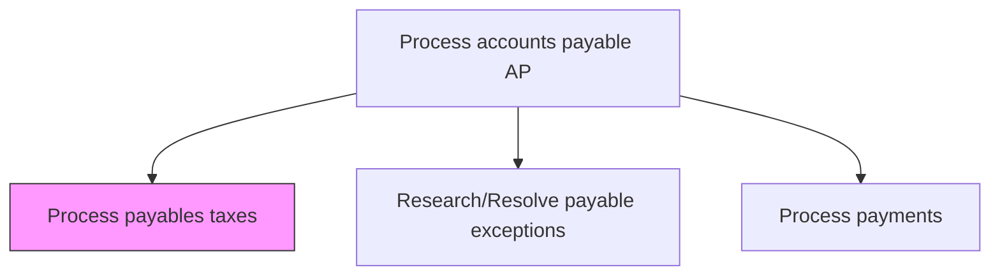
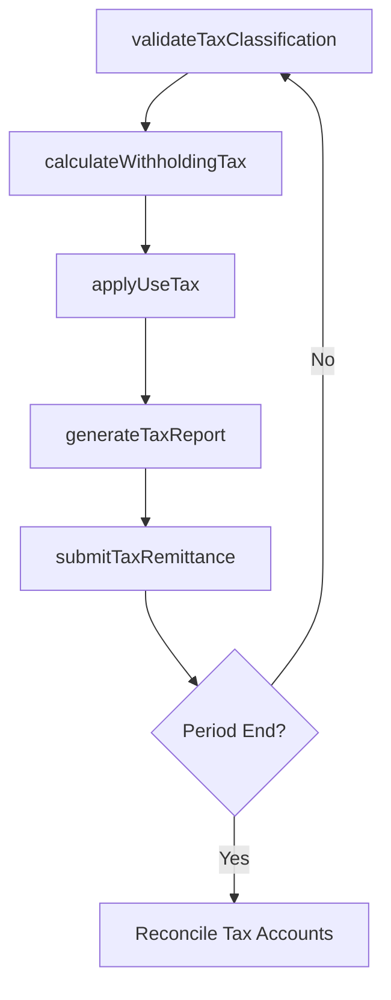

# Process payables taxes

> Business-as-Code definition for payables tax processing. Models the calculation, validation, and filing of tax obligations arising from accounts payable transactions including withholding, use tax, and VAT.

## Overview

Filing the amount of taxes that a company owes as of the balance sheet date. Prepare tax returns, including the income tax filing for an individual or business entity from earnings.

## Process Hierarchy



## GraphDL

```yaml
process:
  object: Payables Taxes
  actor: APTaxSpecialist
  result: PayablesTaxFiling
```

## Actions

| Action | Description |
|--------|-------------|
| calculateWithholdingTax | Compute tax withholding amounts on vendor payments |
| validateTaxClassification | Verify vendor tax status and applicable tax codes |
| applyUseTax | Assess and record use tax on qualifying purchases |
| generateTaxReport | Produce periodic payables tax summary reports |
| submitTaxRemittance | File tax payments to appropriate taxing authorities |

## Events

| Event | Description |
|-------|-------------|
| withholdingTaxCalculated | Withholding tax amount computed for vendor payment |
| taxClassificationValidated | Vendor tax codes and exemptions verified |
| useTaxApplied | Use tax assessed and recorded on purchase transactions |
| taxReportGenerated | Payables tax summary report produced |
| taxRemittanceSubmitted | Tax payment filed with taxing authority |

## Searches

| Search | Description |
|--------|-------------|
| getPayablesTaxLiability | Retrieve outstanding tax liabilities from AP transactions |
| getVendorTaxStatus | Query vendor tax classification and exemption certificates |
| getTaxRemittanceHistory | List prior tax remittances by jurisdiction and period |

## Process Flow



## RACI Matrix

| Activity | Responsible | Accountable | Consulted | Informed |
|----------|-------------|-------------|-----------|----------|
| calculateWithholdingTax | APTaxSpecialist | APManager | TaxDirector | Controller |
| validateTaxClassification | APClerk | APManager | TaxAdvisor | Procurement |
| generateTaxReport | APTaxSpecialist | APManager | Controller | ExternalAuditor |
| submitTaxRemittance | APTaxSpecialist | APManager | Treasurer | CFO |

## Related Processes

| Process | Relationship |
|---------|-------------|
| 9.6.1.8 Process payments | Upstream - payments trigger tax withholding |
| 9.9.2 Process taxes | Downstream - payables tax data feeds corporate tax returns |
| 9.6.1.11 Adjust accounting records | Parallel - tax adjustments require record corrections |

## Related Departments

| Department | Role |
|-----------|------|
| Accounts Payable | Calculates and records payables taxes |
| Tax | Provides tax codes, rates, and compliance guidance |
| Procurement | Supplies vendor contracts with tax terms |

## Related Occupations

| Occupation | Involvement |
|-----------|-------------|
| AP Tax Specialist | Calculates withholding and use taxes on payables |
| Tax Accountant | Reviews tax classifications and filings |

## KPIs

| KPI | Description | Unit |
|-----|-------------|------|
| Tax Calculation Accuracy | Percentage of payables taxes computed correctly | % |
| Timely Remittance Rate | Percentage of tax payments filed before deadline | % |
| Withholding Compliance Rate | Percentage of applicable payments with correct withholding | % |

## Usage

```typescript
import { processPayablesTaxes } from '@headlessly/process-payables-taxes'

const payablesTax = processPayablesTaxes()

// Calculate withholding tax on a vendor payment
const withholding = await payablesTax.calculateWithholdingTax({
  vendorId: 'V-10234',
  invoiceAmount: 50000,
  jurisdiction: 'US-CA',
  taxCode: '1099-NEC'
})

// Submit quarterly tax remittance
const remittance = await payablesTax.submitTaxRemittance({
  period: 'Q1-2025',
  jurisdiction: 'US-Federal',
  taxType: 'withholding'
})
```
