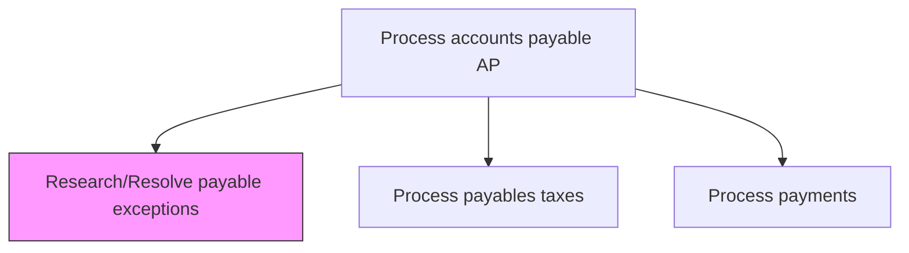
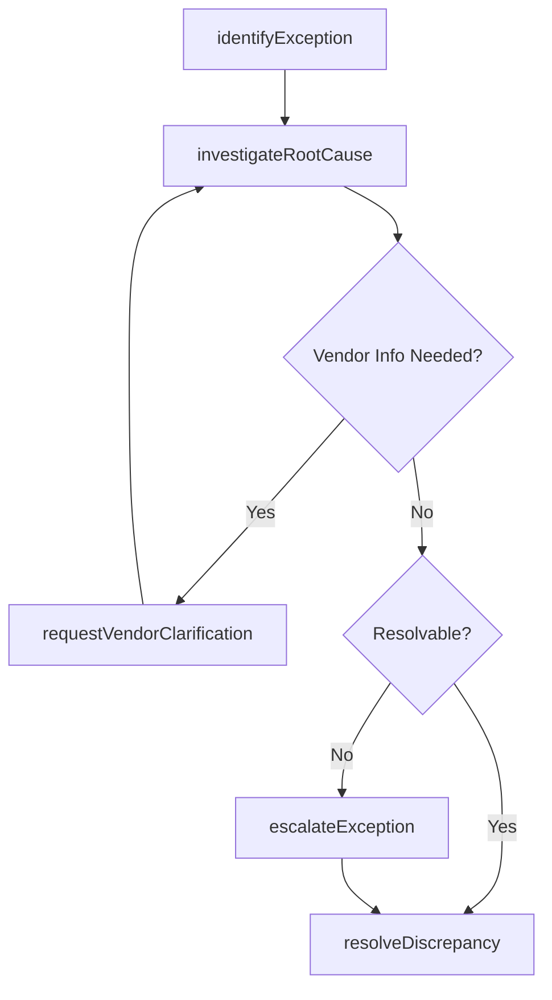

# Research/Resolve payable exceptions

> Business-as-Code definition for payable exception resolution. Models the investigation, root cause analysis, and resolution of discrepancies in accounts payable such as invoice mismatches, duplicate payments, and pricing variances.

## Overview

Resolving any atypical or inconsistent situation concerning payments to be made by the organization. Address any exceptional case of accounts payable on an ad hoc basis, by seeking counsel or carrying out any necessary research.

## Process Hierarchy



## GraphDL

```yaml
research/resolve:
  object: Payable Exceptions
  actor: APAnalyst
  result: ExceptionResolution
```

## Actions

| Action | Description |
|--------|-------------|
| identifyException | Flag payable transactions with discrepancies or mismatches |
| investigateRootCause | Research the underlying cause of a payable exception |
| requestVendorClarification | Contact vendor to obtain missing or corrected documentation |
| resolveDiscrepancy | Apply corrective action to clear the exception |
| escalateException | Route unresolved exceptions to management for decision |

## Events

| Event | Description |
|-------|-------------|
| exceptionIdentified | Payable exception flagged for investigation |
| rootCauseInvestigated | Root cause analysis completed for the exception |
| vendorClarificationRequested | Vendor contacted for clarification on discrepancy |
| discrepancyResolved | Exception cleared with corrective action applied |
| exceptionEscalated | Unresolved exception routed to management |

## Searches

| Search | Description |
|--------|-------------|
| getOpenExceptions | List unresolved payable exceptions by age, type, or vendor |
| getExceptionHistory | Retrieve resolution history for a specific vendor or invoice |
| getExceptionMetrics | Query exception volumes and resolution statistics |

## Process Flow



## RACI Matrix

| Activity | Responsible | Accountable | Consulted | Informed |
|----------|-------------|-------------|-----------|----------|
| identifyException | APClerk | APManager | Controller | Vendor |
| investigateRootCause | APAnalyst | APManager | Procurement | Finance |
| requestVendorClarification | APAnalyst | APManager | VendorManagement | Procurement |
| resolveDiscrepancy | APAnalyst | APManager | LegalCounsel | Controller |

## Related Processes

| Process | Relationship |
|---------|-------------|
| 9.6.1.8 Process payments | Upstream - payment processing surfaces exceptions |
| 9.6.1.11 Adjust accounting records | Downstream - resolutions require record adjustments |
| 9.6.1.9 Respond to AP inquiries | Parallel - vendor inquiries may trigger exception research |

## Related Departments

| Department | Role |
|-----------|------|
| Accounts Payable | Investigates and resolves payable discrepancies |
| Procurement | Provides purchase order and contract details |
| Receiving | Confirms goods receipt against invoices |

## Related Occupations

| Occupation | Involvement |
|-----------|-------------|
| AP Analyst | Leads exception investigation and resolution |
| Procurement Specialist | Validates purchase order terms and pricing |

## KPIs

| KPI | Description | Unit |
|-----|-------------|------|
| Exception Resolution Time | Average days to resolve a payable exception | Days |
| Exception Rate | Percentage of invoices flagged as exceptions | % |
| First-Contact Resolution Rate | Percentage of exceptions resolved without escalation | % |

## Usage

```typescript
import { researchResolvePayableExceptions } from '@headlessly/research-resolve-payable-exceptions'

const exceptions = researchResolvePayableExceptions()

// Identify exceptions in current AP batch
const openItems = await exceptions.identifyException({
  batchId: 'AP-2025-0142',
  thresholdVariance: 0.05
})

// Investigate root cause of a specific exception
const analysis = await exceptions.investigateRootCause({
  exceptionId: 'EXC-78432',
  includeMatchingPOs: true
})
```
