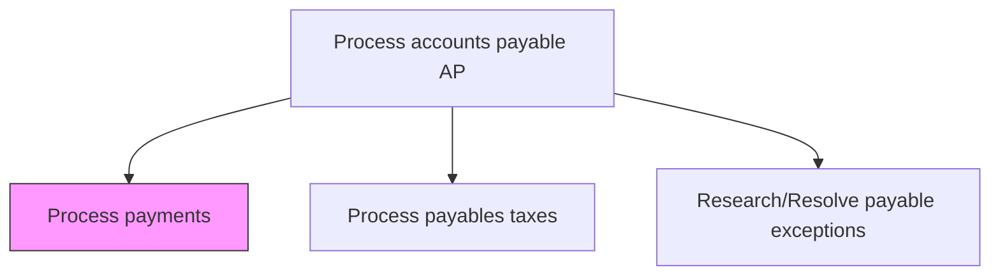
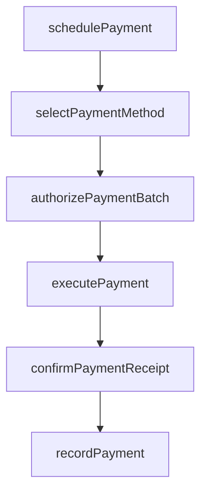

# Process payments

> Business-as-Code definition for payment processing. Models the end-to-end disbursement workflow including payment scheduling, method selection, authorization, execution, and confirmation of vendor and supplier payments.

## Overview

Executing the end-to-end disbursement of approved vendor payments through the appropriate payment channels including ACH, wire transfer, check, and virtual card. This process schedules approved invoices into payment runs based on due dates, discount eligibility, and cash position, selects the optimal payment method for each transaction, obtains batch authorization, and transmits payment instructions to the banking system. Post-disbursement activities include confirming vendor receipt and recording the payment in the general ledger.

## Process Hierarchy



## GraphDL

```yaml
process:
  object: Payments
  actor: APClerk
  result: PaymentConfirmation
```

## Actions

| Action | Description |
|--------|-------------|
| schedulePayment | Queue approved invoices for payment based on due dates and terms |
| selectPaymentMethod | Determine payment channel such as ACH, wire, check, or virtual card |
| authorizePaymentBatch | Obtain approval for a batch of outgoing payments |
| executePayment | Transmit payment instructions to the banking system |
| confirmPaymentReceipt | Verify that payment was received by the vendor |
| recordPayment | Post payment transaction to the general ledger |

## Events

| Event | Description |
|-------|-------------|
| paymentScheduled | Invoice queued in payment run based on terms |
| paymentMethodSelected | Payment channel determined for the transaction |
| paymentBatchAuthorized | Payment batch approved for execution |
| paymentExecuted | Payment instructions transmitted to bank |
| paymentReceiptConfirmed | Vendor confirmed receipt of payment |
| paymentRecorded | Payment posted to general ledger |

## Searches

| Search | Description |
|--------|-------------|
| getPaymentQueue | List invoices scheduled for upcoming payment runs |
| getPaymentStatus | Track status of a specific payment by reference number |
| getPaymentHistory | Retrieve payment history for a vendor or date range |
| getDisbursementSummary | Query total disbursements by method, period, or entity |

## Process Flow



## RACI Matrix

| Activity | Responsible | Accountable | Consulted | Informed |
|----------|-------------|-------------|-----------|----------|
| schedulePayment | APClerk | APManager | Procurement | Vendor |
| authorizePaymentBatch | APManager | Controller | Treasurer | CFO |
| executePayment | TreasuryOperator | Treasurer | APManager | Controller |
| recordPayment | APClerk | APManager | Controller | ExternalAuditor |

## Related Processes

| Process | Relationship |
|---------|-------------|
| 9.6.1.6 Process payables taxes | Parallel - tax withholding applied during payment |
| 9.6.1.10 Retain records | Downstream - payment records archived for retention |
| 9.7.3 Manage cash | Downstream - disbursements affect cash position |

## Related Departments

| Department | Role |
|-----------|------|
| Accounts Payable | Schedules and processes vendor payments |
| Treasury | Executes bank transfers and manages payment funding |
| Procurement | Validates payment terms and vendor agreements |

## Related Occupations

| Occupation | Involvement |
|-----------|-------------|
| AP Clerk | Prepares and schedules payment runs |
| Treasury Operations Analyst | Executes wire transfers and ACH batches |

## KPIs

| KPI | Description | Unit |
|-----|-------------|------|
| On-Time Payment Rate | Percentage of payments made by or before due date | % |
| Payment Processing Cost | Average cost per payment transaction processed | Currency |
| Electronic Payment Adoption | Percentage of payments made via electronic methods | % |
| Early Payment Discount Capture | Percentage of available early payment discounts taken | % |

## Usage

```typescript
import { processPayments } from '@headlessly/process-payments'

const payments = processPayments()

// Schedule invoices for the next payment run
const batch = await payments.schedulePayment({
  paymentDate: '2025-03-15',
  includeDiscountEligible: true,
  maxBatchSize: 500
})

// Execute authorized payment batch
const result = await payments.executePayment({
  batchId: batch.id,
  method: 'ACH',
  priority: 'standard'
})
```
