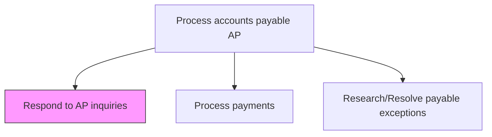
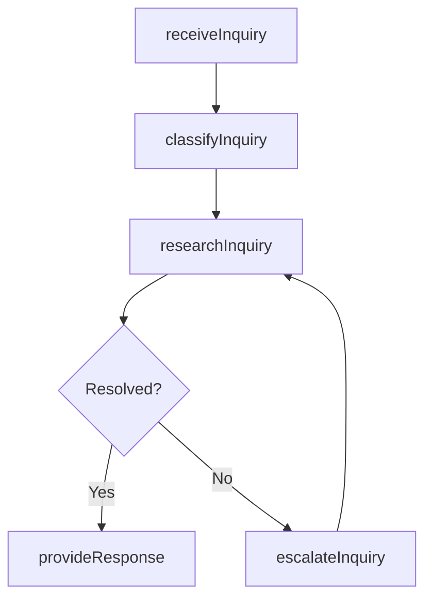

# Respond to AP inquiries

> Business-as-Code definition for accounts payable inquiry management. Models the intake, research, and resolution of vendor and internal stakeholder questions regarding payment status, invoice discrepancies, and account balances.

## Overview

Clarifying or address queries relating to the particulars of AP such as date, discounts, amount, and installments. Coordinate with concerned parties about the fulfillment of bills payable.

## Process Hierarchy



## GraphDL

```yaml
respond:
  object: To AP Inquiries
  actor: APClerk
  result: InquiryResponse
```

## Actions

| Action | Description |
|--------|-------------|
| receiveInquiry | Log incoming vendor or internal inquiry regarding AP status |
| classifyInquiry | Categorize the inquiry by type such as payment status, balance, or dispute |
| researchInquiry | Investigate the inquiry using invoice, payment, and vendor records |
| provideResponse | Communicate the resolution or status update to the inquirer |
| escalateInquiry | Route complex inquiries to senior AP staff or management |

## Events

| Event | Description |
|-------|-------------|
| inquiryReceived | AP inquiry logged from vendor or internal stakeholder |
| inquiryClassified | Inquiry categorized by type and priority |
| inquiryResearched | Investigation completed with findings documented |
| responseProvided | Resolution or status communicated to the inquirer |
| inquiryEscalated | Complex inquiry forwarded to management |

## Searches

| Search | Description |
|--------|-------------|
| getOpenInquiries | List unresolved AP inquiries by vendor, type, or age |
| getInquiryHistory | Retrieve past inquiries and resolutions for a vendor |
| getResponseMetrics | Query average response times and resolution rates |

## Process Flow



## RACI Matrix

| Activity | Responsible | Accountable | Consulted | Informed |
|----------|-------------|-------------|-----------|----------|
| receiveInquiry | APClerk | APManager | VendorRelations | Procurement |
| classifyInquiry | APClerk | APManager | APAnalyst | VendorRelations |
| researchInquiry | APAnalyst | APManager | Treasury | Controller |
| provideResponse | APClerk | APManager | LegalCounsel | Vendor |

## Related Processes

| Process | Relationship |
|---------|-------------|
| 9.6.1.7 Research/Resolve payable exceptions | Parallel - inquiries may surface underlying exceptions |
| 9.6.1.8 Process payments | Upstream - payment status is the most common inquiry topic |
| 9.6.1.10 Retain records | Downstream - inquiry records retained for audit trail |

## Related Departments

| Department | Role |
|-----------|------|
| Accounts Payable | Receives and resolves vendor and internal inquiries |
| Procurement | Provides purchase order context for inquiry resolution |
| Vendor Management | Maintains vendor relationships and communication channels |

## Related Occupations

| Occupation | Involvement |
|-----------|-------------|
| AP Clerk | First point of contact for inquiry handling |
| AP Analyst | Researches complex payment and balance inquiries |

## KPIs

| KPI | Description | Unit |
|-----|-------------|------|
| Average Response Time | Mean time to respond to an AP inquiry | Hours |
| First-Contact Resolution Rate | Percentage of inquiries resolved on first interaction | % |
| Inquiry Volume Trend | Monthly count of AP inquiries received | Count |

## Usage

```typescript
import { respondToApInquiries } from '@headlessly/respond-to-ap-inquiries'

const apInquiries = respondToApInquiries()

// Log a new vendor inquiry
const inquiry = await apInquiries.receiveInquiry({
  vendorId: 'V-20512',
  type: 'payment-status',
  referenceNumber: 'INV-2025-04821',
  channel: 'email'
})

// Research and provide response
const response = await apInquiries.provideResponse({
  inquiryId: inquiry.id,
  resolution: 'Payment processed via ACH on 2025-03-10, confirmation #ACH-88123'
})
```
