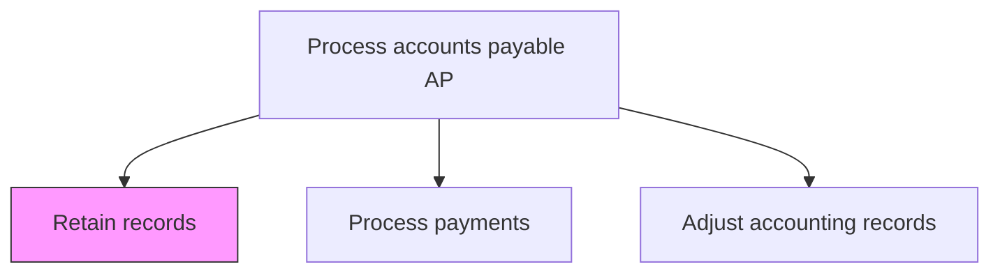
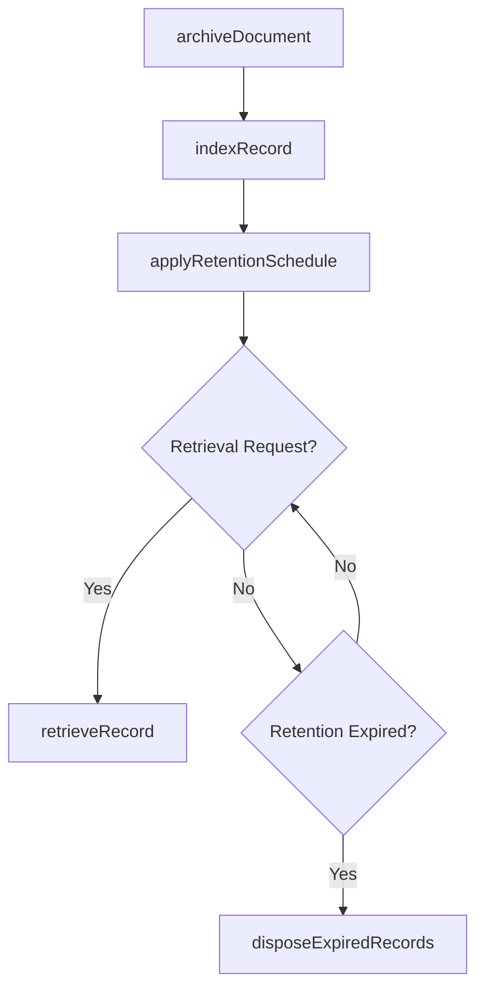

# Retain records

> Business-as-Code definition for accounts payable record retention. Models the archival, indexing, and lifecycle management of AP documents including invoices, payment confirmations, and supporting documentation per regulatory retention schedules.

## Overview

Archiving, indexing, and managing the lifecycle of accounts payable documents including vendor invoices, payment confirmations, contracts, and supporting correspondence per regulatory retention schedules. This process ensures that AP records are stored in a searchable document management system, tagged with appropriate metadata for efficient retrieval, and assigned retention periods based on document type, jurisdiction, and regulatory requirements. When retention periods expire, records are securely destroyed following documented disposal procedures.

## Process Hierarchy



## GraphDL

```yaml
retain:
  object: Records
  actor: RecordsManager
  result: RetainedDocument
```

## Actions

| Action | Description |
|--------|-------------|
| archiveDocument | Store AP documents in the records management system |
| indexRecord | Tag and categorize documents for searchability |
| applyRetentionSchedule | Assign retention period based on document type and regulation |
| retrieveRecord | Locate and produce archived documents upon request |
| disposeExpiredRecords | Securely destroy documents past their retention period |

## Events

| Event | Description |
|-------|-------------|
| documentArchived | AP document stored in records management system |
| recordIndexed | Document tagged with metadata for retrieval |
| retentionScheduleApplied | Retention period assigned to the document |
| recordRetrieved | Archived document located and produced |
| expiredRecordsDisposed | Documents past retention period securely destroyed |

## Searches

| Search | Description |
|--------|-------------|
| findArchivedRecords | Search retained documents by vendor, date, or invoice number |
| getRetentionSchedule | Retrieve applicable retention rules by document type |
| getExpiringRecords | List documents approaching end of retention period |

## Process Flow



## RACI Matrix

| Activity | Responsible | Accountable | Consulted | Informed |
|----------|-------------|-------------|-----------|----------|
| archiveDocument | APClerk | RecordsManager | ITSystems | Controller |
| indexRecord | APClerk | RecordsManager | ITSystems | APManager |
| applyRetentionSchedule | RecordsManager | ComplianceOfficer | LegalCounsel | APManager |
| disposeExpiredRecords | RecordsManager | ComplianceOfficer | LegalCounsel | InternalAuditor |

## Related Processes

| Process | Relationship |
|---------|-------------|
| 9.6.1.8 Process payments | Upstream - payment confirmations require archival |
| 9.8.2 Operate controls and monitor compliance | Parallel - retention supports internal control requirements |
| 9.6.1.11 Adjust accounting records | Upstream - adjustments generate documents for retention |

## Related Departments

| Department | Role |
|-----------|------|
| Accounts Payable | Produces documents requiring retention |
| Records Management | Manages archival systems and retention schedules |
| Legal | Defines regulatory retention requirements |

## Related Occupations

| Occupation | Involvement |
|-----------|-------------|
| Records Manager | Oversees document lifecycle and retention compliance |
| AP Clerk | Archives transaction documents after processing |

## KPIs

| KPI | Description | Unit |
|-----|-------------|------|
| Retention Compliance Rate | Percentage of documents stored per retention schedule | % |
| Document Retrieval Time | Average time to locate and produce an archived record | Minutes |
| Timely Disposal Rate | Percentage of expired records disposed on schedule | % |

## Usage

```typescript
import { retainRecords } from '@headlessly/retain-records'

const records = retainRecords()

// Archive a processed invoice
const archived = await records.archiveDocument({
  documentType: 'vendor-invoice',
  invoiceId: 'INV-2025-04821',
  vendorId: 'V-20512',
  retentionCategory: 'financial-7yr'
})

// Retrieve a record for audit
const record = await records.retrieveRecord({
  invoiceId: 'INV-2024-03112',
  includeAttachments: true
})
```
