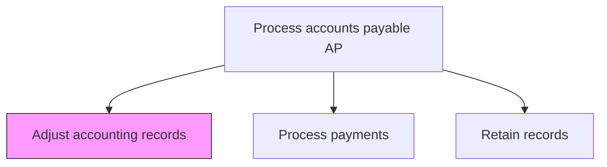
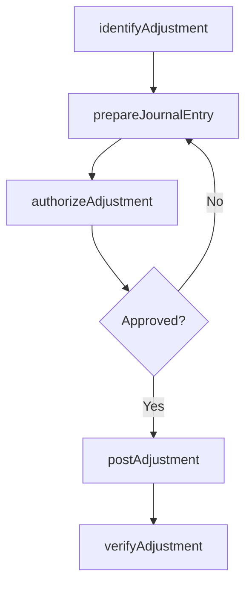

# Adjust accounting records

> Business-as-Code definition for AP accounting record adjustments. Models the identification, authorization, posting, and verification of correcting entries to accounts payable sub-ledger and general ledger records.

## Overview

Identifying, authorizing, and posting correcting entries to the accounts payable sub-ledger and general ledger to resolve recording errors, reclassifications, and discrepancies. This process handles corrections for duplicate payments, incorrect GL coding, pricing adjustments, and write-offs of uncollectible vendor credits. Each adjustment requires supporting documentation, proper authorization per the organization's approval matrix, and verification after posting to ensure the correction accurately resolves the original discrepancy.

## Process Hierarchy



## GraphDL

```yaml
adjust:
  object: Accounting Records
  actor: APAccountant
  result: AdjustmentEntry
```

## Actions

| Action | Description |
|--------|-------------|
| identifyAdjustment | Detect accounting entries requiring correction or reclassification |
| prepareJournalEntry | Draft the correcting journal entry with supporting documentation |
| authorizeAdjustment | Obtain approval for the proposed adjustment |
| postAdjustment | Record the approved adjustment in the sub-ledger and general ledger |
| verifyAdjustment | Confirm that the adjustment correctly resolves the discrepancy |

## Events

| Event | Description |
|-------|-------------|
| adjustmentIdentified | Accounting discrepancy flagged for correction |
| journalEntryPrepared | Correcting journal entry drafted with documentation |
| adjustmentAuthorized | Adjustment approved by authorized personnel |
| adjustmentPosted | Correcting entry recorded in the ledger |
| adjustmentVerified | Adjustment confirmed as accurate and complete |

## Searches

| Search | Description |
|--------|-------------|
| getPendingAdjustments | List adjustments awaiting authorization or posting |
| getAdjustmentHistory | Retrieve adjustment entries by account, vendor, or period |
| getReconciliationVariances | Query sub-ledger to GL variances requiring adjustment |

## Process Flow



## RACI Matrix

| Activity | Responsible | Accountable | Consulted | Informed |
|----------|-------------|-------------|-----------|----------|
| identifyAdjustment | APAccountant | APManager | Controller | InternalAuditor |
| prepareJournalEntry | APAccountant | APManager | Controller | ExternalAuditor |
| authorizeAdjustment | Controller | CFO | ExternalAuditor | APManager |
| postAdjustment | APAccountant | Controller | ITSystems | ExternalAuditor |

## Related Processes

| Process | Relationship |
|---------|-------------|
| 9.6.1.7 Research/Resolve payable exceptions | Upstream - exception resolutions trigger adjustments |
| 9.3 Perform general accounting and reporting | Downstream - adjustments flow to general ledger reporting |
| 9.6.1.10 Retain records | Downstream - adjustment documentation archived |

## Related Departments

| Department | Role |
|-----------|------|
| Accounts Payable | Identifies discrepancies and prepares adjustments |
| Accounting | Authorizes and posts correcting journal entries |
| Internal Audit | Reviews adjustments for proper authorization and accuracy |

## Related Occupations

| Occupation | Involvement |
|-----------|-------------|
| AP Accountant | Prepares and posts correcting entries |
| Controller | Authorizes material adjustments |

## KPIs

| KPI | Description | Unit |
|-----|-------------|------|
| Adjustment Volume | Number of correcting entries per period | Count |
| Adjustment Accuracy | Percentage of adjustments posted correctly on first attempt | % |
| Adjustment Authorization Time | Average days from identification to approval | Days |

## Usage

```typescript
import { adjustAccountingRecords } from '@headlessly/adjust-accounting-records'

const adjustments = adjustAccountingRecords()

// Identify an adjustment needed for a duplicate payment
const adjustment = await adjustments.identifyAdjustment({
  type: 'duplicate-payment',
  vendorId: 'V-20512',
  originalPaymentRef: 'PMT-2025-08821',
  amount: 12500.00
})

// Post the approved adjustment
const posted = await adjustments.postAdjustment({
  adjustmentId: adjustment.id,
  debitAccount: '2100-AP',
  creditAccount: '1000-Cash',
  effectiveDate: '2025-03-15'
})
```
