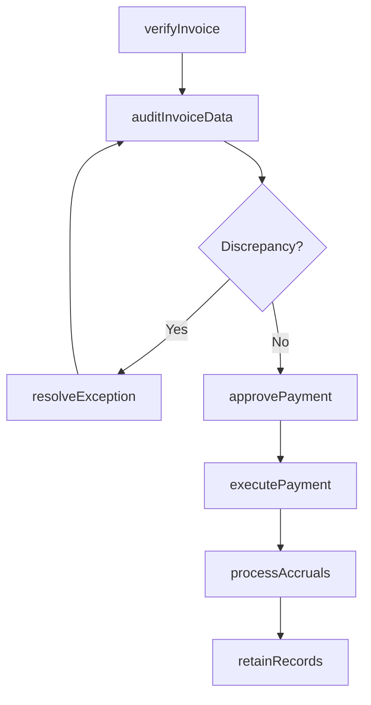

# Process accounts payable (AP)

> Business-as-Code definition for accounts payable processing. Models invoice verification, electronic commerce management, invoice auditing, payment approval, accrual processing, exception resolution, and payment execution as programmable APIs.

## Overview

Processing payments of operating expenses and other supplier charges. This includes the development of policies and procedures around processing of accounts payable and all operations. This process is often supported by key technology enablers.

## Process Hierarchy

```mermaid
graph TD
    A[Process accounts payable (AP)]
    A --> B[Verify AP pay file with purchase order vendor master file]
    A --> C[Maintain/Manage electronic commerce]
    A --> D[Audit invoices and key data in AP system]
    A --> E[Approve payments]
    A --> F[Process financial accruals and reversals]
    A --> G[Process payables taxes]
    A --> H[Research/Resolve payable exceptions]
    A --> I[Process payments]
    A --> J[Respond to AP inquiries]
    A --> K[Retain records]
    A --> L[Adjust accounting records]
```

## GraphDL

```yaml
process:
  object: Accounts Payable (AP)
  actor: APSpecialist
  result: VendorPayment
```

## Actions

| Action | Description |
|--------|-------------|
| verifyInvoice | Match vendor invoice against purchase order and goods receipt |
| auditInvoiceData | Validate invoice coding, amounts, and tax calculations |
| approvePayment | Route invoice for authorization per delegation of authority |
| processAccruals | Record and reverse period-end expense accruals |
| resolveException | Investigate and resolve invoice discrepancies or matching failures |
| executePayment | Disburse vendor payments via check, ACH, or wire transfer |
| retainRecords | Archive invoices, payment documentation, and supporting records |

## Events

| Event | Description |
|-------|-------------|
| invoiceVerified | Invoice matched to purchase order and goods receipt |
| invoiceDataAudited | Invoice coding and calculations validated |
| paymentApproved | Invoice authorized for payment per delegation policy |
| accrualsProcessed | Period-end accruals recorded or reversed |
| exceptionResolved | Invoice discrepancy investigated and corrected |
| paymentExecuted | Vendor payment disbursed and recorded |
| recordsRetained | AP documentation archived per retention policy |

## Searches

| Search | Description |
|--------|-------------|
| getOpenInvoices | List unpaid invoices by vendor, due date, or amount |
| getPaymentHistory | Retrieve payment records by vendor, check number, or date |
| getExceptions | Query unresolved invoice exceptions by type or age |
| getAPAgingReport | Get accounts payable aging by vendor and bucket |
| getAccrualSummary | Retrieve period-end accrual balances by account |

## Process Flow



## RACI Matrix

| Activity | Responsible | Accountable | Consulted | Informed |
|----------|-------------|-------------|-----------|----------|
| verifyInvoice | AP Clerk | AP Manager | Procurement | Vendor |
| auditInvoiceData | AP Specialist | AP Manager | Internal Audit | Controller |
| approvePayment | Department Manager | AP Manager | Controller | Treasury |
| executePayment | AP Specialist | AP Manager | Treasury | Vendor |

## Sub-Processes

| ID | Name | Description |
|----|------|-------------|
| 9.6.1.1 | Verify AP pay file with purchase order vendor master file | Matching records of bills to be paid with accounts. Check accounts payable entries with vendor's acc |
| 9.6.1.2 | Maintain/Manage electronic commerce | Tracking all online transactions. |
| 9.6.1.3 | Audit invoices and key data in AP system | Monitoring and evaluating bills registered in accounts books. Check all invoices. Maintain records. |
| 9.6.1.4 | Approve payments | Processing payments for products/services. |
| 9.6.1.5 | Process financial accruals and reversals | Handling transactions for accruals and reversals. Record transactions in the books of accounts on an |
| 9.6.1.6 | Process payables taxes | Filing the amount of taxes that a company owes as of the balance sheet date. Prepare tax returns, in |
| 9.6.1.7 | Research/Resolve payable exceptions | Resolving any atypical or inconsistent situation concerning payments to be made by the organization. |
| 9.6.1.8 | Process payments | Making payments for products/services on due dates (payment cycle) decided by parties involved. |
| 9.6.1.9 | Respond to AP inquiries | Clarifying or address queries relating to the particulars of AP such as date, discounts, amount, and |
| 9.6.1.10 | Retain records | Keeping bills of every transaction for future reference. |
| 9.6.1.11 | Adjust accounting records | Rectifying for alterations occurred in accounts while recording. |

## Related Processes

| Process | Relationship |
|---------|-------------|
| 9.3.2 Perform general accounting | Downstream - AP entries post to the general ledger |
| 9.7 Manage treasury operations | Parallel - payment disbursements affect cash position |
| 4.3 Procure materials and services | Upstream - purchase orders and receipts trigger AP processing |

## Related Departments

| Department | Role |
|-----------|------|
| Accounts Payable | Primary owner of invoice processing and vendor payments |
| Procurement | Provides purchase orders and goods receipt confirmations |
| Treasury | Manages cash availability and payment funding |
| Internal Audit | Reviews AP controls and three-way matching compliance |
| IT | Maintains AP automation and electronic invoicing systems |

## Related Occupations

| Occupation | Involvement |
|-----------|-------------|
| AP Specialist | Processes invoices, resolves exceptions, and executes payments |
| AP Manager | Oversees AP operations, policy compliance, and vendor relations |
| AP Clerk | Performs data entry, filing, and basic invoice validation |

## KPIs

| KPI | Description | Unit |
|-----|-------------|------|
| Invoice Processing Cost | Average cost to process a single vendor invoice | USD |
| Three-Way Match Rate | Percentage of invoices auto-matched to PO and receipt | % |
| Days Payable Outstanding | Average days to pay vendor invoices after receipt | Days |
| Early Payment Discount Capture | Percentage of available early-pay discounts taken | % |
| Exception Rate | Percentage of invoices requiring manual exception handling | % |

## Usage

```typescript
import { processAccountsPayable } from '@headlessly/process-accounts-payable-ap'

const ap = processAccountsPayable()

// Verify an invoice against purchase order
const verification = await ap.verifyInvoice({
  invoiceNumber: 'INV-V-2025-4421',
  vendorId: 'VND-00325',
  purchaseOrder: 'PO-2025-0891'
})

// Execute payment run for approved invoices
await ap.executePayment({
  paymentRun: 'weekly',
  method: 'ACH',
  dueBy: '2025-12-20'
})
```
