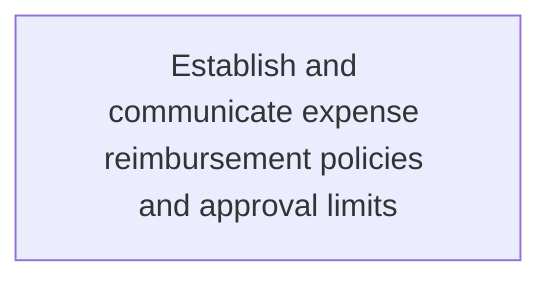
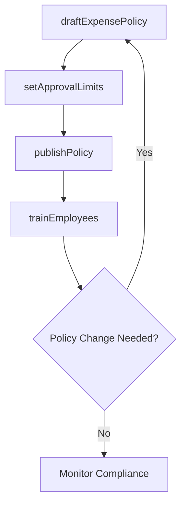

# Establish and communicate expense reimbursement policies and approval limits

> Business-as-Code definition for expense reimbursement policy management. Models the creation, approval, publication, and communication of expense policies, per diem rates, and approval authority limits to employees across the organization.

## Overview

Creating, approving, and communicating the expense reimbursement policies, per diem rates, and approval authority limits that govern how employees submit and receive payment for business-related expenses. This process defines eligible expense categories, documentation requirements, spending thresholds by approval level, and the workflow for submitting and reviewing claims. Policies are distributed through mandatory training sessions, employee handbooks, and the corporate intranet, with annual reviews to ensure alignment with regulatory changes and organizational budget constraints.

## Process Hierarchy



## GraphDL

```yaml
establish:
  object: And Communicate Expense Reimbursement Policies And Approval Limits
  actor: PolicyAdministrator
  result: ExpensePolicy
```

## Actions

| Action | Description |
|--------|-------------|
| draftExpensePolicy | Create or revise expense reimbursement policies and guidelines |
| setApprovalLimits | Define spending thresholds and approval authority levels |
| publishPolicy | Distribute finalized policy to all employees |
| trainEmployees | Conduct training on expense policy requirements |

## Events

| Event | Description |
|-------|-------------|
| expensePolicyDrafted | Expense reimbursement policy created or revised |
| approvalLimitsSet | Spending thresholds and authority levels defined |
| policyPublished | Policy distributed to employee population |
| employeesTrained | Expense policy training completed |

## Searches

| Search | Description |
|--------|-------------|
| getCurrentPolicy | Retrieve the active expense reimbursement policy |
| getApprovalLimits | Query approval thresholds by role or department |
| getTrainingCompletion | Check policy training completion rates |

## Process Flow



## RACI Matrix

| Activity | Responsible | Accountable | Consulted | Informed |
|----------|-------------|-------------|-----------|----------|
| draftExpensePolicy | PolicyAdministrator | CFO | HRDirector | LegalCounsel |
| setApprovalLimits | APManager | CFO | Controller | DepartmentHeads |
| publishPolicy | PolicyAdministrator | APManager | Communications | AllEmployees |
| trainEmployees | PolicyAdministrator | APManager | HRDepartment | DepartmentHeads |

## Related Processes

| Process | Relationship |
|---------|-------------|
| 9.6.2.3 Approve reimbursements and advances | Downstream - policies define approval rules |
| 9.6.2.2 Capture and report relevant tax data | Parallel - policies affect taxable reimbursement types |
| 9.6.3.1 Establish corporate credit card policies | Parallel - card and expense policies must align |

## Related Departments

| Department | Role |
|-----------|------|
| Accounts Payable | Administers expense policies and limits |
| Human Resources | Contributes policy content for travel and per diem rates |
| Finance | Sets budget-driven spending limits |

## Related Occupations

| Occupation | Involvement |
|-----------|-------------|
| Policy Administrator | Drafts and maintains expense policies |
| AP Manager | Approves policy changes and spending thresholds |

## KPIs

| KPI | Description | Unit |
|-----|-------------|------|
| Policy Acknowledgment Rate | Percentage of employees acknowledging current policy | % |
| Training Completion Rate | Percentage of staff completing expense training | % |
| Policy Update Frequency | Number of policy revisions per year | Count |

## Usage

```typescript
import { establishAndCommunicateExpenseReimbursementPoliciesAndApprovalLimits } from '@headlessly/establish-and-communicate-expense-reimbursement-policies-and-approval-limits'

const policies = establishAndCommunicateExpenseReimbursementPoliciesAndApprovalLimits()

// Draft updated expense policy
const policy = await policies.draftExpensePolicy({
  effectiveDate: '2025-04-01',
  perDiemRates: { domestic: 75, international: 150 },
  maxMealExpense: 100
})

// Set approval limits by role
const limits = await policies.setApprovalLimits({
  manager: 5000,
  director: 15000,
  vp: 50000
})
```
