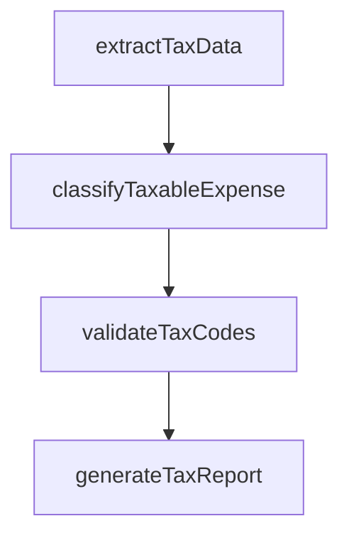

# Capture and report relevant tax data

> Business-as-Code definition for expense tax data capture and reporting. Models the extraction, classification, and reporting of tax-relevant data from employee expense transactions including taxable fringe benefits and deductible business expenses.

## Overview

Extracting, classifying, and reporting tax-relevant data from employee expense transactions to ensure compliance with tax regulations and accurate corporate tax filings. This process identifies taxable fringe benefits such as meals, entertainment, and personal use of company assets, as well as deductible business expenses. Tax data analysts apply correct tax codes, validate expense categories against IRS or local tax authority rules, and produce periodic reports that feed into the organization's payroll tax calculations and corporate tax returns.

## Process Hierarchy


## GraphDL

```yaml
capture:
  object: And Report Relevant Tax Data
  actor: TaxDataAnalyst
  result: ExpenseTaxReport
```

## Actions

| Action | Description |
|--------|-------------|
| extractTaxData | Identify tax-relevant fields from expense reports |
| classifyTaxableExpense | Categorize expenses as taxable, deductible, or exempt |
| generateTaxReport | Produce periodic tax data reports for tax department |
| validateTaxCodes | Verify correct tax codes assigned to expense categories |

## Events

| Event | Description |
|-------|-------------|
| taxDataExtracted | Tax-relevant data identified from expense transactions |
| taxableExpenseClassified | Expense categorized for tax treatment |
| taxReportGenerated | Expense tax data report produced |
| taxCodesValidated | Tax code assignments verified |

## Searches

| Search | Description |
|--------|-------------|
| getTaxableExpenses | List expenses classified as taxable by period and employee |
| getExpenseTaxSummary | Retrieve aggregate tax data by category and jurisdiction |

## Process Flow



## RACI Matrix

| Activity | Responsible | Accountable | Consulted | Informed |
|----------|-------------|-------------|-----------|----------|
| extractTaxData | TaxDataAnalyst | TaxManager | APManager | Controller |
| classifyTaxableExpense | TaxDataAnalyst | TaxManager | TaxAdvisor | APManager |
| generateTaxReport | TaxDataAnalyst | TaxManager | Controller | CFO |

## Related Processes

| Process | Relationship |
|---------|-------------|
| 9.6.2.4 Process reimbursements and advances | Upstream - processed expenses provide tax data |
| 9.9.2 Process taxes | Downstream - expense tax data feeds corporate tax returns |
| 9.6.2.1 Establish expense reimbursement policies | Upstream - policies define taxable vs. non-taxable categories |
| 7.3.4 Process payroll taxes | Related - taxable fringe benefits affect payroll tax calculations |

## Related Departments

| Department | Role |
|-----------|------|
| Tax | Classifies expenses and produces tax reports |
| Accounts Payable | Provides raw expense transaction data |
| Payroll | Coordinates taxable fringe benefit reporting |

## Related Occupations

| Occupation | Involvement |
|-----------|-------------|
| Tax Data Analyst | Extracts and classifies tax-relevant expense data |
| Payroll Tax Specialist | Ensures fringe benefit tax compliance |

## KPIs

| KPI | Description | Unit |
|-----|-------------|------|
| Tax Data Accuracy | Percentage of expenses correctly classified for tax | % |
| Report Timeliness | Percentage of tax data reports delivered on schedule | % |
| Tax Code Validation Rate | Percentage of expense entries with verified tax codes | % |
| Fringe Benefit Identification Rate | Percentage of taxable fringe benefits correctly identified | % |

## Usage

```typescript
import { captureAndReportRelevantTaxData } from '@headlessly/capture-and-report-relevant-tax-data'

const taxData = captureAndReportRelevantTaxData()

// Generate quarterly tax data report
const report = await taxData.generateTaxReport({
  period: 'Q1-2025',
  includeCategories: ['meals', 'entertainment', 'travel'],
  jurisdiction: 'US-Federal'
})

// Classify expenses for tax treatment
const classified = await taxData.classifyTaxableExpense({
  expenseIds: ['EXP-2025-00321', 'EXP-2025-00322'],
  applyCurrentRules: true,
  flagAmbiguous: true
})
```
